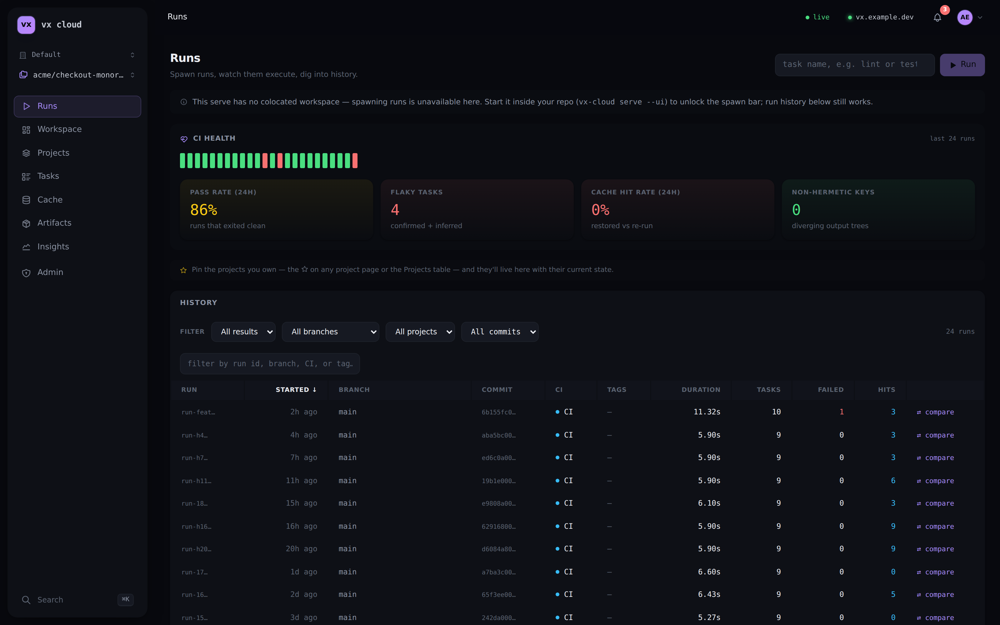
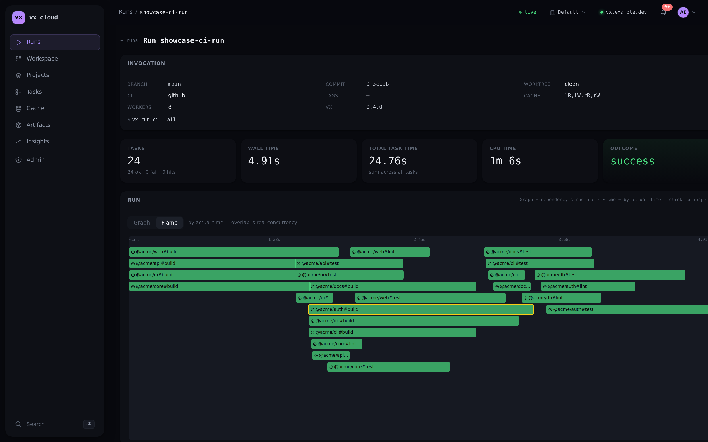
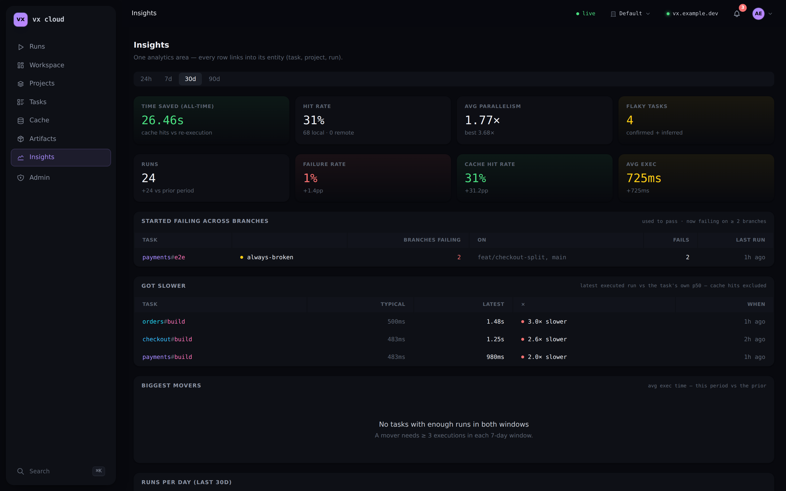
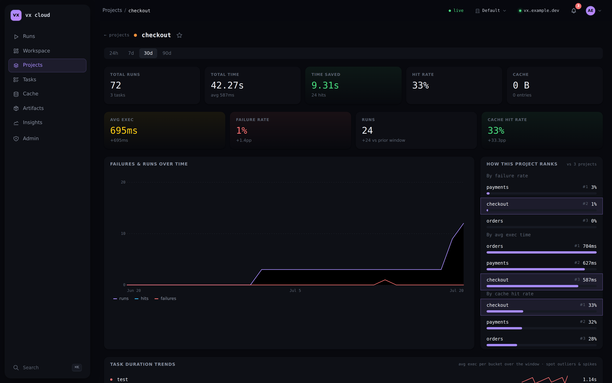
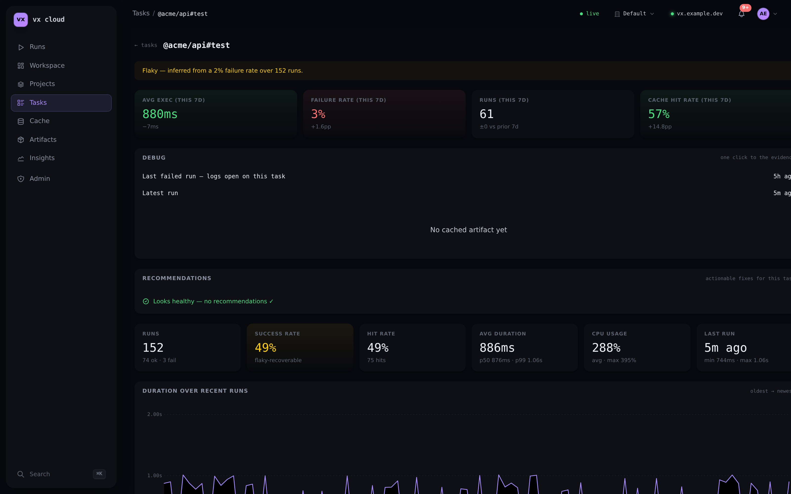
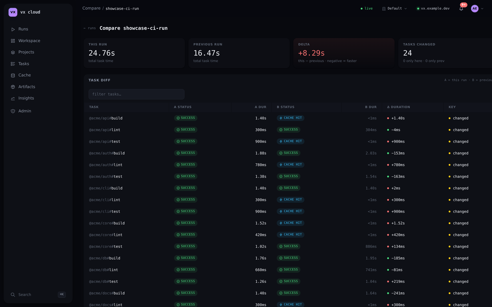
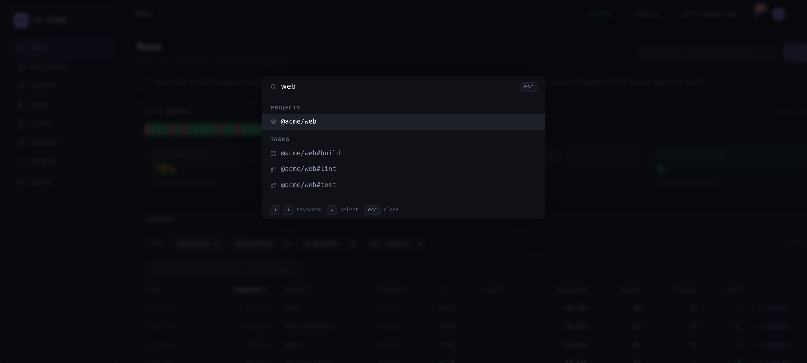

The dashboard is the UI of **`@vzn/vx-cloud`**, the [self-hosted CI
platform](/vx/cloud/self-hosting/). It ships **inside the compiled
`vx-cloud` binary and the Docker image** — the same `vx-cloud server`
process that serves the analytics API serves the dashboard at `/`. There
is nothing to build and no asset directory on disk: the SPA is embedded in
the executable.

Open your deployment's `VX_CLOUD_BASE_URL` in a browser and the dashboard
loads. It is served by `vx-cloud server` — core `vx` has no server
commands.

## A quick tour

*The **Runs** landing is the dev's entry point: a live CI-health strip
(pass rate, flaky count, cache hit rate) over a filterable history of
every `vx run`, faceted by result, branch, project, and commit.*

*Open any run to see its **flamegraph** — each task a bar on the real
timeline, so overlap is genuine concurrency and the critical path is
obvious. The invocation header carries the branch, commit, worker count,
and cache policy; per-task rows add CPU time and peak RSS. One click from
here reaches a task's logs and artifacts.*

*The **Insights** area turns history into answers: it names the task that
**started failing across branches** (here `@acme/web#build`, broken on two
open PRs) and ranks the **biggest movers** — tasks whose average duration
shifted most, with the signed delta and direction.*

*Every project has its own drill-in: a failures-and-runs trend, how it
**ranks against the other projects** on failure rate and speed, per-task
duration sparklines, and where each failure was first noticed across
branches — the answer to "did *my* project get faster or slower?"*

*Drill into a single `(project, task)`: a **flaky badge**, this-window-vs-prior
**trend tiles**, a **Debug card** (one click to the last failed run with its
logs), a **Recommendations** card that turns flaky/hermeticity/caching signals
into copy-pasteable config fixes, and a duration-over-recent-runs sparkline.*

*Compare any run against its immediately previous invocation: total-time delta,
tasks-changed count, and a per-task diff — which tasks flipped to a **cache hit**,
which got slower, which changed status — so a regression is one glance away.*

*`Cmd`/`Ctrl`-`K` opens a command palette that searches every destination —
pages plus your projects and tasks by name — so you jump straight to the entity
you care about without hunting through the nav.*

## Accounts, orgs, and access

The platform is account-based. You **register or log in**; the first
account ever registered becomes the **instance admin**, after which
signup closes and everyone else joins by invite (see
[Self-host](/vx/cloud/self-hosting/#first-run-register--admin)).

- **Login** establishes a session (an HttpOnly cookie; `Secure` when
  `VX_CLOUD_BASE_URL` is `https://`).
- An **org switcher** in the header selects which organization you're
  viewing when your account belongs to more than one — every analytics
  read is clamped to that org.
- The **Admin** area (for `owner`/`admin` roles) manages
  **organizations**, **workspaces**, **members** (roles `owner`, `admin`,
  `member`, `viewer`), **invites**, and **API tokens** (`vxc_`, a
  `trusted`/`untrusted` tier, optionally workspace-scoped). The tokens you
  mint here are what CI and `vx run` present.
- **Invites** are single-use and expire after 7 days, and are accepted
  two ways: a **new** person opens the invite URL and the login gate's
  create-account form registers them straight into the org; an
  **existing** signed-in user joins from in-app ("Join with an invite",
  pasting the `vxi_` token). Of two racing accepts of one invite,
  exactly one wins.
- The **account menu** (avatar, top-right) shows who you're signed in as
  and links to **Settings** and (for privileged roles) **Admin**.
- **Settings** (`/settings`) is your personal account area: rename yourself
  under **Profile**, and change your password under **Security**.

## Notifications

The **bell** in the header surfaces the current workspace's recent broken
builds — the runs where a task failed — newest first, each linking straight
to that run. An unread badge counts failures you haven't looked at yet
(tracked per browser, per workspace); opening the panel clears it. It polls
lightly and pauses while the tab is in the background. Cross-branch
regressions and flaky tasks are analytics, not per-event alerts — they live
on **Insights**, one click away from the panel.

## Where the data comes from

The dashboard reads from **Postgres** (run/task history and analytics) and
the **S3 artifact store** — never a developer's private `cache.db`. Runs
land in Postgres via the [`cloud()` plugin](/vx/guides/plugins/): each
executed task is pushed as it finishes (`POST /v1/ingest/task`, result +
log tail), so a run's detail page **fills in live** while it's still
running, and the run's summary is pushed at the end (`POST /v1/ingest`)
as the completeness backstop. A run appears on the dashboard **only after
a `cloud()`-enabled `vx run` pushes it**; a fresh deployment with no
pushes shows empty views — that's expected.

Because the platform holds no workspace checkout, the dashboard is an
**analytics + cache** surface: you dig into runs that already happened,
not spawn new ones from the browser.

## Multiple workspaces

An org can hold many workspaces. Each has a stable id (derived from the
client's git remote) and is provisioned on first push (or from Admin).
Every analytics read scopes to a workspace via `?ws=<id>`; the dashboard
picks the current one and can switch between them. A single-workspace org
just shows that one.

## What you see

The surfaces auto-refresh on a short interval so new runs and metrics
appear without a manual reload. Previously-loaded data stays on screen
during a refresh — only the first load shows a skeleton. A **command
palette** (`Cmd`/`Ctrl`-`K`) searches every destination — pages plus
your projects and tasks by name — and keeps the retired route names
(Trends, Bottlenecks, Overview) searchable, landing them on their
successors.

- **Runs** — the run **history** landing: every `vx run` invocation with
  branch / commit / CI / tags columns and per-row links to run detail and
  compare. A **CI-health strip** shows the last ~24 runs as status ticks
  plus health tiles (pass rate, flaky-task count, cache hit rate,
  non-hermetic-key count), each tinted by threshold and linking to the
  entity that explains it. **Faceted filters** (result · branch · project
  · commit) narrow the history and persist in the URL hash
  (`#/runs?result=failed&branch=main`), so a filtered view is shareable
  and restores on load.
- **Run detail** — a per-task table (CPU + peak RSS + hash), a
  **graph / flame toggle** (the dependency graph view needs a colocated
  workspace to reconstruct edges, so on the platform the card
  auto-falls back to the **flamegraph** timeline), and a
  **"why did this re-run?"** card naming
  the exact cache-key components that changed since the previous run.
  Select a task to open its panel — including the task's **captured log
  tail** (the last 128 KiB of merged stdout+stderr), so you can read a
  failed task's output without leaving the browser. A cache-hit task shows
  the output from the run that produced it (resolved by hash), plus an
  artifact download when the store holds it.
- **Compare** — diff a run against its immediately previous invocation
  (per-task duration deltas, status / hash changes).
- **Workspace** — the workspace entity page: identity and links into the
  other areas, plus per-workspace rollups.
- **Projects** / **Tasks** — per `(project, task)` analytics: runs,
  success rate, hit rate, avg/p50/p99, and a **trend row** (this window
  vs the prior equal-length one, with signed deltas — "did MY
  project/task get faster or slower?"). A task detail adds a **Debug
  card** (one-click jumps to the last *failed* run with logs pre-opened,
  the latest run, and the latest artifact), a flaky badge, and a
  **Recommendations** card that turns flaky / hermeticity / caching
  signals into concrete config fixes (each with a copy-pasteable snippet).
- **Project detail** — a single-dev drill-in for a project you own, all
  windowed by the same **timeframe selector** (24h · 7d · 30d · 90d,
  persisted in the URL). **Task duration trends** draws a per-task
  sparkline of average executed duration over the window — spot the
  outlier or the task that spiked, colored by direction (slower = red).
  **Failures & runs over time** charts the project's runs / hits /
  failures per bucket. **How this project ranks** compares it against
  every other project on three axes (failure rate, average exec time,
  hit rate) with your project highlighted at its true rank. **Where
  failures were first noticed — across branches** names, for each failing
  task, the branch it *first* started failing on, when, and the commit —
  so you know whether `main` broke or a feature branch found it first.
  The lifetime task table gains a **Δavg** column (each task's
  period-over-period average delta), and **Recent executions** lists the
  project's last runs — a row opens the run with that task's logs, the
  hash opens the cache entry.
- **Cache** — hit-rate split (local vs remote), estimated time saved,
  **storage by project** (which projects' artifacts occupy the store),
  a **storage-growth chart** (last 30 days), and the **entries table**
  (hash, task, size, age, last hit). Each entry's hash opens the
  **cache-entry page**: the entry's facts, its **artifact download**,
  and every run that **produced or restored** it — the provenance chain
  for one cached result.
- **Artifacts** — the S3 artifact store made visible: every artifact your
  principal may read (trust-scoped), with size/age/tier, best-effort
  task/run provenance links, and authenticated downloads.
- **Insights** — the analytics area, windowed by a **timeframe selector**
  (24h · 7d · 30d · 90d — persisted in the URL, so a windowed view is
  shareable; 24h switches the trend charts to hourly buckets).
  **Trending tiles** compare the selected window against the prior
  equal-length one (runs, failure rate, cache hit rate,
  average executed duration). A **Biggest movers** table ranks tasks
  whose average duration shifted most, and a **Started failing across
  branches** card names tasks whose most-recent run fails on ≥2 distinct
  branches — the "what just broke everywhere?" signal. Plus flaky tasks
  (with a within-run-retry **Retried** column and a **Suggested fix**
  column), the **Hermeticity** card (cross-machine output-fingerprint
  divergence from `vx run --force --verify=fingerprint` runs — the exact
  task, platforms, and diverging output files), bottlenecks
  (**Where to invest**, with weekly-savings estimates), and recent
  failures. Activity charts cover **runs per day** and **total duration
  per day**, a **When you build** heatmap (7×24 build-activity grid), and
  a **parallelism factor per invocation** chart — how much of the
  declared concurrency each run actually used. The cache column of the
  story lives here too: the **hit source** split (last 24h), **cache
  storage growth**, **top time-burners**, and a **prunable cache
  entries** table (what a `vx cache prune` would reclaim). Every row
  links into its entity — a failure opens its run with the task
  pre-selected.

## MCP: the same platform, for AI agents

The server exposes `POST /mcp` — a dependency-free MCP endpoint (JSON-RPC
2.0) behind the same auth, tenant-clamped by org/workspace. AI agents
connect to your deployment and read the same metrics the dashboard shows.
See [`vx mcp — AI agents`](/vx/cloud/mcp/).

## Task logs: capture, storage, and privacy

Per-task log tails are captured by the `cloud()` plugin (default on when
connected) and shipped to the platform after each run's summary. Storage
is bounded at every layer: the last 128 KiB per task, 4 MiB shipped per
run (a failed task's tail is never evicted to keep a successful one's),
a 16 MiB request cap, plus an age + byte-ceiling retention on the server.
Cache-hit tasks store nothing — they resolve by hash to the run that
produced the bytes.

**Privacy.** Log tails are program output and may echo secrets. This is
the same trust boundary the remote cache already crosses (a cacheable
success ships its full stdout to the same platform, under the same token +
trust scoping). Turn capture off with `cloud({ logs: false })` or
`VX_CLOUD_LOGS=0`.

## Known limits

- **No run history for a distributed run.** A distributed
  (`VX_CLOUD_DISTRIBUTE`) run has no single `run()` executing the whole
  graph, so it ingests no summary and doesn't appear under Runs.
- **Analytics come from pushed summaries.** A view is only as complete as
  the runs the `cloud()` plugin has pushed; a workspace nobody pushed from
  is empty.

See also: [`Self-host vx-cloud`](/vx/cloud/self-hosting/),
[`Distributed CI execution`](/vx/cloud/distributed-ci/),
[`Remote caching`](/vx/cloud/remote-caching/).
