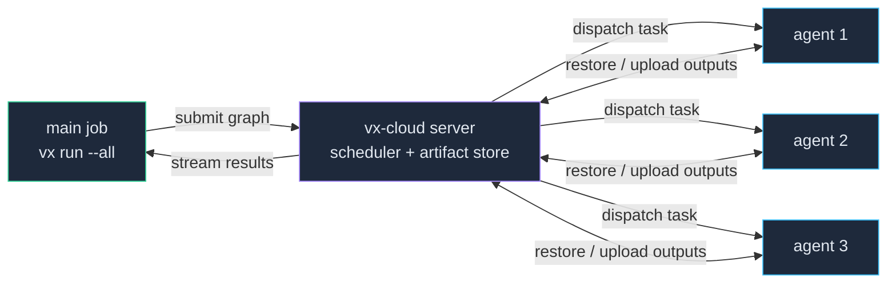

**vx agents** distribute a single `vx run` across many machines. A
normal run on the main job fans its task graph out to a pool of agent
machines that share the same checkout and commit; cache hits execute
nowhere, outputs move between machines only through the serve's
artifact store, and the main job renders one ordinary run and owns the
exit code. This is the Nx-Cloud-DTE contract, built on parts vx
already ships.

Here's the shape of it — the main job submits the graph to the server,
which dispatches ready tasks to whichever agents have capacity; each
agent restores upstream outputs from the shared artifact store, runs its
task, and uploads the results for the next agent:



There are two binaries:

- **`vx`** (`@vzn/vx`) — the core task runner. A plain `vx run`.
- **`vx-cloud`** (`@vzn/vx-cloud`) — the [self-hosted platform](../self-hosting/)
  (`vx-cloud server`) plus the client verbs (`vx-cloud agent`,
  `vx-cloud connect`). **Distribution is a `vx-cloud` feature**, enabled
  from a normal `vx run` through the `cloud()` plugin.

The deployed `vx-cloud` platform is the rendezvous: it holds the session
registry, schedules each submission, and hosts the shared `/v1/cache`
artifact store. Agents attach to it; the main job submits to it.

## Turnkey setup

Two ready-made recipes ship in the vx repo so you don't hand-wire the
connection and an agent matrix. Both assume a **deployed `vx-cloud`
platform** (see [Self-host vx-cloud](../self-hosting/)) and the `cloud()`
plugin declared in your `vx.workspace.ts`:

```ts
import { defineWorkspace } from '@vzn/vx'
import { cloud } from '@vzn/vx-cloud/plugin'

export default defineWorkspace({ plugins: [cloud()] })
```

Store the connection as two repository secrets — `VX_CLOUD_URL` (your
deployment's origin) and `VX_CLOUD_TOKEN` (a `trusted` API token minted
under **Admin → Tokens** on the platform).

> **Installing the CLIs in CI.** Both ship on npm as standalone binaries,
> no Bun needed: core `vx` (`npm i -g @vzn/vx`) and the `vx-cloud` CLI
> (`npm i -g @vzn/vx-cloud`) — each a prebuilt per-platform binary (the
> `vx-cloud` binary has the dashboard embedded). The agent jobs need
> `vx-cloud`; the run job needs only `vx` plus
> `VX_CLOUD_URL`/`VX_CLOUD_TOKEN`. (The platform itself is the
> `ghcr.io/vznjs/vx-cloud` image — see [Self-host](../self-hosting/).)

### One `uses:` — the reusable workflow

Call the reusable workflow from your own. It launches an agent matrix
plus a main job that submits with explicit distribution
(`VX_CLOUD_DISTRIBUTE`) and runs your task:

```yaml
# .github/workflows/ci.yml
name: CI
on: [push, pull_request]

jobs:
  distributed:
    uses: vznjs/vx/.github/workflows/vx-distributed-ci.yml@main
    with:
      task: ci # the vx task/group (append flags, e.g. "ci --all")
      agents: 6 # number of ephemeral agent jobs
    secrets:
      VX_CLOUD_URL: ${{ secrets.VX_CLOUD_URL }}
      VX_CLOUD_TOKEN: ${{ secrets.VX_CLOUD_TOKEN }}
```

Pin `@main` to a release tag for reproducible CI. That's the whole
setup — the reusable workflow handles the matrix, the agents'
vx-cloud install, and the `VX_CLOUD_DISTRIBUTE`-driven `vx run`.

Why explicit and not ambient (`connect --distribute`) in CI: the agent
matrix and the main job start **in parallel**, and ambient mode falls
back to a silent local run when zero remote agents have registered at
the instant of submit — a race you'd lose whenever the main job's
setup finishes first, leaving the whole matrix idle. Explicit mode
submits regardless (agents join mid-run), hard-errors on an
unreachable serve, and warns loudly if no agent ever joins. Ambient is
the right mode for a developer's *machine* (leave it on, never blocks
a solo run); explicit is the right mode for CI, where the agents are
provisioned by the same workflow.

### The agent action — for a hand-rolled workflow

Prefer to own your workflow? The `vx-agent` composite action runs one
agent per job. **Check out the same commit and install your workspace
dependencies first** — the agent executes real tasks, so it needs your
toolchain on disk (a dirty tree makes it refuse to start):

```yaml
jobs:
  agents:
    strategy:
      fail-fast: false
      matrix: { agent: [1, 2, 3, 4, 5, 6] }
    runs-on: ubuntu-latest
    steps:
      - uses: actions/checkout@v4
      - uses: oven-sh/setup-bun@v2
      - run: bun install --frozen-lockfile
      - uses: vznjs/vx/.github/actions/vx-agent@main
        with:
          url: ${{ secrets.VX_CLOUD_URL }}
          token: ${{ secrets.VX_CLOUD_TOKEN }}
          capacity: 4
          session: ${{ github.run_id }}-${{ github.run_attempt }}

  run:
    runs-on: ubuntu-latest
    env:
      VX_CLOUD_URL: ${{ secrets.VX_CLOUD_URL }}
      VX_CLOUD_TOKEN: ${{ secrets.VX_CLOUD_TOKEN }}
      VX_AGENT_SESSION: ${{ github.run_id }}-${{ github.run_attempt }}
      # EXPLICIT distribution: submit to the pool even if the agent matrix
      # hasn't registered yet (ambient would silently run local on that race).
      VX_CLOUD_DISTRIBUTE: '6'
    steps:
      - uses: actions/checkout@v4
        with: { fetch-depth: 0 }
      - run: npm i -g @vzn/vx
      - uses: oven-sh/setup-bun@v2
      - run: bun install --frozen-lockfile
      # No vx-cloud CLI needed here — VX_CLOUD_URL/TOKEN drive the connection
      # and VX_CLOUD_DISTRIBUTE routes the run to the pool. Only the agent
      # jobs run the vx-cloud binary.
      - run: vx run ci --all
```

The `agents` and `run` jobs start in parallel; the matrix uses the same
`session` the run job sets in `VX_AGENT_SESSION` so they rendezvous.
`vx-agent` inputs: `url` (required), `token`, `capacity` (default `1`),
`session`, `idle-timeout` (default `900000`), and `version` (the
`@vzn/vx-cloud` npm version/dist-tag it installs, default `latest`).

### GitLab CI

The same shape maps to GitLab's `parallel` matrix — a pool of agent
jobs plus a run job, both in one stage so they run concurrently and
share the pipeline session (`CI_PIPELINE_ID`):

```yaml
# .gitlab-ci.yml  (the oven/bun:1.3 image ships Bun + npm)
default:
  image: oven/bun:1.3
  variables:
    VX_AGENT_SESSION: $CI_PIPELINE_ID # agents + run share one session
  before_script:
    # Install both CLIs from npm, then your workspace deps.
    - npm i -g @vzn/vx @vzn/vx-cloud
    - bun install --frozen-lockfile

agents:
  parallel: 6
  script:
    - vx-cloud agent --url "$VX_CLOUD_URL" --token "$VX_CLOUD_TOKEN" --capacity 4

run:
  variables:
    # EXPLICIT distribution — submits to the pool even if the parallel agent
    # jobs haven't registered yet (ambient `connect --distribute` would
    # silently run local on that race).
    VX_CLOUD_DISTRIBUTE: '6'
  script:
    - vx run ci --all
```

Set `VX_CLOUD_URL` / `VX_CLOUD_TOKEN` as masked CI/CD variables. Both
jobs derive the same session from `CI_PIPELINE_ID`, so they find each
other automatically.

The rest of this guide is the **how it works** behind these recipes —
the correctness contract, the manual wiring, and the failure modes.

## How it works

```
main job: vx run ci   (VX_CLOUD_DISTRIBUTE=6, connected to a vx-cloud)
  cloud() backend → distributed submitter
   ├ prepareRun (has the checkout) → task graph + stable hashes
   ├ dist:submit { session, commitSha, graph } ───────────────┐
   ├ self-registers as an agent (so it never deadlocks)        │
   ├ renders the relayed event stream (one normal run)         │
   └ materializes outputs back onto disk                       │
                                                               ▼
                       ┌────────────── vx-cloud platform ─────────────┐
                       │  session registry {org, workspaceId, session} │
                       │    → agents (commit = eligibility filter)      │
                       │  per-submission scheduler:                     │
                       │    • prune: stat the store by stable hash      │
                       │      → a warm task executes NOWHERE            │
                       │    • assign bare task ids to free agents       │
                       │    • re-queue + reassign on agent death        │
                       │  /v1/cache — the shared artifact store         │
                       └──────┬─────────────────────────────┬──────────┘
                    task:assign {taskId}          task:assign {taskId}
                              ▼                             ▼
                     vx-cloud agent                vx-cloud agent
                      same commit, own checkout      same commit, own checkout
                      scoped run(): deps restore      scoped run(): …
                      warm from /v1/cache, runs,      agent:done {taskId, outcome}
                      saves + uploads to /v1/cache
```

The main job builds the graph (it has the checkout), submits it, and
renders the relayed events like any delegated run. The serve schedules
bare task ids onto agents. Each agent runs the assigned task as a
**scoped core `run()` of that exact task with its dependency closure** —
the closure's deps restore as warm `cache-hit-remote` from `/v1/cache`,
the task executes, and its artifact uploads back to `/v1/cache` before the
agent reports `done`. There is **no input shipping**: agents already have the
source at the shared commit, and every output travels only as a
content-addressed artifact through the store.

## The contract: same repo, same commit, clean tree

Because a task's cache key folds its inputs' git OIDs (relative paths,
never absolute checkout locations) and its upstream deps' keys, an
agent's scoped run derives keys **byte-identical** to the full run's —
but only when every machine sees the same source. So the contract is:

- **Same repository, same commit.** Registration is keyed by
  `{workspaceId, session, commitSha}`, and the commit is a
  **dispatch-eligibility filter**: a submission dispatches only to
  agents holding its exact SHA. An agent on a different SHA is not
  refused — it stays registered and simply idles as ineligible for that
  submission; a submission whose commit no remote agent holds runs
  entirely on the submitter's own self-agent (degrading toward a normal
  local run, never a wrong cache hit). In GitHub Actions every job of
  one workflow run checks out the same commit automatically. (Only a
  distribution-protocol version mismatch refuses an agent outright.)
- **Clean working tree.** A `vx-cloud agent` on a dirty tree refuses to
  start (exit 1, listing the offending paths) — uncommitted changes
  can't exist on the other agents, and divergent inputs would split the
  cache. The submitting run with a dirty tree falls back to a normal
  local run.
- **A reachable remote cache.** The serve's `/v1/cache` store is the
  transport for every output; distribution needs both remote read and
  remote write on.

Pin one CI image and prefer `--frozen` on the main job so configs
resolve identically everywhere. Divergence (env / toolchain drift)
degrades to a cache miss and re-execution — never a stale hit.

## Enabling distribution

Setup is three steps, all driven by the **one connection** (the same
`VX_CLOUD_URL` + `VX_CLOUD_TOKEN` that powers the remote cache and the
dashboard — see [Remote caching](../remote-caching/)):

1. **Connect** a vx-cloud — `vx-cloud connect <url> --token <t>`, or set
   `VX_CLOUD_URL` + `VX_CLOUD_TOKEN`.
2. **Set `VX_CLOUD_DISTRIBUTE=<n>`** on the submitting run.
3. **Run agents** — `vx-cloud agent` on each machine.

No separate cache config on the agents: the connection hosts the
`/v1/cache` store, so the agents' scoped runs restore and upload
through it automatically.

Distribution is a rung of the `cloud()` backend plugin, so declare the
plugin in `vx.workspace.ts` (it's zero-cost until enabled):

```ts
import { defineWorkspace } from '@vzn/vx'
import { cloud } from '@vzn/vx-cloud/plugin'

export default defineWorkspace({ plugins: [cloud()] })
```

A plain `vx run` becomes distributed when **both** hold:

1. `VX_CLOUD_DISTRIBUTE=<n>` is set — `<n>` is an advisory expected
   agent count (also `cloud({ distribute: n })`).
2. A vx-cloud connection is reachable. The submitter resolves it through
   the usual ladder: `VX_CLOUD_URL` env → the active `vx-cloud connect`
   environment.

`VX_CLOUD_DISTRIBUTE` set with **no reachable connection is a hard
error** — distribution was explicitly requested, so silently running
locally would hide a broken matrix forever. (This differs from ambient
delegation, which fails safe to local.)

## Attaching agents

Each agent machine checks out the workspace at the same commit and
runs:

```sh
vx-cloud agent --url https://vx-serve.example.com --token "$VX_CLOUD_TOKEN"
```

Flags:

| Flag | Meaning |
| --- | --- |
| `--url <origin>` | The serve to attach to. Falls back to `VX_CLOUD_URL` (then the legacy `VX_SERVICE_URL`), then the active `vx-cloud connect` environment. |
| `--token <t>` | Bearer token for the serve. Falls back to `VX_CLOUD_TOKEN`. |
| `--capacity <n>` | How many assignments to execute in parallel (default `1`). |
| `--session <s>` | The session key to join (default: derived, see below). |
| `--idle-timeout <ms>` | Self-terminate after this long with no assignment (default `600000` = 10 min; `0` = never). |
| `--label <l>` | Tag the agent (repeatable). Informational in v1. |

The **session** groups the agents and the submitter that belong to one
pipeline. It resolves from `--session` → `VX_AGENT_SESSION` → a CI
variable (`GITHUB_RUN_ID`+`GITHUB_RUN_ATTEMPT`, GitLab
`CI_PIPELINE_ID`, Buildkite `BUILDKITE_BUILD_ID`) → `'local'`. The
submitter and every agent **must land on the same session key** — the
simplest way in CI is to set `VX_AGENT_SESSION` on every job.

An agent drains and exits cleanly when the submission finishes (or on
its idle timeout). It **exits 0 even when tasks failed** — the main job
is the sole authority on the run's verdict, so a red agent row means
infrastructure trouble (a refusal, a dirty tree, an unexpected
disconnect), not a failing test.

## Scheduling: longest task first

The per-submission scheduler is not FIFO — among a submission's ready
tasks it starts the **historically longest first** (the
longest-processing-time makespan heuristic, the same idea Nx Agents
uses), so a long pole begins as early as possible instead of landing
last on a nearly-drained pool. The duration hints come from the
platform's own run history: the mean executed duration per
`project#task` over the workspace's ingested `task_runs`, computed
server-side at submit and memoized (~30 s).

The hints are **trust-scoped exactly like the cache**: a submission
from the repo's default branch reads only default-branch timings — one
dev's slow branch experiment can never skew the ordering every trunk
build uses — while a branch submission reads its own branch's timings
first and falls through to trunk for tasks it hasn't run yet (never
another branch's). A task with no history in scope simply has no hint.
The hints are advisory ordering only: they never affect outcomes, cache
keys, or which agent may run a task, and a fresh workspace with no
history degrades to plain queue order.

## Pool health: heartbeats and the capacity probe

Agents send a heartbeat every 10 s, and **any** message counts as
liveness — a busy-but-quiet agent is never suspected. A serve-side
sweep reaps agents silent past ~30 s (a crashed box, a half-open TCP
connection that would otherwise stall until the OS keep-alive timeout)
and re-queues their in-flight tasks to surviving agents, exactly like a
clean disconnect.

The same rendezvous path doubles as a **capacity read**: a plain
bearer-authenticated `GET /v1/agents?ws=<id>&session=<key>&commit=<sha>`
returns the pool's shape —

```json
{ "agents": 3, "remoteAgents": 2, "capacity": 12, "remoteCapacity": 8, "ready": 5 }
```

`remoteAgents`/`remoteCapacity` exclude the submitter's own self-agent,
so a non-zero value means genuine external help; `commit=` scopes the
counts to agents holding that SHA (a feature-branch dev probing a
main-pinned pool correctly reads 0 and stays local). `ready` is the
number of tasks ready to run but waiting for a free agent slot —
non-zero only when the pool is saturated, which makes it the signal an
**autoscaler** scales up on: poll it for your session and add agent
machines while it stays above zero. (vx owns task placement only —
machine lifecycle stays with your CI matrix or cluster.)

## GitHub Actions

The realistic pattern points every job at **one vx-cloud platform
reachable by all of them** — your deployed `vx-cloud server` behind a URL
(see [Self-host vx-cloud](../self-hosting/)). Two secrets carry the whole
connection: `VX_CLOUD_URL` and `VX_CLOUD_TOKEN` (a `trusted` token minted
under Admin → Tokens). A matrix of agent jobs attaches to it, and a
separate run job submits.

```yaml
# .github/workflows/distributed.yml
name: CI (distributed)
on: [push, pull_request]

# The one connection + a shared session for the whole workflow run — the
# submitter and every agent derive the same session key from it.
env:
  VX_CLOUD_URL: ${{ secrets.VX_CLOUD_URL }}
  VX_CLOUD_TOKEN: ${{ secrets.VX_CLOUD_TOKEN }}
  VX_AGENT_SESSION: ${{ github.run_id }}-${{ github.run_attempt }}

jobs:
  agents:
    strategy:
      matrix:
        agent: [1, 2, 3, 4, 5, 6]     # six agent machines
    runs-on: ubuntu-latest
    steps:
      - uses: actions/checkout@v4
      - run: npm install -g @vzn/vx
      - uses: oven-sh/setup-bun@v2
      - run: bun install --frozen-lockfile
      # Same repo, same commit, clean tree. Blocks until the submission
      # drains it (a generous idle timeout covers the run job's startup).
      # The connection also provides the /v1/cache store — no extra config.
      - run: |
          vx-cloud agent \
            --url "$VX_CLOUD_URL" \
            --token "$VX_CLOUD_TOKEN" \
            --session "$VX_AGENT_SESSION" \
            --capacity 4 \
            --idle-timeout 900000

  run:
    runs-on: ubuntu-latest
    env:
      VX_CLOUD_DISTRIBUTE: "6"          # advisory: expect ~6 agents
    steps:
      - uses: actions/checkout@v4
        with:
          fetch-depth: 0                # --affected needs history
      - run: npm install -g @vzn/vx
      - uses: oven-sh/setup-bun@v2
      - run: bun install --frozen-lockfile
      # A NORMAL vx run. The cloud() plugin routes it to the serve because
      # VX_CLOUD_DISTRIBUTE + the connection (VX_CLOUD_URL) are set. Zero
      # remote agents degrades to a loud local run — never a deadlock.
      - run: vx run ci --all --frozen
```

The `agents` and `run` jobs start in parallel. Agents register with the
serve and wait; the run job submits the graph and dispatch begins. The
submitter self-registers as an agent, so even if no matrix agent has
connected yet the run makes progress locally and mixes in remote agents
as they join.

Every agent and the run job point at the same deployed platform at the
same `VX_CLOUD_URL`. (The platform is a stateful service — Postgres + an
S3 bucket — so it's a deployment, not something a CI job spins up
ad hoc.)

### Job summaries and PR checks

Independent of distribution, a `vx run` inside GitHub Actions with the
`cloud()` plugin declared reports its result back to the PR:

- **Job summary** — when `GITHUB_STEP_SUMMARY` is set (every Actions
  job), the run appends a per-task result table to the job page:
  failures first with exit codes, cache provenance per task, a
  ⚠️ *flaky* flag on any task that only passed after a retry, and a
  `🔒 Hermeticity` line on `--verify` runs. No platform connection is
  required for this — the table works standalone.
- **A real check run on the commit** — additionally created via the
  Checks API when the step is handed `GITHUB_TOKEN` (the hand-off is
  the opt-in; grant `checks: write`). The conclusion mirrors the run,
  the check body is the same failures-first table, and on
  `pull_request` events it attaches to the PR's head SHA (not the
  synthetic merge commit) so it surfaces on the PR. Knobs:
  `VX_GITHUB_CHECK=0` disables, `VX_GITHUB_CHECK_NAME` names the check
  (default: the run's command). A missing permission degrades to a
  warning — reporting never fails a build.

When a platform connection resolved, both the summary and the check
carry a **dashboard deep link** to the run (`/#/runs/<runId>`), so a red
check is one click from the failing task's logs.

A distributed submission appears under **Runs** and fills in live too — with
**per-task logs**: each agent tees its task's stdout/stderr to the controller
(the same stream that renders live on your terminal), and the controller
captures the tail and stores it the moment the task finishes. So the
server-side controller records each task (result + log tail) as it lands and
writes the invocation header when the run ends — a distributed run reads
exactly like a local `cloud()` run, click a failed task and read its output.

## Fork PRs: present the PR token

The artifact store is **trust-scoped** so a fork PR can warm off `main`
without poisoning it, and the tier follows **which token you present** —
there is no trust flag and no autodetection. In the platform's **Admin →
Tokens**, mint **two** tokens: one `trusted` and one `untrusted`.

A trusted token reads and writes the trusted scope. The untrusted token
reads `untrusted ∪ trusted` but **writes only the untrusted scope** — the
server derives the scope from the bearer, never from a client claim. So a
fork-PR job simply presents `VX_CLOUD_PR_TOKEN` (the untrusted token)
**instead of** `VX_CLOUD_TOKEN` (a fork can't see your repo secrets, so
the untrusted token is the only one it has — which token you hold *is* the
tier):

```yaml
  run:
    env:
      VX_CLOUD_DISTRIBUTE: "6"
      VX_CLOUD_PR_TOKEN: ${{ secrets.VX_CLOUD_PR_TOKEN }}
```

The run then reads the trusted cache (staying fast) but writes only the
untrusted scope — it can't poison a trusted build, so the PR token is
safe to expose. Present the same PR token on the agent jobs
(`--token "$VX_CLOUD_PR_TOKEN"`) so their scoped runs write to the
untrusted scope too. The full model is in
`docs/design/cache-trust-scopes-2026-07.md`.

## When a run stays local

Some runs can't be distributed. The submitter checks these up front and
**falls back to a normal local run**, printing the reason
(`vx: distribution disabled: <reason> — running locally`):

- **Forwarded args** (`vx run test -- --grep x`) — the requested-arg
  fold can't be reproduced across agents in v1.
- **A dirty worktree** — uncommitted changes can't exist on agents.
- **A cache policy without the remote layer** (`--no-cache`, `--force`,
  or any `--cache=…` that drops remote read or write) — the store is
  the transport.
- **A persistent task** anywhere in the graph — a dev server on a
  remote agent is meaningless.

Only an **unreachable serve** is a hard error; every other gate is a
graceful, loud fallback.

## Zero remote agents

Because the submitter self-registers, the zero-agent deadlock can't
occur — there's always at least one agent (the main job itself). If no
**remote** agent joins the session within `agentTimeoutMs` (default
5 min, `VX_CLOUD_AGENT_TIMEOUT_MS`), the scheduler prints a loud warning
and the run completes on the submitter alone. A green build is never
failed over missing accelerators.

## Known limits

Honest gaps in the current design (see
`docs/design/distributed-execution-2026-07.md` for the full record):

- **Remote agents honor the run's `--frozen` / `--timeout` / `--retry`.**
  The submitter's run policy rides every assignment, so a standalone
  agent applies the same lockfile-freeze, task timeout, and retry
  defaults it would locally. The **cache policy is not** propagated by
  design: a distributed run always has the remote axes (the artifact
  transport), and each agent's own local cache stays on so warm restores
  work across its assignments.
- **Uncacheable intermediate tasks re-execute** inside each dependent's
  closure on every agent that needs them — there's nothing to restore.
  Make intermediates cacheable (declare their `cache.outputs`). Dep
  affinity and each agent's warm local cache bound the waste.
- **Fairness is equal-share only; no priorities, no persistence.** A
  session multiplexes any number of concurrent submissions across its
  agents (round-robin max-min fair share; only commit-matching agents
  are eligible, and a submitter's own machine serves only its own run),
  but there are no weighted priorities and the registry is in-memory —
  a serve restart fails in-flight submissions loudly.
- **No agent autoscaling or managed fleets.** Your CI matrix (or k8s)
  owns machine lifecycle; vx owns task placement only.
- **Input shipping is a permanent non-goal.** Same-checkout is the
  contract; dirty trees run locally.
- **An agent that loses its WS exits** — it does not reconnect. The
  matrix restarts it or it doesn't; the scheduler reassigns its
  in-flight tasks to surviving agents.

## See also

- [Continuous integration](/vx/guides/ci/) — the single-machine CI setup,
  `--affected`, and the lockfile workflow.
- [Remote caching](../remote-caching/) — the artifact store that
  the connection provides and agents share.
- [Self-host vx-cloud](../self-hosting/) — deploy the platform every job
  attaches to, in one `docker compose up`.
- [vx-cloud wire protocol](../wire-protocol/) — the JSON-RPC envelope the
  relayed run stream rides.
- `docs/design/distributed-execution-2026-07.md` — the full design and
  the correctness proof.
