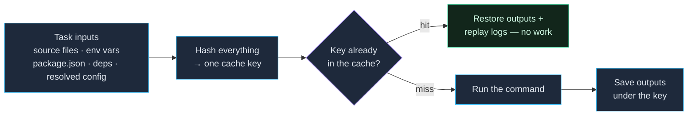

vx's cache is **content-addressed**: it hashes everything a task depends
on into a key, and a cache hit means "we've run this exact task on these
exact inputs before — here's the stored result." Get the declarations
right and every run is both correct and fast.

## How a cache decision is made

Every run, for every task, vx folds the task's real dependencies into one
key and looks it up. Nothing changed since last time → the key matches →
vx **restores the stored outputs and replays the logs** instead of running
the command. Change any input → the key changes → the task re-runs and the
new result is saved under the new key. That's the whole model, and it's
why a warm run is near-instant while staying correct:



The payoff is real: on this repo's benchmark, a fully-cached warm run of a
3-package build drops from ~620 ms of actual work to ~20 ms of restores —
and because the key covers **every** input, a hit is only ever served when
the result is genuinely identical.

This is the guide that matters most. The one failure mode worth fearing
is a **stale hit** (shipping a result built from inputs that actually
changed), and it comes from under-declared inputs.

## Inputs: what the task reads

```ts
cache: {
  inputs: { files: ['src/**', 'tsconfig.json'] },
  outputs: { files: ['dist/**'] },
}
```

`inputs.files` is project-relative globs. Be precise — list everything
the command actually reads:

```ts
files: ['src/**']                      // a source tree
files: ['src/**', '!**/*.test.ts']     // exclude with !
files: ['src/**', 'tsconfig.json', 'schema.graphql']
files: []                              // no file inputs (still keyed on env, deps, lockfile…)
```

### What vx folds in for you

You don't have to list these — they're always part of the key:

- **The package's `package.json`** — so a dependency bump invalidates the
  cache even if your globs are narrow like `['src/**']`. (Turborepo gets
  this via the lockfile; vx folds the bytes directly, matching Nx.)
- **The workspace lockfile fingerprint** — `bun.lock`,
  `pnpm-lock.yaml`, etc.
- **Upstream task hashes** — see [cascading](#cascading-through-dependencies).
- **The resolved command + env declarations**, and any forwarded `--`
  args.

### What's always excluded

`node_modules/`, `.git/`, `.vx/`, `*.tsbuildinfo`, gitignored files, the
task's own declared outputs, and files belonging to a nested project.
Inputs are enumerated through git, so anything git ignores is invisible
to the cache.

## Outputs: what the task produces

```ts
outputs: { files: ['dist/**'] }     // a build
outputs: { files: [] }              // lint / test / typecheck — no files
outputs: { files: ['dist/**', 'coverage/**'] }
```

On a cache **hit**, vx restores these from the artifact. On a **miss**,
it runs the command and stores them.

**Strict output ownership** is a vx guarantee Turborepo and Nx don't
offer: declared outputs are **wiped before every build and before every
restore**, so your output dir ends each run bit-identical to the cached
snapshot. A stale `dist/old.js` from a previous build can never survive
into a run that doesn't rewrite it. (Outputs are *not* gitignore-filtered
— `dist/`, `.next/`, `coverage/` are captured even though they're
usually gitignored.)

## Environment variables

If a task's behavior depends on an env var, track it so the cache knows:

```ts
build: {
  exec: { command: 'vite build', env: { passThrough: ['NODE_ENV'] } },
  cache: {
    inputs: { files: ['src/**'], env: ['NODE_ENV'] },
    outputs: { files: ['dist/**'] },
  },
}
```

There are **two independent lists**, and a tracked var usually needs
both:

- `cache.inputs.env` — names whose **values are folded into the cache
  key**. Change `NODE_ENV` and you get a different cache entry.
- `exec.env.passThrough` — names whose **values reach the child
  process**. The child env is isolated by default.

A var that affects the build must be in *both*: track it (so the key
varies) and pass it through (so the command can actually see it). See
[Environment variables](../environment-variables/) for the full model.

## Cascading through dependencies

When a task `dependsOn`s another, the upstream's own cache key (its
input-based task hash) is folded into the downstream's key — so any
change to an upstream's inputs cascades a rebuild through everything that
depends on it. This is **pure-input transitive hashing**, the same model
Turborepo and Nx use.

Because keys are derived from *inputs* alone, the whole graph's keys are
known before anything executes — which is what lets vx fire remote-cache
lookups in the background while earlier tasks are still running. (vx does
*not* do "early cutoff" — an upstream that re-runs but produces identical
output still re-runs its dependents. That was tried and deliberately
removed; see the [caching deep dive](../../caching/).)

If a `dependsOn` exists only for *ordering* and the upstream's output
doesn't actually affect this task, decouple their keys:

```ts
e2e: {
  dependsOn: ['build'],          // run after build
  exec: { command: 'playwright test' },
  cache: {
    inputs: { files: ['e2e/**'], tasks: [] },  // …but build's hash doesn't key e2e
    outputs: { files: ['playwright-report/**'] },
  },
}
```

`inputs.tasks` filters which upstream hashes participate (`[]` = none,
`['^build']` = only that one, default = all). Same micro-syntax as
`dependsOn`.

## Inputs that live outside the package

For root-level shared files (a base tsconfig, shared codegen output),
use `workspaceFiles` — globs resolved from the **workspace root**:

```ts
inputs: {
  files: ['src/**'],
  workspaceFiles: ['tsconfig.base.json', 'shared/generated/**'],
}
```

These are the Turborepo `$TURBO_ROOT$` / Nx `{workspaceRoot}` equivalent.
There's a matching `outputs.workspaceFiles` for writing outside the
package dir.

## Debugging the cache

When a task hit or missed and you didn't expect it:

```bash
vx run build --dry        # predicted hit/miss + resolved plan, no execution
vx run build --graph      # the dependency graph (text or DOT)
vx show build             # the live resolved config for the task
```

To force a clean run while debugging (without editing config):

```bash
vx run build --no-cache   # ignore the cache for this run
```

A quick checklist when a hit looks stale:

1. Did the changed file match `inputs.files`? If not, your globs are too
   narrow — add it.
2. Is the value an env var? It must be in `inputs.env`.
3. Is it a root-level file? Use `inputs.workspaceFiles`.

## Next steps

- **[Environment variables](../environment-variables/)** — the full
  passthrough/tracking model.
- **[Caching deep dive](../../caching/)** — key derivation, the
  invalidation table, the artifact format.
- **[Remote caching](../remote-caching/)** — share the cache across
  machines and CI.
