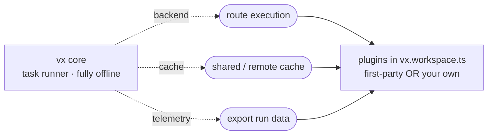

vx core is **only a task runner**. It discovers projects, builds the task
graph, hashes inputs, runs tasks in order with a local cache, and prints
the result. That's the whole product. A plain `vx run` opens no socket,
calls no service, and needs no account — it works fully offline, forever.

Everything beyond that — a **dashboard**, a **shared/remote cache**,
**distributed execution**, **telemetry export** — is a **plugin**. Core
defines the extension seams; plugins fill them. The first-party cloud
plugin is one implementation, but it is **not privileged**: core never
imports it, never names it, and never needs it. You can delete it, ignore
it, or replace it with your own — core behaves identically.

## The seams

A plugin is a small object in `vx.workspace.ts` that contributes any of
three capabilities. Each is independent, opt-in, and has a built-in
default, so declaring nothing costs nothing.



| Seam        | What a plugin swaps                              | Default if no plugin        |
| ----------- | ------------------------------------------------ | --------------------------- |
| `backend`   | *where* tasks run — local, remote, or distributed | in-process                  |
| `cache`     | *which* cache is used — your server, S3, Redis   | local cache only            |
| `telemetry` | *where* run data goes — OTel, Slack, your DB      | nothing exported            |

None of these can change *how* a task's command runs — shell is the API.
`telemetry` is observe-only by construction (a sink holds no run handle),
so it can never change, slow, or fail a run.

See [Writing a vx plugin](/vx/guides/plugins/) for the full contract and
runnable examples.

## The first-party cloud plugin is just a plugin

The first-party cloud is one package that implements all three seams
against a deployed self-hosted platform. Declaring it is one line in
`vx.workspace.ts`, and with no connection configured it **declines every
seam** and adds zero overhead — so it's safe to leave declared everywhere.
Point it at a deployment and the same one connection lights up the remote
cache, analytics ingest, and distributed execution. It's a normal plugin —
nothing more. The setup lives in its own section:
[the Cloud platform overview](../../cloud/overview/).

## Build your own

Because the seams are the only contract, a third-party package is a
**first-class equal** to the first-party cloud plugin. To back the cache
with your own infrastructure, no cloud involved, implement core's three-call
`RemoteCacheLayer` seam (`has`/`get`/`put` — throw on failure, and
`LayeredCache` degrades every throw to a cache miss):

```ts
// vx.workspace.ts
import { defineWorkspace, LayeredCache, type RemoteCacheLayer, type VxPlugin } from '@vzn/vx'

class AcmeRemote implements RemoteCacheLayer {
  constructor(private url: string) {}
  async has(hash: string) {
    return (await fetch(`${this.url}/artifacts/${hash}`, { method: 'HEAD' })).ok
  }
  async get(hash: string) {
    const res = await fetch(`${this.url}/artifacts/${hash}`)
    if (res.status === 404) return null
    if (!res.ok) throw new Error(`GET ${hash} → ${res.status}`)
    return { body: await res.arrayBuffer(), durationMs: undefined }
  }
  async put(hash: string, body: ArrayBuffer | Uint8Array) {
    await fetch(`${this.url}/artifacts/${hash}`, { method: 'PUT', body })
  }
}

function acmeCache(): VxPlugin {
  return {
    name: 'acme/cache',
    cache(ctx) {
      const url = process.env.ACME_CACHE_URL
      if (!url) return undefined // decline → core uses the local cache
      return new LayeredCache(ctx.localCache, new AcmeRemote(url), {
        policy: ctx.policy,
        onRemoteError: (e) => ctx.warn(`acme cache: ${e.message}`),
      })
    },
  }
}

export default defineWorkspace({ plugins: [acmeCache()] })
```

The same pattern gives you a custom `backend` (route to your own executor)
or `telemetry` sink (ship to your own analytics). Everything a plugin
needs — `VxPlugin`, `CacheLayer`, `RemoteCacheLayer`, `LayeredCache`,
`TelemetrySink`, `RunBackend`, the run/graph types — is exported from the
single `@vzn/vx` entry point.

## Bring your own remote cache

The remote-cache **wire is a plugin concern** — core ships no HTTP cache
client at all. The first-party cloud plugin speaks its own vx-native
`/v1/cache` wire; a **Turborepo-compatible** cache server (ducktors, Vercel
hosted, …) is the same recipe with Turbo's shapes inside the class:

```ts
import { LayeredCache, type RemoteCacheLayer, type VxPlugin } from '@vzn/vx'

class TurboRemote implements RemoteCacheLayer {
  // speak /v8/artifacts/:hash + x-artifact-* here, incl. HMAC if wanted
  constructor(private opts: { url: string; token: string }) {}
  async has(hash: string) {
    const res = await fetch(`${this.opts.url}/v8/artifacts/${hash}`, {
      method: 'HEAD',
      headers: { authorization: `Bearer ${this.opts.token}` },
    })
    if (res.status === 404) return false
    if (!res.ok) throw new Error(`HEAD ${hash} → ${res.status}`)
    return true
  }
  async get(hash: string) {
    const res = await fetch(`${this.opts.url}/v8/artifacts/${hash}`, {
      headers: { authorization: `Bearer ${this.opts.token}` },
    })
    if (res.status === 404) return null
    if (!res.ok) throw new Error(`GET ${hash} → ${res.status}`)
    const duration = res.headers.get('x-artifact-duration')
    return {
      body: await res.arrayBuffer(),
      durationMs: duration !== null ? Number(duration) : undefined,
    }
  }
  async put(hash: string, body: ArrayBuffer | Uint8Array, meta: { durationMs: number }) {
    const res = await fetch(`${this.opts.url}/v8/artifacts/${hash}`, {
      method: 'PUT',
      body,
      headers: {
        authorization: `Bearer ${this.opts.token}`,
        'content-type': 'application/octet-stream',
        'x-artifact-duration': String(meta.durationMs),
      },
    })
    if (!res.ok) throw new Error(`PUT ${hash} → ${res.status}`)
  }
}

export function turboCache(opts: { url: string; token: string }): VxPlugin {
  return {
    name: 'acme/turbo-cache',
    cache: (ctx) =>
      new LayeredCache(ctx.localCache, new TurboRemote(opts), { policy: ctx.policy }),
  }
}
```

`LayeredCache` owns everything wire-independent — read-through with
local hydration, at-most-once in-flight deduplication, background
write-through uploads, and the never-fail contract — so a wire plugin
stays this small. Embedders that already hold a client can also inject
it per-run via `RunOptions.remoteCache` (explicit injection wins over
the plugin consult).

## The boundary is enforced

This isn't a convention you have to trust — it's checked in CI. Core
**never** imports any service/cloud package; that direction is asserted by
`tests/package-boundaries.test.ts` and the public API surface is
snapshot-pinned. Concretely, vx core:

- has **no** dependency on any first-party service/cloud package (or any
  `@vzn/vx-*` package);
- reads **no** cloud-provider environment variable and no remote-cache env
  at all — the remote cache reaches core only through the `cache`
  capability or `RunOptions.remoteCache`;
- ships **no** server, dashboard, or account logic;
- runs every task the same whether zero plugins or ten are declared.

So the dependency arrow only ever points **one way**: plugins depend on
`@vzn/vx`; `@vzn/vx` depends on nobody. That's what keeps the cloud
optional and makes "bring your own" a real, supported path.

## See also

- [Writing a vx plugin](/vx/guides/plugins/) — the capability contract + Sentry/Slack/metrics/cache examples.
- [Remote caching](/vx/guides/remote-caching/) — the `RemoteCacheLayer` seam and artifact integrity.
- [Distributed CI execution](../../cloud/distributed-ci/) — the `backend` seam at scale.
- [OpenTelemetry traces & metrics](/vx/guides/otel-bridge/) — a `telemetry` plugin in the wild.
