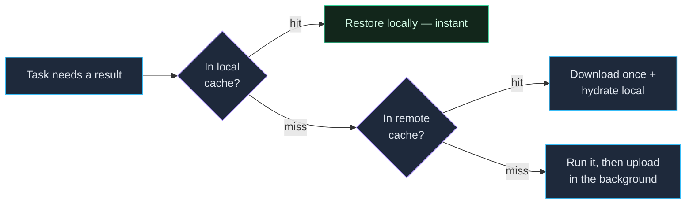

A local cache makes *your* repeat runs instant, and it needs **no setup** —
it's on by default for every `vx run`. A **shared** cache extends that
across machines: CI restores what a teammate already built, and a fresh
clone is fast on its first run.

## How a shared cache resolves a result

The key point is that the same content-addressed key works on *every*
machine: if your teammate built a task, its result is stored under a key
that your CI runner computes identically. So a fresh clone with an empty
local cache doesn't rebuild — it looks the key up **remotely**, downloads
the artifact once, and hydrates its local cache so the next run is
instant too. Reads are local-first (never pay the network for something
you already have); writes upload in the background and never block or
fail the build:



The payoff: pair a shared cache with [`--affected`](../running-tasks/#selecting-only-what-changed-affected)
and a typical PR executes only the few packages it changed and **downloads
everything else** — CI that would take minutes finishes in seconds, on a
machine that never ran most of the code.

Sharing is the only part that needs a server. A solo developer needs
nothing here — the [local cache](../caching/) is automatic.

## Sharing is a plugin

Core ships **no HTTP cache client**. Sharing a cache is a **plugin
concern**: core defines a three-call `RemoteCacheLayer` seam
(`has`/`get`/`put`) and a `cache` plugin capability, and everything else —
read-through with local hydration, at-most-once in-flight deduplication,
background write-through uploads, and the never-fail contract — is core's
`LayeredCache`. A plugin provides the wire; `LayeredCache` provides the
behavior.

Reads try local first, then remote (hydrating local on a remote hit), with
a background prefetch pass that overlaps remote GETs with execution. Writes
go to local immediately; the remote upload is a fire-and-forget background
task drained at end of run — failures are logged but never fail the build.

## The first-party shared cache

`@vzn/vx-reapi` fills the seam with Bazel's Remote Execution API: an
`ActionCache` entry per task key, artifacts in the `ContentAddressableStorage`.
That means NativeLink, BuildBuddy, Buildbarn and bazel-remote all work as a
vx remote cache with one endpoint of configuration — six mature server
implementations, none of them written by us, because the REAPI server is
deliberately dumb. The same plugin can also RUN your tasks on that pool —
see [Remote execution](../remote-execution/).

```ts
// vx.workspace.ts — reapi BEFORE localCachePlugin so a remote hit wins.
import { reapi } from '@vzn/vx-reapi'

export default defineWorkspace({
  plugins: [reapi({ endpoint: 'cache.example.com:443' }), localExecutorPlugin(), localCachePlugin()],
})
```

Configure it inline, or from `VX_REAPI_ENDPOINT` / `VX_REAPI_INSTANCE`. With no
endpoint the plugin **declines** and costs nothing, so it is safe to leave
declared everywhere — the same contract every vx plugin follows.

**How a vx key becomes a REAPI entry.** A CAS digest is the sha256 of the
content, so it cannot be known before the bytes exist and `has(key)` could
never answer. The ActionCache supplies the indirection: a synthetic action
digest, `sha256("vx-reapi-v1\0" + key)`, addresses an ActionResult whose one
output file points at the artifact blob. The version prefix keeps vx keys out
of the address space of real Bazel actions on a shared server, and makes a
future change to the mapping miss cleanly instead of misreading.

**It requires Bun ≥ 1.4**, and says so rather than misbehaving if it is not.
Bun's HTTP/2 client hangs on chunked uploads above a version-dependent size;
the plugin chunks at 128 KB and refuses to start on a Bun where that is unsafe.

## Bring your own backend

Because the wire is a plugin, you can back the shared cache with
**anything** — your own server, a Turborepo-compatible cache, S3/R2, Redis
— with no platform involved. Implement core's `RemoteCacheLayer` seam and
wrap the local cache in `LayeredCache`; the runnable recipe (including a
Turbo-wire variant that speaks `/v8/artifacts/:hash`) is in
[Core is provider-neutral](../extensibility/#bring-your-own-remote-cache).
Embedders that already hold a client can inject it per-run via
`RunOptions.remoteCache` (explicit injection wins over the plugin consult).

## It never breaks your build

Whatever backend fills the seam, the remote cache is **fully optional at
runtime**. Any failure — a 500, a timeout, an auth error, a corrupt
artifact — degrades to a local cache miss and the run continues. A remote
outage slows you down; it never fails you.

## Artifact integrity

Every blob `@vzn/vx-reapi` reads — ByteStream and batch alike, compressed
or not — is re-hashed with the negotiated digest function and
length-checked against the digest it was requested under. Bytes that don't
match are refused with a named integrity error instead of being written
into the local content-addressed store, so a corrupt store or a truncating
proxy degrades to a **miss**, never to wrong bytes under a trusted name.
That is the same check Bazel's own client performs, and a bring-your-own
backend filling the `cache` seam should hold to it.

## In CI

Set the connection as CI secrets and you're done — see
[Continuous integration](../ci/) for a complete GitHub Actions example.
Pair the shared cache with `--affected` and most PRs only execute the
packages they actually changed; everything else restores from a previous
build.

## Next steps

- **[Continuous integration](../ci/)** — the full CI recipe.
- **[Core is provider-neutral](../extensibility/)** — the seam and a
  bring-your-own recipe.
- **[Caching deep dive](../../caching/)** — the artifact format and the
  layered cache.
