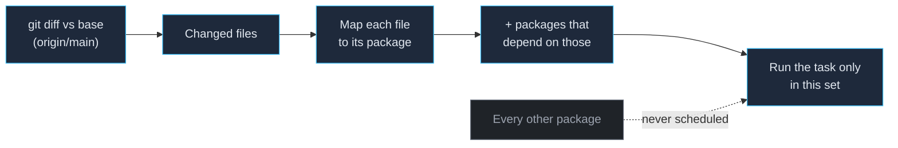

`vx run <task>` is the command you'll type most. By default it runs the
task in the **current package** plus its dependency graph. Flags let you
widen, narrow, and target the run.

## Scope: where the task runs

```bash
vx run build            # current package (by cwd) + its deps
vx run build --all      # every package that declares build
vx run build --filter "@app/*"        # packages matching a filter
vx run test --affected          # only packages changed vs the base branch
```

`--all`, `--filter`, and `--affected` switch vx into a **broad** run;
with none of them, it's a **focused** run on the current package and
streams that task's output live.

## Multiple tasks at once

Pass several task names and vx runs them in one shared graph (so shared
dependencies build only once):

```bash
vx run lint test build --all
```

## Targeting a specific package's task

Use `pkg#task` to address one package directly, regardless of cwd:

```bash
vx run app#build
vx run app#build api#test
```

## Filtering with `--filter`

vx speaks the pnpm/Turborepo filter DSL:

```bash
vx run build --filter "@app/web"      # one package by name
vx run build --filter "@app/*"        # a glob over package names
vx run build --filter "./packages/ui" # by path
vx run build --filter "...@app/web"   # a package and its dependency graph
vx run build --filter "[origin/main]" # packages changed since a git ref
```

The `...` expansion pulls in related packages across the dependency
graph; see the [CLI reference](../../cli/) for the exact table. Combine
multiple `--filter` flags to union selections.

## Selecting only what changed: `--affected`

```bash
vx run test --affected                  # vs the default base branch
vx run test --affected=origin/main      # vs an explicit ref
```

vx asks git which files changed, maps them to packages, and runs the
task only for those packages (and the ones that depend on them). This is
the flag that keeps CI fast — pair it with remote caching and most PRs
touch a handful of packages.

**How `--affected` narrows the run:** it starts from git, not from your
task graph. A PR that touches one file in `@acme/web` selects only
`@acme/web` plus anything that depends on it — the rest of the monorepo
is skipped entirely, never even scheduled. On a big repo that's the
difference between building 3 packages and building 300:



## Forwarding arguments with `--`

Everything after `--` is appended to the task's command:

```bash
vx run test -- --bail --testNamePattern auth
# the child sees:   bun test "--bail" "--testNamePattern" "auth"
```

Forwarded args are part of the cache key, so different args form distinct
cache entries — no stale hits across argument changes.

## Preview without executing

```bash
vx run build --all --dry        # predicted hits/misses + the plan
vx run build --all --dry=json   # same, as JSON
vx run build --graph            # the task graph (text)
vx run build --graph=g.dot      # Graphviz DOT
```

`--dry` is the fastest way to answer "what will this run do, and what's
already cached?" before committing to it. It prints the plan and the
predicted cache verdict per task, then exits without running anything:

```text
would run:
  ◉  @acme/api#build  cache hit (local)         8625b603
  ◉  @acme/ui#build   cache hit (local)         71e5d9a0
  ◉  @acme/web#build  cache hit (local)         42e9b39d

3 task(s) planned, 3 cache hits (3 local).
```

## Useful run flags

| Flag                       | Effect                                                       |
| -------------------------- | ------------------------------------------------------------ |
| `--no-cache` (`--force`)   | Ignore the cache for this run (don't read or write).         |
| `--concurrency <n>`        | Cap parallel tasks (default: your CPU count).                |
| `--output-logs <mode>`     | `full` · `errors-only` · `none` — control per-task logging.  |
| `--summarize[=<path>]`     | Write a per-run JSON summary.                                |
| `--profile[=<path>]`       | Write a Chrome-trace timeline of the run.                    |
| `--frozen`                 | Run from the committed `vx-lock.json` (CI; see below).       |

## Re-run on change: `vx watch`

```bash
vx watch test           # initial run, then re-run on every file change
```

`vx watch` runs the task, then watches the relevant files and re-runs on
change (debounced, with bursty edits collapsed into one run). Great for a
test or typecheck loop. See [Dev & long-running tasks](../dev-tasks/) for
dev servers, which are a different mechanism (`persistent`).

## Other handy commands

```bash
vx show                 # list projects and their tasks
vx show app#build       # the live resolved config for one task
vx info                 # doctor printout: versions, cache size, run stats
vx cache prune --older-than 7d --max-size 5gb
```

## Next steps

- **[Continuous integration](../ci/)** — `--affected` + remote cache in
  CI.
- **[Caching tasks](../caching/)** — why a run hit or missed.
- **[CLI reference](../../cli/)** — every flag, exit code, and the full
  filter table.
