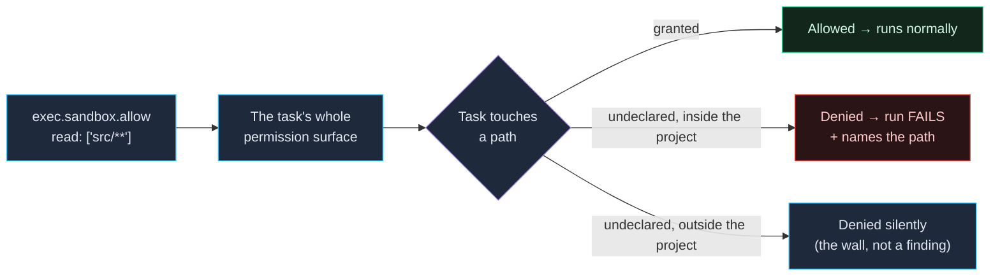

A task can declare an **OS-level sandbox** that restricts what it may read,
write, and reach. It's opt-in per task and deliberately strict: the task
gets exactly what you declare and nothing else, and a run that touches
anything undeclared **fails** rather than silently succeeding.

Use it to catch under-declared inputs (a build secretly reading a file
outside its `inputs`), to stop a tool from phoning home, or to enforce
hermetic builds in CI.

## Why it makes caching trustworthy

A cache is only correct if the declared `inputs` are the *complete* set of
files the task reads. The sandbox turns that assumption into an enforced
boundary. A build that secretly reads a file vx never hashed is denied the
read and the run fails, naming the path. Without the sandbox that build
would pass and cache a result that silently depends on an unlisted file:
the classic **stale-hit** bug.

The sandbox derives nothing from `cache`, and that is deliberate.
`cache.inputs` says what INVALIDATES a task; `sandbox.allow` says what it
may TOUCH. When one was derived from the other, a path added for caching
silently widened the sandbox, and a path the task genuinely needed had to
be laundered through the cache key to get it. Declare both, and let
`--verify=inputs` tell you when they disagree.



## Turn it on

Add a `sandbox` block to any `exec`:

```ts
lint: {
  exec: {
    command: 'eslint .',
    sandbox: { allow: { read: ['.'] } },
  },
  cache: { inputs: { files: ['src/**', '.eslintrc'] }, outputs: { files: [] } },
}
```

- **Omitted** → the command runs unsandboxed (the default).
- **`sandbox: {}`** → opts in with the baseline: reads nothing, writes
  nothing, no network. Not even the project's own directory — which is
  why `read: ['.']` is the first line of almost every real block.
- **`sandbox: { allow: … }`** → the baseline plus what you grant.

There is no inheritance, no workspace-wide default, and no built-in
escapes. One `vx.config.ts` describes a task's full permission surface.

## The one grant vx makes for you

Dependencies. `node_modules` is readable, and so is the real path of every
workspace package linked into it — a project never has to name a sibling
to import what its own `package.json` already depends on. Everything else
is yours to declare.

## Capabilities

`allow`, `deny` and `ignore` share one shape, so the vocabulary that
grants a thing is the vocabulary that silences it:

```ts
sandbox: {
  allow: {
    read: ['.', '~/.cache/ms-playwright', '/etc/ssl/certs'],
    write: ['dist/**', 'coverage'],
    network: ['registry.npmjs.org', '*.sentry.io'],
    systemInfo: ['vfs.disk-space'],
    unixSockets: ['/var/run/docker.sock'],
    localBinding: true,
    machLookup: ['com.apple.FSEvents'],
    pty: false,
    gitConfig: false,
  },
  deny: { network: ['telemetry.example.com'] },
}
```

- **`read` / `write`** — paths or globs, project-relative, absolute, or
  `~`-expanded. A write grant is readable too (`tsc --incremental`
  re-reads its own `.tsbuildinfo`).
- **`network`** — `true` for anywhere, or an allowlist of domains
  (wildcards allowed). `deny.network` is evaluated first.
- **`systemInfo`** — sysctl names a tool probes, like `vfs.disk-space`.
- **`unixSockets`** — `true`, or the socket paths to allow.
- **`localBinding`** — bind and reach localhost ports, for a test that
  boots its own server.
- **`machLookup`** — macOS mach global-names, e.g. `com.apple.FSEvents`
  for a watcher.
- **`pty`** — the task needs a TTY (rare in CI).
- **`gitConfig`** — most build tools shouldn't reconfigure git, so writes
  to `.git/config` are blocked unless you set this.

### Globs

`read` and `write` accept patterns, with one platform difference worth
knowing: on macOS the pattern reaches the policy itself and matches files
created *during* the run; on Linux a grant is a mount, so the pattern is
expanded when the task starts and a file created later is not covered —
grant its directory instead.

On both platforms `<dir>/**` and `<dir>/**/*` collapse to `<dir>`. That
matters more than it sounds: `**/*` matches everything *under* the
directory and never the directory itself, so without the collapse a task
granted `read: ['**/*']` could not list its own cwd.

## The boundary is the project

A task may not leave its own project. Every sibling project and every
workspace-root file is denied, and that denial is **not reported** —
being stopped at the wall is the sandbox working, not a finding. Every
process walks from `/` down to its own cwd, and no config can declare
that away.

What *is* reported is an undeclared touch of the project's own files,
because that is the read that makes a cache key wrong.

To reach a path outside the project on purpose — `~/.npmrc`, `/etc/ssl`,
a workspace-level fixture — declare it and it is granted.

## Fail on violation

- **macOS** — a log monitor records undeclared reads and writes; any
  violation fails the task and the report lists the unique lines.
- **Linux** — bwrap structurally denies undeclared paths, so the child
  typically sees `ENOENT` and fails on its own; `strace`, when present,
  turns that into the same structured report.

A failed task is **never cached**, so a violation can't poison the cache.
When a tool is legitimately noisy, silence the specific pattern with
`ignore` instead of granting it:

```ts
sandbox: {
  allow: { read: ['.'], write: ['dist/vx'] },
  ignore: { write: ['*.bun-build'] },
}
```

## Weaker modes

```ts
sandbox: {
  weakerWhenNested: true,      // Linux: a sandboxed task that itself sandboxes
  weakerNetworkIsolation: true, // macOS: route via host proxy, lower overhead
}
```

Both trade isolation for compatibility; leave them off unless a task
genuinely needs them.

## Requirements & platform support

The sandbox uses [`@anthropic-ai/sandbox-runtime`](https://www.npmjs.com/package/@anthropic-ai/sandbox-runtime),
initialized lazily — only when at least one task in the run declares a
sandbox. On a platform where it isn't available, a task that needs it
fails fast with a clear message (it never runs unsandboxed by accident).

- **Linux** — needs `bubblewrap` (`bwrap`) and `socat` installed; some
  hosts (Ubuntu 24+) restrict unprivileged user namespaces and need an
  AppArmor/sysctl tweak. See `.github/workflows/ci.yml` for the exact CI
  setup.
- **macOS** — uses the system sandbox (seatbelt) plus a log monitor. The
  unified log feeding that monitor is lossy under load, so a violation
  can go unreported; enforcement is unaffected, since the OS denied the
  operation either way.
- **Windows** — unsupported.

## What can't be sandboxed

- **Group tasks** (no `exec`) — there's no command to wrap.
- **Persistent tasks** (dev servers) — the sandbox is silently skipped.
- **A task that itself sandboxes, on macOS.** `sandbox_apply` is refused
  inside a sandboxed process, so seatbelt cannot nest at any permission
  level. `weakerWhenNested` covers the Linux case; there is no macOS
  equivalent. vx's own test suite is the one task in this repo with no
  sandbox block for exactly this reason.

## Next steps

- **[Caching tasks](../caching/)** — what invalidates a task, as opposed
  to what it may touch.
- **[Environment variables](../environment-variables/)** — the child env
  is isolated too.
- **[Configuration reference](../../schema/)** — every `SandboxConfig`
  field.
