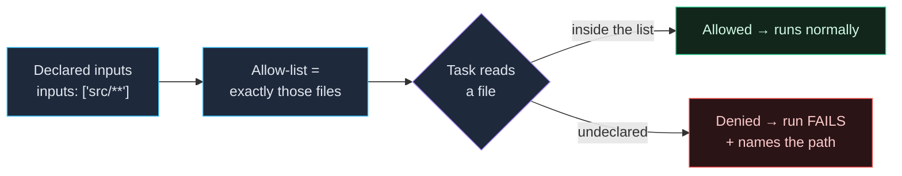

A task can declare an **OS-level sandbox** that restricts what it may read,
write, and reach over the network. It's opt-in per task and deliberately
strict: the task sees exactly what you declare and nothing else, and a run
that touches anything undeclared **fails** rather than silently succeeding.

Use it to catch under-declared inputs (a build secretly reading a file
outside its `inputs`), to stop a tool from phoning home, or to enforce
hermetic builds in CI.

## Why it makes caching trustworthy

A cache is only correct if the declared `inputs` are the *complete* set
of files the task reads. The sandbox turns that assumption into an
enforced boundary: the task's allow-list **is** its declared inputs, so a
build that secretly reads `../../config/secret.json` (a file vx never
hashed) is denied the read and the run fails — naming the exact path.
Without the sandbox that build would pass and cache a result that silently
depends on an unlisted file: the classic **stale-hit** bug. With it, an
under-declared input can't hide.



## Turn it on

Add a `sandbox` block to any task with an `exec`:

```ts
lint: {
  exec: { command: 'eslint .' },
  cache: { inputs: { files: ['src/**', '.eslintrc'] }, outputs: { files: [] } },
  sandbox: {}, // opt in with the baseline
}
```

- **Omitted** → the task runs unsandboxed (the default).
- **`sandbox: {}`** → opts in with the **minimum baseline**.
- **`sandbox: { … }`** → the baseline plus the explicit grants below.

There is no inheritance, no workspace-wide default, and no built-in
escapes. One `vx.config.ts` describes a task's full permission surface.

## The baseline

With `sandbox: {}` and nothing else, a task may:

- **Read** only its resolved `cache.inputs.files`.
- **Write** only the static prefix of its `cache.outputs.files` (a task
  with `outputs: { files: [] }` — like `lint` — can write **nowhere**).
- **Reach no network.**

So declaring a sandbox is also a forcing function for declaring accurate
inputs and outputs — which is exactly what makes caching correct.

## Filesystem grants

Paths are project-relative, absolute (`/tmp`), or tilde-expanded
(`~/.npmrc`). **No globs** — bwrap on Linux only accepts path prefixes.

```ts
sandbox: {
  allowRead: ['node_modules', '~/.cache/ms-playwright', '/etc/ssl/certs'],
  allowWrite: ['/tmp', 'coverage'],
  allowGitConfig: false, // permit writes to .git/config (default false)
}
```

- **`allowRead`** — extra readable paths, unioned with the declared inputs.
- **`allowWrite`** — extra writable paths, beyond the outputs prefix.
- **`allowGitConfig`** — most build tools shouldn't reconfigure git, so
  writes to `.git/config` are blocked unless you set this.

## Network

Blocked by default. Open it coarsely or precisely:

```ts
sandbox: { network: true }            // allow all outbound
sandbox: { network: false }           // block all (the default)

sandbox: {
  network: {
    allowedDomains: ['registry.npmjs.org', '*.sentry.io'],
    deniedDomains: ['telemetry.example.com'], // evaluated first
    allowUnixSockets: ['/var/run/docker.sock'],
    allowLocalBinding: true,           // a test booting a localhost server
  },
}
```

`SandboxNetworkConfig` also has `allowAllUnixSockets`, and (macOS only)
`allowMachLookup`. Domain patterns support wildcards (`*.example.com`,
`*`).

## Process behavior

```ts
sandbox: {
  allowPty: true,                       // task needs a TTY (rare in CI)
  enableWeakerNestedSandbox: true,      // Linux: a sandboxed task spawning a sandboxed task
  enableWeakerNetworkIsolation: true,   // macOS: route via host proxy, lower overhead
}
```

The two `enableWeaker*` flags trade isolation for compatibility; leave
them off unless a task genuinely needs them.

## Fail on violation

The policy is strict on purpose:

- **macOS** — a log monitor records undeclared reads/writes; a non-empty
  violation set after the command fails the task and appends the
  violations to stderr.
- **Linux** — bwrap structurally denies undeclared paths, so the child
  typically sees `ENOENT` and fails on its own.

A failed task is **never cached**, so a violation can't poison the cache.
When a tool is legitimately noisy (e.g. a compiler `statx`-ing many
candidate header paths), silence specific known probes instead of opening
the whole path:

```ts
sandbox: {
  ignoreViolations: {
    cc: ['/usr/lib/gcc'], // ignore violations on paths under here when the command contains "cc"
  },
}
```

## Requirements & platform support

The sandbox uses [`@anthropic-ai/sandbox-runtime`](https://www.npmjs.com/package/@anthropic-ai/sandbox-runtime),
initialized lazily — only when at least one task in the run declares a
`sandbox`. On a platform where it isn't available, a task that needs it
fails fast with a clear message (it never runs unsandboxed by accident).

- **Linux** — needs `bubblewrap` (`bwrap`) and `socat` installed; some
  hosts (Ubuntu 24+) restrict unprivileged user namespaces and need an
  AppArmor/sysctl tweak. See `.github/workflows/ci.yml` for the exact CI
  setup.
- **macOS** — uses the system sandbox + a log monitor.
- **Windows** — unsupported.

## What can't be sandboxed

- **Group tasks** (no `exec`) — there's no command to wrap.
- **Persistent tasks** (dev servers) — they need unrestricted network and
  run indefinitely, so the sandbox is silently skipped.

## Next steps

- **[Caching tasks](../caching/)** — accurate inputs/outputs are the
  sandbox baseline.
- **[Environment variables](../environment-variables/)** — the child env
  is isolated too.
- **[Configuration reference](../../schema/)** — every `SandboxConfig`
  field.
