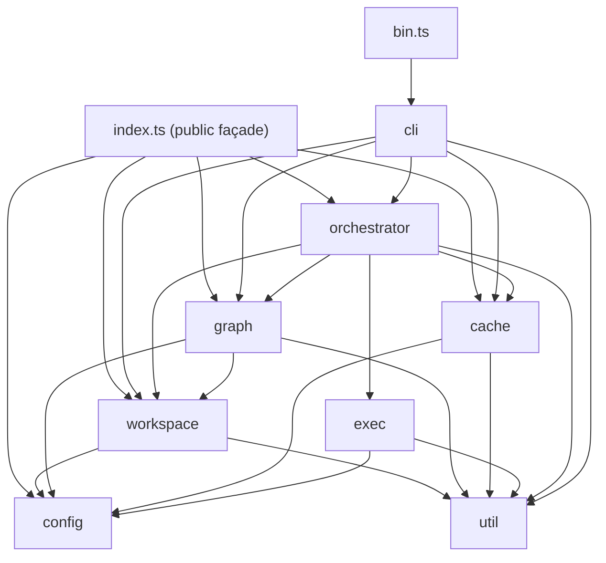

# Architecture

This is the design map of `@vzn/vx`. Read it after
[`README.md`](./README.md) and before the per-module pages.

## Repository shape

The repo is a Bun workspace. The root package is `@vzn/vx` — the core
task runner, and the only thing a plain `vx run` ever needs. Sibling
packages integrate with core exclusively through its public API
(`src/index.ts`, imported as the bare `@vzn/vx` specifier — enforced
by `tests/package-boundaries.test.ts`):

| Package              | What                                                                                             |
| -------------------- | ------------------------------------------------------------------------------------------------ |
| `.` (root)           | `@vzn/vx` — the core runner. Everything below in this doc.                                       |
| `packages/vx-otel`   | `@vzn/vx-otel` — `otel()` telemetry plugin, OTLP/HTTP JSON traces + metrics, zero SDK deps       |
| `packages/vx-reapi`  | `@vzn/vx-reapi` — `reapi()` plugin: remote cache (Bazel AC/CAS) + remote execution over REAPI v2 |
| `packages/vx-github` | `@vzn/vx-github` — `github()` telemetry plugin: the GitHub Actions job summary                   |
| `apps/docs`          | Astro Starlight docs site; imports `docs/**` at build time                                       |

Core never imports a sibling package. The integrations reach core
through two seams: the ~80-symbol public API and the plugin
capabilities (below).

## Module map

Core is organised as **eight modules** plus three root files. A module
is a directory under `src/` with an `index.ts` contract — cross-module
imports go through that contract, never into internal files — or a
single root file when it has no internals to hide. The design and
migration history live in
[`design/module-isolation-2026-06.md`](./design/module-isolation-2026-06.md).

| Module         | Form                        | Contract highlights                                                                                                                              |
| -------------- | --------------------------- | ------------------------------------------------------------------------------------------------------------------------------------------------ |
| `util`         | dir + `index.ts`            | `UserError`, `xxh3*` hashing, `relPosix`/`toPosix`, `ulid`                                                                                       |
| `config`       | single file `src/config.ts` | schema types + `defineProject`/`defineWorkspace`. Root-level: every other module consumes it                                                     |
| `workspace`    | dir + `index.ts`            | discovery, config loaders, lockfile (`vx-lock.json`), package graph, filter DSL, affected, `computeNestedProjectDirs`, workspace fingerprint     |
| `graph`        | dir + `index.ts`            | task-graph builder, two-tier scheduler, dependency-spec parser, `TaskNode`/`TaskOutcome`/`TaskStatus`                                            |
| `cache`        | dir + `index.ts`            | `Cache`, `CacheLayer`, `LayeredCache`, `RemoteCache`, `CachePolicy`, input/output resolution, `CASBackend`/`Digest`. `archive.ts` stays internal |
| `exec`         | dir + `index.ts`            | `runCommand`, `runPersistent`, sandbox runtime, env composition                                                                                  |
| `orchestrator` | dir + `index.ts`            | `run`, `planRun`, `prepareRun`, plugin + telemetry contracts, event bus, metrics queries                                                         |
| `cli`          | dir + `index.ts`            | dispatcher (`run(argv)`) + test-facing parser/formatter re-exports                                                                               |

Root files outside the module set: `bin.ts` (shebang entry),
`index.ts` (public package façade), `version.ts` (the `VERSION`
constant, extracted so `index`/`cli`/`orchestrator` don't form a
cycle through it).

### The orchestrator's file inventory

The orchestrator is the composition module; its files fall into five
layers:

| Layer                  | Files                                                                                                                                                    |
| ---------------------- | -------------------------------------------------------------------------------------------------------------------------------------------------------- |
| Run composition        | `run.ts`, `prepare.ts`, `options.ts`, `plan.ts`, `execute-task.ts`, `task-hash.ts`, `upstream.ts`, `run-context.ts`, `run-artifacts.ts`, `run-report.ts` |
| Cache acceleration     | `remote-cache-setup.ts`, `remote-prefetch.ts`, `stable-keys.ts`, `local-shortcircuit.ts`                                                                 |
| Plugin + telemetry     | `plugin.ts`, `plugin-host.ts`, `telemetry.ts`, `telemetry-host.ts`                                                                                       |
| Events                 | `events.ts` — the run event bus and the serializable `WireEvent` any surface reads                                                                       |
| Presentation + queries | `logger.ts`, `framed-output.ts`, `status-line.ts`, `summary.ts`, `tally.ts`, `colors.ts`, `metrics.ts`, `history.ts`, `predict.ts`                       |



### Allowed dependency matrix (rows import columns, via index only)

|                  | util | config | version | workspace | graph | cache | exec | orchestrator | cli |
| ---------------- | ---- | ------ | ------- | --------- | ----- | ----- | ---- | ------------ | --- |
| **workspace**    | ✓    | ✓      |         | —         |       |       |      |              |     |
| **graph**        | ✓    | ✓      |         | ✓         | —     |       |      |              |     |
| **cache**        | ✓    | ✓      |         |           |       | —     |      |              |     |
| **exec**         | ✓    | ✓      |         |           |       |       | —    |              |     |
| **orchestrator** | ✓    | ✓      | ✓       | ✓         | ✓     | ✓     | ✓    | —            |     |
| **cli**          | ✓    | ✓      | ✓       | ✓         | ✓     | ✓     |      | ✓            | —   |
| **index**        | ✓    | ✓      | ✓       | ✓         | ✓     | ✓     |      | ✓            |     |
| **bin**          | ✓    |        |         |           |       |       |      |              | ✓   |

Composition happens only at `orchestrator` (wires workspace → graph →
cache → exec into a run) and `cli` (wires argv → orchestrator).
`cli → cache` is deliberate — `vx cache prune` / `vx info` open the
cache without a run. `cli → exec` is deliberately absent.

### Enforcement

The matrix is law, not convention: `tests/module-boundaries.test.ts`
scans every import specifier under `src/` and fails the suite when
(rule 1) a cross-module edge isn't in the matrix, or (rule 2) a
cross-module import of a contracted module targets anything but its
`index.ts`. Every directory module is contracted. Tests under
`tests/` are exempt — they may exercise internals. A second guard,
`tests/package-boundaries.test.ts`, pins the cross-PACKAGE law: core
never imports `@vzn/vx-*`; sibling packages import core only via the
bare `@vzn/vx` specifier, and the public-API symbol set is a
deliberate snapshot.

## The plugin capability seam

Core is extended in-process, per run, through `VxPlugin`
(`orchestrator/plugin.ts`) — declared in `vx.workspace.ts` via
`defineWorkspace({ plugins: [...] })`. No auto-discovery. A plugin
changes WHERE a task's command executes (`executor`), never WHAT it is —
the command string is the task (principle #3). Five capabilities:

| Capability  | Kind                      | Contract                                                                                                                                                                                                                                                                                                                                                                                                                                             |
| ----------- | ------------------------- | ---------------------------------------------------------------------------------------------------------------------------------------------------------------------------------------------------------------------------------------------------------------------------------------------------------------------------------------------------------------------------------------------------------------------------------------------------- |
| `executor`  | behavior                  | returns a `TaskExecutor` or declines. Consulted once per run; ALL kept in declaration order; each task is PLACED once before scheduling on the first that may take it (a `remote` executor is skipped for a task pinned local by `exec.remote: false` or a persistent dependency, then `accepts()` decides), and an executor with a `capacity` gets its own scheduler pool; nothing is appended — `localExecutorPlugin()` is declared like any other |
| `config`    | pipeline stage            | edits the workspace config in place, before anything is derived from it                                                                                                                                                                                                                                                                                                                                                                              |
| `project`   | pipeline stage            | edits one loaded project's tasks in place (add / remove / edit); core re-validates after the last plugin, and the key hashes the result                                                                                                                                                                                                                                                                                                              |
| `graph`     | pipeline stage            | edits the task graph in place (`deps`, `requested`, resources); a dangling dep or a cycle is refused naming the plugin                                                                                                                                                                                                                                                                                                                              |
| `commands`  | CLI                       | `{ verb: { description, run(argv, ctx) } }` — consulted for a verb core does not know, when the cwd is inside a workspace declaring the plugin; `vx help` lists them                                                                                                                                                                                                                                                                              |
| `cache`     | behavior                  | returns a `CacheLayer` or declines. ALL kept in declaration order and CHAINED (lookup walks, save reaches all, the first owns the run index); a layer wrapping the local handle subsumes the bare `localCachePlugin()` layer                                                                                                                                                                                                                         |
| `telemetry` | observe-only              | returns `TelemetrySink`(s) or declines. ALL plugins' sinks are additive; a sink receives immutable records and holds no run handle                                                                                                                                                                                                                                                                                                                   |

Plus optional `setup` (fail-fast with a clean `UserError` naming the
plugin) and `teardown`. Consultation lives in `plugin-host.ts`
(executor/cache) and `telemetry-host.ts` (telemetry). Every
capability is resolved inside `prepareRun`/`run()` from the declared list
(`prepared.plugins`). **No defaults:** core applies no plugin on its own —
its executor and cache are plugins under `src/plugins/` (see
`docs/modules/plugins.md`), declared like any other; a workspace that
declares none fails before any task runs, naming the fix. The hard
invariant for observe-only plugins: **a workspace whose telemetry plugins
all decline is byte-identical to one with none declared.** `subscribeTelemetry` returns `undefined` when zero
sinks are contributed, so no bus subscriber is added and no summary
records are built.

The repo's own `vx.workspace.ts` declares `otel()` alongside the local
executor and cache; `otel()` declines without its env, so a plain run stays
zero-overhead.

## The telemetry contract

`orchestrator/telemetry.ts` is THE canonical, versioned export shape
(`TELEMETRY_SCHEMA_VERSION = 1`) every exporter reads — OTel, a
self-hosted analytics service, or a third-party sink:

- **`TelemetryRecord`** — streaming, one per lifecycle event
  (`run.start` / `task.start` / `task.log` / `task.end` / `run.end`).
  `task.log` is opt-in via `TelemetrySink.wants` (large; excluded by
  default). `task.end` carries the denormalized `TaskTelemetry`
  analytics (status, `cacheSource` via `deriveCacheSource`, duration,
  CPU, RSS, wallclock spans).
- **`RunSummaryRecord`** — one per run at run:end: the invocation
  header (`RunContextRecord`: command, cache policy, git/CI/host
  context, tags) plus the full `tasks[]` list. What `POST /v1/ingest`
  and the HTTP exporters primarily speak.

`createTelemetrySource` projects the run event bus into these records
ONCE and fans them to sinks under crash isolation — a throwing sink is
disabled for the run and can never fail or stall it. Sinks are
observe-only **by construction**: their context carries read-only
strings, no bus, no cache handle, no request.

## The event bus

`run()` never calls the terminal renderer directly. It emits
`RunEvent`s (`run:start`, `task:start`, `task:stdout`/`stderr`,
`task:complete`, `run:status`, `run:end`) through an in-process bus
(`orchestrator/events.ts`); the terminal logger is just the always-on
subscriber (`terminalSubscriber`). Fan-out is synchronous and
order-preserving, so terminal bytes are identical to a direct call.
Additional subscribers attach without touching the producer: plugins,
telemetry, any surface a caller wires up through `RunOptions.bus`, and
`wireForwarder` — which projects events into the serializable
`WireEvent` form (ids + decimal-string
ns instead of live node refs and bigints) for anything crossing a
process or socket.

### The cache cluster (`src/cache/`)

The cache is not a single file. It is composed:

- **`cache.ts`** — local cache. `bun:sqlite` metadata index +
  one `<cacheDir>/<hash>.tar.zst` artifact per entry (`stdout` +
  `outputs/<rel>`; metadata lives in the SQLite `entries` row).
  The constructor takes the local slice of the 4-axis `CachePolicy`
  (`{ read, write }`) and gates only the task-artifact `get`/`save`.
- **`layered-cache.ts`** — composes local + a remote layer behind the
  same `CacheLayer` interface, and declares **`RemoteCacheLayer`** —
  the three-call seam (`has`/`get`/`put`) a remote wire client must
  implement. Core ships NO wire client: a plugin provides one via the
  `cache` capability — `@vzn/vx-reapi` (Bazel AC/CAS), a Turbo wire, an
  S3-direct wire all plug in the same way. Read-through (local,
  then remote with hydrate-into-local; `prefetch` + an in-flight map
  guarantee at most one remote GET per key); write-through (local
  sync; the remote upload is a fire-and-forget background task drained
  at end of run, so PUT latency never sits on a task's critical path
  and a remote outage never fails the build).
- **`inputs.ts`** — git-backed input enumeration (`GitFilesCache`),
  glob resolution with hard project boundaries, runtime-command
  resolution, output cleaning.
- **`cas-backend.ts` / `digest.ts`** — the pluggable
  content-addressed-storage seam (`CASBackend`, `Digest`). Reference
  `Memory`/`Fs` backends ship; `cache.ts` is not yet rewired onto it
  (roadmap: R2/S3/REAPI backends).

`prepareRun` constructs the local cache, then resolves the layer: an
explicitly injected `RunOptions.remoteCache` wins outright (composed
into a `LayeredCache`); else a plugin's `cache` capability; else the
bare local cache. `executeTask` consumes the `CacheLayer` surface and
never branches on layering.

### Graph + scheduler

- **`graph/task-graph.ts`** — given the user's requested
  `(project, task)` pairs, walks `dependsOn` to build the full task
  DAG. Detects cycles. Each node carries an `id` (`${project}#${task}`),
  `projectName`, `projectDir`, `taskName`, sorted deps, a
  `requested: boolean`, an optional display-only `surfaced` flag
  (transparent groups), and the resolved task config. `'^task'`
  expansion uses the nearest-holder frontier walk (v19).
- **`graph/scheduler.ts`** — runs the DAG with up to N concurrent
  tasks over **two ready queues**: exec-tier (dep-gated: misses +
  unstable tasks) and restore-tier (confirmed stable local cache
  hits — ready immediately, low priority, worker-slot backfill only).
  Failed tasks mark their dependents `skipped`; independent siblings
  keep running; restore-tier tasks bypass the failed-dep check (their
  key is dep-independent). Priority = transitive-reverse-dependent
  count (bitset closure), optionally overridden by a caller-supplied
  `priorities` map. The scheduler is pure / ignorant of caching —
  it receives an `execute(node, upstream)` callback, an optional
  `priorities` map, and an optional `restoreTier` set.
- **`graph/dependency-spec.ts`** — shared Turbo/Nx micro-syntax parser
  (`'name'`, `'^name'`, `'pkg#name'`, plus `'*'` / `'^*'` / `'!form'`
  for filter contexts). Used by `task-graph` for `dependsOn` edges
  and by `orchestrator/upstream` for `cache.inputs.tasks` filtering.

### Runner

`exec/runner.ts` is the spawn primitive:

- **`runCommand`** — spawn the user's `exec.command` via `Bun.spawn`
  with `shell: true` so users get POSIX shell semantics (`&&`,
  redirects, pipes). Captures stdout/stderr via stream callbacks, awaits
  exit. On exit, calls `resourceUsage()` for `cpuMs` + `peakRssBytes`.
  Stdin is `'ignore'` — no TTY input. Forwarded args (`--`) are
  shell-quoted and appended. `exec.timeout` arms a SIGTERM timer
  (`armTimeout`); an overrun is a real `failed`, never cached.
- **`runPersistent`** — for dev servers + watchers. Spawns the command
  but does NOT await exit. Returns `{ ready, child, readyMs() }`.
  `ready` resolves when a regex match appears in stdout/stderr (or
  immediately when no `readyWhen` is set). If the child exits before
  ready, `ready` rejects. `exec.timeout` bounds the readiness wait.
  The spawn retains no output: chunks reach the caller through the
  live callbacks, and the logger keeps the one bounded tail.

- **`runSandboxed`** (`exec/sandbox-runtime.ts`) — opt-in per-task
  sandboxing via `@anthropic-ai/sandbox-runtime`, activated by a
  `sandbox: {...}` block in the task config. Fail-on-violation policy.
  Without that block, tasks run unsandboxed and under-declared
  `cache.inputs.files` silently produce stale cache hits — the
  standard task-runner tradeoff (Turbo and Nx behave the same).

## Data flow on `vx run <task>`

1. **`bin.ts`** spawns with the user's argv. Forwards everything
   after the binary name to the cli module's `run`.
2. **`cli/index.ts`** dispatches by subcommand: `run`, `watch`,
   `cache`, `lock`, `migrate`, `upgrade`, `show`, `info` (+ `stats`
   alias), `mcp`, `help`, `version`.
3. **`cli/run.ts:parseRunArgs`** parses the argv into a `RunArgs`
   object (including the 4-axis cache policy from `--cache` /
   `--no-cache` / `--force`). Surfaces parse errors as `RunArgs.error`
   so the caller prints + exits before doing any I/O.
4. **`cli/run.ts:runCmd`** resolves the project scope:
   - Bare positionals (`build`) honour `--all` / `--filter` /
     `--affected` / default-to-cwd.
   - Anchored positionals (`pkg#build`) bypass the scope and target
     directly.
   - `--affected[=<base>]` is sugar for an extra filter `[<base>]`
     resolved via git.
   - No positionals + TTY → interactive picker → emits a single
     `pkg#task`.

   Then it calls `run()` directly — a run always executes in THIS
   process. `--dry` / `--graph` short-circuit into `planRun` instead.

5. **`orchestrator/run.ts:run()`** is called with `RunOptions`.
   From here:
   1. `prepareRun` (shared with `planRun`): workspace discovery →
      **scoped** config loading (only in-scope projects + their
      transitive dep closure evaluate; `--frozen` loads from
      `vx-lock.json` after a hash tripwire instead of evaluating) →
      package graph → task-graph build → cache open (local `Cache`
      with the policy's local slice, wrapped by a plugin cache or the
      env-var remote layer) → bulk `git ls-files` populate →
      per-run hash memo.
   2. Plugins install as bus subscribers (`installPlugins` +
      `subscribeEventSinks`), then — only when plugins are declared —
      the run context (git/CI/host, one git spawn) is captured and
      `subscribeTelemetry` wires the telemetry source (no-op when
      every plugin declines).
   3. `markSurfacedDeps(nodes)` marks the display-only surfaced tasks
      for requested groups; the run banner context is built for the
      footer (there is no top-of-run header).
   4. **Remote prefetch** (LayeredCache only): every stable-key
      cacheable task's key is derived up front and the remote GETs
      fire in the background so network latency overlaps execution.
   5. **Local short-circuit** (local-only cache, local reads on, ≥1
      dep edge): derive stable keys + probe local ONCE → `preProbed`
      map (probe reuse) + `restoreTier` set (confirmed hits the
      scheduler may restore ahead of their deps).
   6. `runGraph({ nodes, concurrency, execute, priorities,
restoreTier })` runs the DAG two-tier. Each ready node invokes
      `executeTask({ node, upstream, preProbed?, … })`.
   7. After the graph drains, dependency-only persistent subprocesses
      are `SIGTERM`ed; persistent tasks the user REQUESTED are kept
      alive and the process blocks on them at the very end (after the
      summary), so Ctrl-C reaps them.
   8. Summary + optional artifacts: `--summarize` (per-run JSON),
      `--profile` (Chrome-trace JSON), `--report=markdown` (CLI-side,
      after `run()` returns).
   9. `cache.recordRunBundle({ runs, invocation })` — every real
      task's row plus one invocation header row, in one transaction.
      Group and `aborted` tasks are skipped.
   10. Telemetry summary emit + flush (only when a sink is active),
       background prefetch/upload drain, `cache.close()`, sandbox
       teardown, plugin disposal.
6. **`orchestrator/execute-task.ts:executeTask`** per task:
   1. **Group task short-circuit** — no `exec` → return `success`
      with a hash rolled up from upstream (so downstream caches still
      invalidate when anything beneath the group changes). No I/O.
   2. **Persistent task** — spawn, wait for `readyWhen` match (or
      immediate ready when omitted; `exec.timeout` bounds the wait).
      Stash the child handle in the registry. Return `success` once
      ready.
   3. **Normal task**:
      a. `resolveInputs` — glob `cache.inputs.files` (+
      `workspaceFiles`), git-backed, declared-outputs-excluded,
      nested-projects-excluded. Read host values for
      `cache.inputs.env`; resolve `runtime` / `workspaceRuntime`
      command outputs (deduped per run).
      b. `filterUpstreamHashes` — apply `cache.inputs.tasks` filters
      to the upstream outcomes (default = all upstream).
      c. `hashTaskConfig` (resolved config JSON) +
      project package.json bytes (both memoized per run).
      d. `cache.key({...})` → 16-hex xxHash3 key.
      e. If reads are on: consume the up-front probe when present,
      else `cache.get(hash)`. On hit, `cleanOutputs` +
      `restoreOutputs` (skipped when the on-disk tree already
      matches) + replay captured stdout → `cache-hit` /
      `cache-hit-remote` by entry source.
      f. On miss + writes enabled: `cleanOutputs` first, so stale
      files from a previous build can't survive a fresh exec.
      g. `buildIsolatedEnv` — essential allowlist + `passThrough`
      host values + `define` literals + `<projectDir>/node_modules/.bin`
      prepended to PATH.
      h. `runCommand` (or `runSandboxed`) — `Bun.spawn` shell with the
      command + forwarded args. Captures stdout / stderr / cpu / RSS.
      i. On `exitCode === 0` + writes enabled: `resolveOutputs` + a
      second `computeTaskHash` with `captureInto` (the miss-only
      input-fingerprint capture) + `cache.save` (which persists the
      `entry_inputs` rows in the same transaction). Otherwise nothing
      is cached.
      j. Return a `TaskOutcome` with hrtime spans relative to the
      run's `t=0` anchor.

## The project loader & the config-time imports problem

`workspace/project-loader.ts` loads each `vx.config.{ts,mts,js,mjs}`
via Bun's native `await import()` — no jiti, no esbuild, no
transpile-on-load step. We append a content-hash query string
(`?vx-bust=<xxh3>`) to the import specifier so:

- Same content → same URL → Bun's module cache hits (fast).
- Changed content → new URL → fresh re-evaluation (correct).

The loader validates each task's shape at load time and surfaces a
`UserError` (clean output, no stack) on malformed configs. Among the
rules enforced: `exec.persistent` rejects malformed shapes; a
persistent task with a `cache` block is rejected (no exit to cache);
group tasks (no `exec`) must declare `dependsOn`; `cache.inputs.files`
and `cache.outputs.files` are required when `cache` is set;
`vx.workspace.ts`'s `plugins` array is shape-checked too.

### Config-time imports & the bootstrap problem

`vx.config.ts` is regular TypeScript. It can import anything Bun can
resolve — npm packages, relative files, workspace siblings. This is
the headline UX win over Turbo's static JSON.

It also creates a chicken-and-egg risk: a config that imports a
workspace package whose `main` points to a built `dist/` won't load
until that package is built — but the package's build itself runs
through vx, which needs the config to load first. The same shape
appears with Nx executor plugins (they're npm packages that themselves
need a build).

**vx's pragmatic resolution: rely on Bun's TypeScript-native imports.**
A workspace package consumed at config-load time should resolve to its
`.ts` source, not to a built artifact:

```jsonc
// packages/preset/package.json
{
  "name": "@org/preset",
  // Source-first: Bun runs the .ts directly. No build needed for
  // config-time consumers. (If you also publish to npm, use an
  // `exports` map with `node` / `default` conditions to ship the
  // built JS to external consumers while keeping source for the
  // workspace.)
  "main": "./src/index.ts",
  "exports": {
    ".": {
      "bun": "./src/index.ts",
      "default": "./dist/index.js",
    },
  },
}
```

This sidesteps bootstrap entirely: importing the preset just evaluates
the source on demand.

A **bootstrap mode** — vx detects that an import resolves to a
workspace package and runs its `build` task before continuing — is
technically possible but was rejected:

1. It's recursive: the preset's own `vx.config.ts` could import
   another preset, requiring another bootstrap. Termination requires
   either declaring a special "tooling" preset class that doesn't
   participate, or scanning a fixed prefix of the import graph at
   load time. Either choice leaks a magic rule.
2. It collapses two distinct phases of the run (config load → task
   graph build → task execute) into one mutual recursion, making
   the `--dry` / `--graph` planning paths conceptually fuzzier.
3. Bun's TS-source-import already covers the common case for
   essentially zero cost. Forcing a bootstrap path is a heavyweight
   solution to a problem the runtime already solves.

The tradeoff: if your preset MUST ship as built JS (e.g. a third-party
team publishes only `dist/` and you can't influence the package), you
have two options that don't require bootstrap:

- Build it out-of-band with `tsc` / `tsdown` directly — no vx involved,
  so no cycle.
- Use package.json `exports` conditions to keep `.ts` for workspace
  consumers and built `.js` for everyone else (recommended).

## Replaceability contract

Every module is structured so swapping it touches that module's `.ts`
file plus its consumers' imports — no behavioural ripple. The
[`modules/`](./modules/) docs list each module's public types and
functions; those are the seam. Internal helpers can change.

| Module                        | Replace it to…                                                                     |
| ----------------------------- | ---------------------------------------------------------------------------------- |
| `workspace/workspace.ts`      | Support different workspace layouts (lerna, rush, custom yaml)                     |
| `workspace/project-loader.ts` | Use a non-Bun TS loader (esbuild, swc, native Node tsx)                            |
| `workspace/filter.ts`         | Replace the filter DSL surface (e.g. with Nx `--projects` semantics)               |
| `workspace/affected.ts`       | Replace git-relative selection (Mercurial, Jujutsu, build-graph diff)              |
| `graph/task-graph.ts`         | Different graph-build semantics (priority, time-cost weighting)                    |
| `graph/scheduler.ts`          | Work-stealing, priority queues, distributed execution                              |
| `cache/cache.ts`              | Different local store (per-entry manifests, BLOB-in-SQLite, S3-local)              |
| `cache/layered-cache.ts`      | Different layering (local → regional → global); `RemoteCacheLayer` = the wire seam |
| `cache/cas-backend.ts`        | R2 / S3 / REAPI blob storage beneath the cache                                     |
| `exec/runner.ts`              | Spawn into containers / remote builders                                            |
| `exec/env.ts`                 | Adjust isolation policy (broader allowlist, OS-specific essentials)                |
| `cache/inputs.ts`             | fspy-style auto-input inference (LD_PRELOAD / Detours / unotify)                   |
| `orchestrator/logger.ts`      | Plain-text logger, JSON-line logger, observability emitter                         |
| `exec/executor.ts`            | Route a task's command elsewhere (a plugin `executor` does this without a fork)    |

## Remote-cache subsystem (detail)

The remote cache is **plugin-driven** — core keeps the seams only
(`design/native-cache-wire-2026-07.md`):

1. A plugin's `cache` capability returns a `LayeredCache` composing the
   local cache with a `RemoteCacheLayer` wire client; OR an embedder
   injects a client via `RunOptions.remoteCache` (which wins over the
   plugin consult).
2. `LayeredCache` owns everything wire-independent: policy gating, the
   in-flight de-dup, remote provenance, and the never-fail contract
   (implementations THROW; every throw degrades to a cache miss via
   `onRemoteError`).

Reads try local first, then remote (hydrating local on remote hit);
`run()` also fires a background **prefetch** pass over every
stable-key task so remote latency overlaps execution — at most one
GET per key. Writes go to local synchronously; the remote PUT is a
fire-and-forget background upload drained before `cache.close()`, so
upload latency never blocks the next task. Remote errors fire
`onRemoteError` (logged) but never throw — no remote failure of any
kind may fail the run. `--dry` / `--graph` use a lightweight remote
existence probe (`RemoteCacheLayer.has`) instead of `get` — planning
never downloads or ingests artifacts.

There is no first-party wire: core ships the seam and nothing else.
`@vzn/vx-reapi` fills it with Bazel's ActionCache + CAS, re-hashing
every blob it reads against the digest it was requested under. The **tar
interior** is the local cache's own format — one `stdout` entry plus
`outputs/<rel>` — shipped verbatim; local and remote layers transport
the same tar.zst bytes end-to-end. A Turbo-wire (or any other) cache
is a third-party plugin against the same seam — the recipe lives in
the extensibility guide.

## Run-history analytics

Every `vx run` invocation stamps a ULID (`run_id`) and writes, in one
transaction (`recordRunBundle`), one row per executed task to the
`runs` table plus one header row to the `invocations` table in
`cache.db`. Per-task `runs` columns:

| Column                                    | What                                                                |
| ----------------------------------------- | ------------------------------------------------------------------- |
| `hash`                                    | The task's cache key (also the join key into `entry_inputs`)        |
| `project, task`                           | `${project}#${task}` split                                          |
| `status`                                  | `success` / `failed` / `cache-hit` / `cache-hit-remote` / `skipped` |
| `exit_code`                               | from the child or 0 for cache-hits                                  |
| `duration_ms`                             | wallclock the user perceived (cache-hit = restore op time)          |
| `forward_args`                            | JSON-encoded `--` args (null when none)                             |
| `started_at, ended_at`                    | ms-epoch wallclock                                                  |
| `run_id`                                  | ULID shared across every task in the same invocation                |
| `cpu_ms`                                  | `Bun.spawn` resource-usage CPU (sum of user + system)               |
| `peak_rss_bytes`                          | resource-usage max RSS                                              |
| `wallclock_start_ns` / `wallclock_end_ns` | hrtime ns relative to run t=0                                       |
| `cache_hit`                               | convenience boolean (derivable from status)                         |

The `invocations` header row carries the command line, requested
tasks, compact cache policy, concurrency, flow, duration, task /
failed / hit counts (local vs remote), exit status, git
commit/branch/dirty, CI provider, host/os/arch, vx version, and
`--tag` pairs. A third table, `entry_inputs`, stores one row per
cache-key component per entry (file OIDs, env values, runtime
outputs, upstream hashes, …) — written only on a cache miss inside
the entry-save transaction; it powers the per-component "why did this
re-run?" diff. Group tasks (no `exec`) and `aborted` tasks are not
recorded.

The same per-task wallclock has three surface forms today:

| Surface            | Where                                              | When written          |
| ------------------ | -------------------------------------------------- | --------------------- |
| `runs` table       | `<cacheDir>/cache.db`                              | every `vx run` end    |
| `--summarize` JSON | `<cacheDir>/runs/<run_id>.json` (or explicit path) | opt-in per invocation |
| `--profile` trace  | `profile.json` (or explicit path)                  | opt-in per invocation |

The summarize JSON mirrors the `runs` table shape; the profile JSON is
Chrome-trace format (one `ph: 'X'` event per task with `ts` and `dur`
in microseconds, one `tid` per project so overlapping tasks render on
distinct lanes — open in `chrome://tracing` or
https://ui.perfetto.dev). See
[`cli.md` § Run artifacts](./cli.md#run-artifacts---summarize---profile).

CI scripts that want live numbers can `sqlite3 cache.db` directly, or
use the query layer (`orchestrator/metrics.ts`, exported from
`@vzn/vx`). In **core** there is no HTTP layer and no UI — the cache
file is the API. Anything that wants a dashboard or an HTTP surface
builds it on the `telemetry` capability, out of process; core never
grows a server.

## Design principles

The codebase consistently chooses the same trade-offs:

1. **Explicit over magical.** Defaults exist but are narrow and
   documented. Where ambiguity is dangerous (cache inputs, outputs,
   env isolation), declaration is required. `cache.inputs.files` has
   no default; you state what the task reads.
2. **One command per task.** `exec: { command }` runs a single shell
   command. To chain steps, use shell composition (`&&`, `;`) or split
   into separate tasks linked by `dependsOn`. Splitting gives you
   per-step caching for free.
3. **Shell is the API.** Commands are strings; the shell is the
   integration boundary. No JS-function tasks; no executor plugin
   protocol. Presets are TypeScript helpers that _return_ `TaskConfig`
   objects, evaluated at config-load time. (Run-level plugins exist —
   executor / cache / telemetry — but they never change how a task
   executes.)
4. **Resolved values, not source bytes.** The cache key derives from
   the _evaluated_ config object, not from the file's text. Imports
   and computed values participate naturally.
5. **Cascade through the dependency graph.** Upstream cache changes
   invalidate dependents via folded-in upstream hashes; workspace-
   level changes (lockfile, workspace yaml) cascade to every task
   via the workspace fingerprint.
6. **Fail loud on the contract.** Cache key shape change → bump
   `CACHE_VERSION`. Schema mismatch on the SQLite tables → drop and
   rebuild. Don't try to be clever with stale data.
7. **Trust internal code; validate at boundaries.** The TypeScript
   types are the contract between modules. Only user input (argv,
   config files, env vars) and external APIs (remote cache) get
   runtime shape checks.
8. **No comments restating the code.** Comments exist only when
   removing them would confuse a future reader. They explain _why_,
   not _what_.

## What's intentionally absent

See [`README.md` § Out of scope](./README.md#out-of-scope-by-design)
for the complete list. The most relevant ones for understanding the
architecture:

- **No executor plugins.** Tasks are shell commands, full stop. The
  shipped plugin system (`VxPlugin`) contributes run-level
  infrastructure (executor / cache / telemetry) and can observe, but
  no plugin can define how a task executes. Presets-as-imports cover
  config reuse.
- **No daemon.** Every `vx run` is a fresh process. Workspace
  re-discovery + config evaluation is cheap enough on Bun that a
  daemon doesn't pay for itself (and config loading is scoped to the
  run's dependency closure).
- **No nested task graphs.** The unit of caching, scheduling, and
  reporting is the task. For parallelism, define separate tasks
  linked by `dependsOn`. For chained commands inside one task, use
  shell composition in `exec.command`.
- **No mandatory sandboxing.** Sandboxing is opt-in per task via
  `sandbox: {...}` (SRT-backed). Without it, under-declared inputs
  produce stale cache hits; that's the accepted tradeoff. Turbo and
  Nx behave the same.
