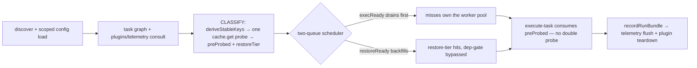
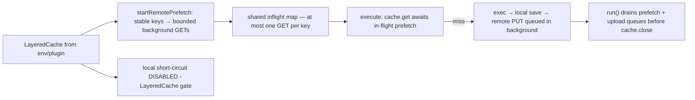
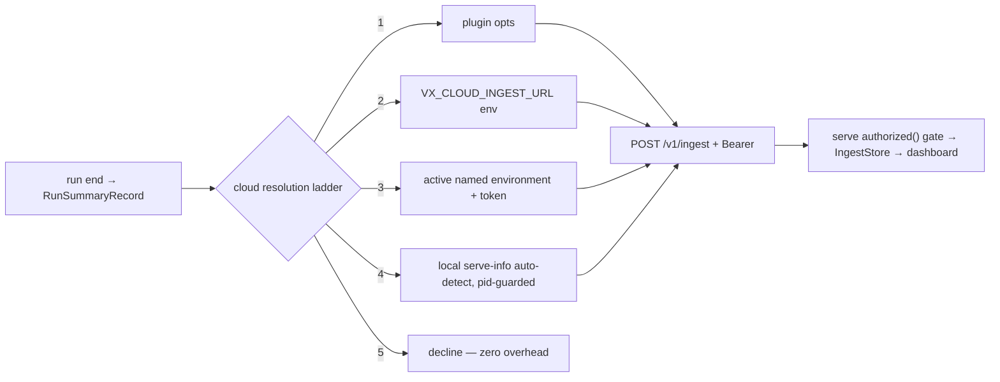

# Consulting review — full-system audit (2026-07)

> **Status:** engagement report (2026-07-02). Synthesizes seven parallel audits
> (git history, top-level docs, module docs, core architecture, cloud
> architecture, UI/UX, test suite) plus `cloud-client-server-2026-07.md`.
> Statuses reflect the fix waves executed during this engagement.

## 1. Executive summary

**Verdict.** The core runner is strong: the June scheduler/cache work
(two-tier restore-ahead, remote prefetch, Tier-3 schema) checks out in code,
module boundaries hold, and the three CLAUDE.md KNOWN-OPEN items are tracked
accurately. The liabilities were elsewhere: **docs had drifted a full
generation** (the canonical caching doc stated the wrong hash algorithm and
cache version; the roadmap doc advertised owner-rejected features),
**vx-cloud was young with two disqualifying gaps** (zero server-side auth
including unauthenticated remote command execution over WS; the ingest store
inheriting the cache's drop-on-upgrade schema gate), the **UI needed
stabilization, not a fifth rewrite**, and **process churn — not code quality —
is the #1 cost driver** (four subsystems built and deleted on main in under a
day each; the dashboard rewritten 4× in one day; a scheduler feature shipped
silently).

**Five most important findings**

| #   | Finding                                                                                                                                                                                                                                  | Outcome                                                    |
| --- | ---------------------------------------------------------------------------------------------------------------------------------------------------------------------------------------------------------------------------------------- | ---------------------------------------------------------- |
| 1   | `vx-cloud serve` had **no server-side auth**: any peer could execute runs via WS with arbitrary cwd, poison `/v1/ingest`, read all analytics (CORS `*`)                                                                                  | FIXED — token gate + `/v1/meta` + environments (`57fb617`) |
| 2   | **IngestStore rode core Cache's drop-on-bump gate** — upgrading a hosted serve silently wipes the team's entire run history                                                                                                              | FIXED — own schema lifecycle, never dropped                |
| 3   | **Process churn**: vx-http lived 54 min, Cytoscape 2h, the CF stack ~6h; dashboard architecture ×4 in 2h; `predictive` shipped wired + exported with zero docs/log entry                                                                 | OPEN — process gates recommended (§6)                      |
| 4   | **Docs contradicted the code and the decision log**: caching.md said SHA-256/v20 (xxh3/v24 real); comparison.md listed shipped features as gaps and rejected features as roadmap; 33 src files undocumented                              | FIXED — full docs unification this engagement              |
| 5   | **Core correctness cluster on the new cache paths**: inflight-join defeated by stale `preProbed`, remote PUTs awaited on the critical path, `--dry` downloading remote artifacts, plugin `teardown`/`flush` documented but never invoked | FIXED — all four                                           |

**Fixed this engagement:** the LayeredCache short-circuit gate; inflight-join
× preProbed; plugin teardown/eventSink flush invocation; background remote
PUTs + end-of-run drain; `--dry` existence probe; prune IN-list chunking;
stats remote-hit counting; persistent buffer cap; mcp VERSION; `config.ts`
telemetry type; cache.ts dangling comments; dead-surface removal
(`PreparedRun.history`, `RunOptions.report`, unconsumed CAS façade exports);
metrics schema drift-guard test; IngestStore schema-wipe; serve auth +
`/v1/meta` + environments/connect; the full docs unification; UI honest
hosted-mode degradation, compare negative-delta, error states, invocation
header on run detail, IA fixes, dead-code removal.

**Remains open (top of the queue):** workspace identity in the telemetry
contract; delegation self-ingest; serve-hosted artifact store; test hygiene
(serve-info pinning, negative paths); kill-or-commit on `predictive`/`vx dev`/
coordinator; process gates.

## 2. State of the system

### Core (`src/`) — **strong, drift contained**

The 2026-06-28 two-tier claims all verify in code (`shouldShortCircuit` gates
exactly as logged post-`cc8c159`; `deriveStableKeys` genuinely shared; no
double probe). The defects found were concentrated where new paths meet old
contracts — inflight dedup × preProbed, awaited remote PUTs, the never-invoked
teardown/flush contract — all fixed. Remaining: the three documented
KNOWN-OPENs (`isOutputsCurrent` staleness, frozen TTY region on signal,
grandchild orphaning) plus one latent trap (undefined upstream outcomes passed
to restore-tier executes).

### Cloud (`packages/cloud`) — **local mode done; remote mode was unsafe, now Phase-1 complete**

Local serve + zero-config plugin push genuinely works. The two critical gaps
(auth, ingest durability) are closed and the environments/connect layer
(design Phase 1) shipped with its test suite. Structural gaps remain: no
workspace identity in the telemetry contract (a machine-level serve mixes
every repo's runs), delegated runs invisible to the ingest store, and the
coordinator/worker skeleton is unwired scaffolding advertised in the public
bin. Isolation is excellent (bare `@vzn/vx` only; light plugin subpath).

### UI (`packages/cloud/ui`) — **sound architecture, drifted content; stabilized, not rewritten**

The JSON-views + catalog architecture is clean and the audit found no reason
for a fifth rewrite. The real problems were honesty and polish: entry-backed
surfaces rendered fake-empty on hosted serves, no error states, a faster run
showing "—", the recorded richest data (invocation header) never rendered —
those shipped. Remaining: status-vocabulary drift in tables, the recorded-run
critical path, predicted-cache overlay, fan-out fetches, component dedup.

### Docs (`docs/`, `docs/modules/`) — **was the worst area; reconciled this engagement**

Two generations: June-28-touched docs were largely accurate; everything older
was wrong somewhere that matters (wrong hash/version, `--cache` "no-op",
"no plugins" ×5 docs, shipped features listed as gaps, rejected features as
roadmap, 33 src files with no module page including the public
plugin/telemetry API, 5 module docs materially wrong). The unification pass
fixed content; the guard tests that would keep it fixed are still open (§7).

### Tests — **large and mostly real; hygiene debt**

1000+ tests; headline features (short-circuit, telemetry, plugins, ingest,
migrate/lock/watch) have real e2e. Debt: two cloud test files clobber the
developer's real `$XDG_RUNTIME_DIR/vx-cloud/serve.json` (the exact
contamination the log blames for watch flakes); byte-exact geometry pins
repinned wholesale 5+ times; 61 fixed-sleep sites; missing negatives
(`--frozen` without lock, serve double-bind); the UI is covered by one layout
unit file and an undocumented manual CDP ritual. The environments/auth code
landed **with** its suite.

### Process / history — **the #1 cost driver**

All 182 commits in a 16-day burst. Well-kept decision log, but direction was
repeatedly discovered through shipped code: same-day build-then-delete
(54 min – 6 h lifespans), 4× dashboard rewrites in 2 hours, three policy
flip-flops inside 24–48 h windows, one silently-shipped scheduler feature,
25% of the month's commits on one landing-page animation. The two decisions
that were put to the owner **before** implementation (staged DAG, custom
theme) never churned — the fix is known and cheap (§6).

## 3. Issues register

Status legend: **FIXED** = fixed this engagement · **OPEN** = remains, with recommendation.

### Critical

| id      | area  | title                                                                                     | status                                                                     |
| ------- | ----- | ----------------------------------------------------------------------------------------- | -------------------------------------------------------------------------- |
| CLOUD-1 | cloud | IngestStore rides Cache drop-on-bump gate — hosted history wiped on upgrade               | FIXED — own schema lifecycle; history is never dropped                     |
| CLOUD-2 | cloud | Zero server-side auth: unauthenticated WS run execution, open ingest, CORS `*`            | FIXED — `--token`/`VX_CLOUD_TOKEN` gate, `/v1/meta`, WS bearer (`57fb617`) |
| UI-1    | ui    | Entry-backed surfaces (cache page, why-diff, entry cards) fake-empty on ingest-only serve | FIXED — capability-driven honest degradation                               |

### High

| id      | area  | title                                                                                                                                                                   | status                                                                               |
| ------- | ----- | ----------------------------------------------------------------------------------------------------------------------------------------------------------------------- | ------------------------------------------------------------------------------------ |
| CORE-1  | core  | Inflight-join carries stale `preProbed` "confirmed miss" — joiner re-executes instead of cache-hitting                                                                  | FIXED — join path drops preProbed; regression test                                   |
| CORE-2  | core  | `VxPlugin.teardown` / `EventSink.flush` documented + validated, never invoked                                                                                           | FIXED — invoked at end-of-run under crash isolation                                  |
| CORE-3  | core  | `LayeredCache.save` awaits remote PUT on the per-task critical path                                                                                                     | FIXED — background PUTs + end-of-run drain                                           |
| CORE-4  | core  | Local short-circuit not gated off for LayeredCache (classify = N remote GETs pre-schedule)                                                                              | FIXED (`cc8c159`)                                                                    |
| CLOUD-3 | cloud | No workspace/repo identity in telemetry contract — machine-level serve mixes every repo's runs                                                                          | OPEN — TELEMETRY_SCHEMA_VERSION 2 + `workspace` field; P1                            |
| CLOUD-4 | cloud | Delegated runs never land in the ingest store — dashboard misses server-executed runs                                                                                   | OPEN — design Phase 2 self-ingest via `RunOptions.telemetrySinks`; P1                |
| UI-2    | ui    | Compare shows "—" when a run got FASTER (negative delta rejected)                                                                                                       | FIXED — signed-duration formatter + semantic delta colors                            |
| UI-3    | ui    | No view binds the `error` status; list pages flash misleading empties while loading                                                                                     | FIXED — error/loading states wired                                                   |
| UI-4    | ui    | Run detail never renders the recorded invocation header (command/branch/commit/CI/tags/policy)                                                                          | FIXED — header card on run detail                                                    |
| UI-5    | ui    | Recorded-run RunViz computes no critical path; defaults to graph view unavailable on hosted serves                                                                      | OPEN — reuse critical-path.ts over recorded spans; flame fallback                    |
| DOCS-1  | docs  | caching.md canonical section: "SHA-256", "vx-cache-v20", pre-v16 layout, stderr caching (real: xxh3, v24, tar.zst)                                                      | FIXED — docs unification                                                             |
| DOCS-2  | docs  | comparison.md lists shipped features as gaps (HMAC, `--output-logs`, stats, OTel, sandboxing) and owner-REJECTED namedInputs/targetDefaults as roadmap                  | FIXED                                                                                |
| DOCS-3  | docs  | README/architecture/patterns/CLAUDE.md layout: "single-package, no plugins" — pre-split by ~130 commits; ~25 src files missing from layout                              | FIXED                                                                                |
| DOCS-4  | docs  | execution.md claims `--cache` is a no-op flag (it is the 4-axis policy flag)                                                                                            | FIXED                                                                                |
| DOCS-5  | docs  | cli.md contradicts three 06-28 serve decisions; false prune-cacheDir claim; self-contradicting gap list                                                                 | FIXED                                                                                |
| DOCS-6  | docs  | 5 module docs materially wrong (index, scheduler, orchestrator, cli, upstream)                                                                                          | FIXED                                                                                |
| DOCS-7  | docs  | 33 src files with no module doc, incl. the public plugin/telemetry/protocol/lockfile/CAS API                                                                            | FIXED — backfilled/indexed in unification                                            |
| TEST-1  | tests | ingest/serve-transports tests clobber the REAL per-user serve.json (unpinned `VX_CLOUD_SERVE_INFO`)                                                                     | OPEN — shared `pinServeInfo()` helper + guard test                                   |
| TEST-2  | tests | Environments/connect/token code had zero tests while uncommitted                                                                                                        | FIXED — landed with unit + e2e + 401 suites (`57fb617`)                              |
| PROC-1  | proc  | Predictive scheduling shipped silently: wired, exported, undocumented, no decision-log entry (violates the project's own logging rule — audit/CLAUDE.md conflict noted) | OPEN — now documented; kill-or-commit: measure on the bench repo or remove the field |

### Medium

| id      | area  | title                                                                                                                            | status                                                                                                  |
| ------- | ----- | -------------------------------------------------------------------------------------------------------------------------------- | ------------------------------------------------------------------------------------------------------- |
| CORE-5  | core  | `plan()` on LayeredCache downloads + ingests every remote hit during `--dry`/`--graph`                                           | FIXED — lightweight existence probe                                                                     |
| CORE-6  | core  | `runPersistent` buffers a dev server's entire stdout/stderr for its lifetime (O(N²) concat)                                      | FIXED — buffers capped at ready-time                                                                    |
| CORE-7  | core  | `config.ts` structural Plugin type omits `telemetry` — inline telemetry-only plugins fail typecheck                              | FIXED                                                                                                   |
| CORE-8  | core  | `Cache.prune` builds unbounded SQL IN-lists (flushAccessed chunks at 900; prune didn't)                                          | FIXED — 900-chunking applied                                                                            |
| CORE-9  | core  | metrics.ts: 1,540 lines of SQL over cache-owned tables, invisible to the boundary test                                           | FIXED (guard) — drift-guard test runs every query against a fresh schema; relocation deferred (§8)      |
| CORE-10 | core  | KNOWN-OPEN confirmed: `isOutputsCurrent` size+mode+second-mtime can leave stale bytes on a hit                                   | OPEN — per-output content hash (P0)                                                                     |
| CLOUD-5 | cloud | Off-machine delegation executes client cwd server-side, no guard, confusing failure                                              | OPEN — `delegate: true` opt-in shipped fences the default; add serve-side cwd/workspace guard (~15 LOC) |
| CLOUD-6 | cloud | `vx dev` hub vestigial: `localDevBackend` unreachable in the normal flow (300+ LOC)                                              | OPEN — decide: cost-gated plugin rung or delete                                                         |
| CLOUD-7 | cloud | Coordinator/worker skeleton drift: streamed logs dropped, dead protocol msg, no cache participation, unwired from resolveBackend | OPEN — mark experimental in `--help`; prune dead surface; real work fenced to P2                        |
| CLOUD-8 | cloud | `/version` leaks the server's workspace path unauthenticated cross-origin                                                        | FIXED — `/version` behind token; pre-auth `/v1/meta` carries name only                                  |
| CLOUD-9 | cloud | `/v1/ingest` validates nothing beyond `run.runId` — `summary.v` never checked                                                    | OPEN — gate on `TELEMETRY_SCHEMA_VERSION` + minimal shape checks (boundary-validation convention)       |
| UI-6    | ui    | Status vocabulary drifts from status.tsx: StatusBadge + DataTable cache cell collapse remote hits into local blue                | OPEN — route every badge/cell through the STATUS map                                                    |
| UI-7    | ui    | Cockpit fetches predicted per-task `cacheStatus` from `/v1/graph` and never renders it                                           | OPEN — pre-run "N/M will restore" overlay; zero backend cost                                            |
| UI-8    | ui    | runWhy fans out one `/v1/diff` fetch per task, unbounded (hundreds of parallel requests)                                         | OPEN — batched `GET /v1/why-all/:runId`                                                                 |
| UI-9    | ui    | Cockpit spreads the whole logs record per stdout chunk — whole-app re-render per chunk                                           | OPEN — per-task store / append buffer; render ANSI                                                      |
| UI-10   | ui    | Duplicated logic: cpuPct ×4, flameEdges ×2, Graph/Flame toggle ×2, duplicate cache-entry cards                                   | OPEN — extract shared helpers                                                                           |
| UI-11   | ui    | IA: landing is Overview not cockpit; Runs page duplicates itself; wrong back link; prunable under Bottlenecks                    | FIXED — IA pass                                                                                         |
| UI-12   | ui    | UnoCSS dynamic `bg-${x}` interpolation + unscanned `.ts` tone maps — safelist coincidences                                       | OPEN — literal class maps; reconcile the two contradictory scanning comments                            |
| DOCS-8  | docs  | 12 one-generation-stale module docs (layered-cache, inputs, config, prepare, logger, cli-run, …)                                 | FIXED                                                                                                   |
| TEST-3  | tests | Byte-exact geometry pins across 4 output suites — 5+ wholesale repin passes on record                                            | OPEN — one geometry-snapshot file; behavior asserts elsewhere                                           |
| TEST-4  | tests | 61 fixed-sleep sites; negative-wait windows; 15 ms timer margins — latent flakes under load                                      | OPEN — promote `waitFor` helper; explicit `forceFloorMs`                                                |
| TEST-5  | tests | Missing negatives: `--frozen` without lock, serve double-bind (the port REVERSAL is unpinned), serve-info units                  | OPEN — ~10 small tests (P0)                                                                             |
| TEST-6  | tests | UI near-zero automated coverage; CDP verification exists only as ritual in design docs                                           | OPEN — script `scripts/ui-e2e.ts`; unit-test layoutStages + critical-path                               |
| PROC-2  | proc  | Same-day build-then-delete on main: vx-http 54 min, Cytoscape 2h04m, CF stack ~6h, `vx insights` ~4.5h                           | OPEN — spike-then-land gate (§6)                                                                        |
| PROC-3  | proc  | Dashboard architecture rewritten 4× in one day; 5th overhaul was queued                                                          | FIXED — stabilized in place this engagement, not rewritten (§8)                                         |
| PROC-4  | proc  | Policy flip-flops in 24–48 h windows (serve port, serve data source, OTel placement) — intent discovered via shipped code        | OPEN — AskUserQuestion/design-doc before topology changes (§6)                                          |

### Low

| id       | area  | title                                                                                                                     | status                                                  |
| -------- | ----- | ------------------------------------------------------------------------------------------------------------------------- | ------------------------------------------------------- |
| CORE-11  | core  | `Cache.stats` omits `cache-hit-remote` — `vx info` undercounts hits                                                       | FIXED                                                   |
| CORE-12  | core  | cache.ts dangling comments: phantom decompression stash, wrong `.tar` extension                                           | FIXED                                                   |
| CORE-13  | core  | Dead surfaces re-accumulating: `PreparedRun.history`, `RunOptions.report`, unconsumed CAS façade exports                  | FIXED — removed                                         |
| CORE-14  | core  | `vx mcp` hardcodes version `0.0.0`                                                                                        | FIXED — uses `VERSION`                                  |
| CORE-15  | core  | Scheduler passes undefined upstream outcomes to restore-tier executes — safe today, latent TypeError trap                 | OPEN — defensive filter or assert + comment             |
| CORE-16  | core  | KNOWN-OPENs confirmed unchanged: frozen TTY region on signal; grandchild orphaning (no process groups)                    | OPEN — tracked accurately in CLAUDE.md                  |
| CLOUD-10 | cloud | `startUiServer` has no production caller since core dropped `--ui`                                                        | OPEN — delete with the `vx dev` decision (CLOUD-6)      |
| CLOUD-11 | cloud | protocol-dist JSON-RPC envelope adapters are test-only (~90 LOC drift risk)                                               | OPEN — remove until a transport consumes them           |
| CLOUD-12 | cloud | Stale strings: worker errors say `vx run --worker`; serve comment claims a removed store switch                           | OPEN — trivial sweep                                    |
| CLOUD-13 | cloud | CloudIngestSink ignores non-2xx — a 401/500 push is indistinguishable from success                                        | OPEN — `if (!res.ok) warn` (matters now auth exists)    |
| UI-13    | ui    | ~200 LOC dead: Sparkline (false comment), Skeleton, listRuns, whyDidThisRerun, getCacheHitSplit, TrendDelta               | FIXED — dead-code removal                               |
| UI-14    | ui    | Cockpit state lost on navigation; task input not persisted; last run not recalled                                         | OPEN — localStorage persistence                         |
| UI-15    | ui    | views/\*.json ~2,900 lines with copy-pasted column sets — drift is structural                                             | OPEN — spec-layer presets                               |
| UI-16    | ui    | 320 KB/86 KB-gzip dist; zod@4 shipped solely for `z.any()` stubs                                                          | OPEN — acceptable; revisit before adding views          |
| DOCS-9   | docs  | VX_CLOUD_PORT undocumented; optimizations row 6 stale command; README docs-map gaps; differentiators overstates `vx lock` | FIXED                                                   |
| TEST-7   | tests | Internals-reaching tests (hand-wired classify, prototype spies) + process-global mutation precludes parallel suite        | OPEN — accept + comment, or refactor when parallelizing |
| PROC-5   | proc  | In-flight scheduler work parked uncommitted 4 days                                                                        | FIXED — committed (`248781c`…`cc8c159`)                 |
| PROC-6   | proc  | 45 of 182 commits (25%) iterating one landing-page animation, PR-per-tweak                                                | OPEN — batch visual iteration (§6)                      |

## 4. Architecture drift log

Drifts between the decision log / docs and code found by the audit, with disposition:

| Drift                                                                                                                                    | Disposition                                                              |
| ---------------------------------------------------------------------------------------------------------------------------------------- | ------------------------------------------------------------------------ |
| Decision log + layered-cache header promise "fire-and-forget" remote uploads; code awaited the PUT per task                              | **Fixed in code** — background PUTs + drain (CORE-3)                     |
| Decision log: restore tier "NOT for LayeredCache runs"; `shouldShortCircuit` never checked the cache type                                | **Fixed in code** (`cc8c159`, CORE-4)                                    |
| Plugin contract documents `teardown`/`flush`; core never called either (the Phase-3 log even recorded the finding, then shipped the lie) | **Fixed in code** — invoked at end-of-run (CORE-2)                       |
| `planRun` documented read-only; remote read-through downloaded + ingested during `--dry`                                                 | **Fixed in code** — existence probe (CORE-5)                             |
| serve.ts comment claimed "authenticated WS run submission"; no auth existed                                                              | **Fixed in code** — auth shipped (CLOUD-2)                               |
| README/architecture/CLAUDE.md layout: "single-package project", "no plugins" — vs monorepo + shipped plugin system                       | **Reconciled in docs**                                                   |
| schema.md/comparison.md advertise namedInputs/targetDefaults — owner-REJECTED per decision log ("don't re-propose")                      | **Reconciled in docs** — deleted                                         |
| caching.md: SHA-256 / v20 / per-hash dirs / stderr caching — vs xxh3 / v24 / tar.zst / stdout-only                                       | **Reconciled in docs**                                                   |
| comparison.md hashing row: "vx always xxh3 raw bytes, loses git interop" — inverted since v20 git blob OIDs                              | **Reconciled in docs**                                                   |
| `predictive` in code with zero docs/log entry — direct conflict with CLAUDE.md's own decisions-get-logged rule                           | **Accepted + documented** for now; kill-or-commit decision owed (PROC-1) |
| Module docs (scheduler/orchestrator/index/cli/upstream) describing implementations 1–3 rewrites old                                      | **Reconciled in docs**                                                   |
| KNOWN-OPENs (`isOutputsCurrent`, frozen TTY region, grandchild orphaning)                                                                | **No drift** — code matches the log exactly; still open                  |
| `vx dev` hub described as the local mirror path; unreachable in the shipped flow                                                         | **Accepted + documented** — rewire-or-remove decision owed (CLOUD-6)     |

## 5. Flows (as they now are)

### 5.1 Local run — two-tier scheduler

Weak points: restore-tier executes receive `undefined` upstream outcomes —
safe only while the hit path never reads them (CORE-15: add an assert);
`isOutputsCurrent` can skip a restore over divergent same-size/same-second
bytes (CORE-10); the inflight-join path must never carry `preProbed` — fixed,
pinned by a regression test.

### 5.2 Remote-cache run — prefetch + background uploads

Weak points: never-fail semantics mean silent degradation to miss — the only
signal is the `onRemoteError` warn (acceptable by design; keep the client-side
non-2xx warn, CLOUD-13); `--dry` now uses the existence probe instead of
read-through; the serve hosts no artifact endpoint yet, so remote cache still
needs separate `VX_REMOTE_CACHE_*` config — closed by roadmap P1 (artifact
store makes `connect` one-URL).

### 5.3 Telemetry / environments push

Weak points: no workspace identity in `RunContextRecord` — two repos' `web#build`
collide in every query (CLOUD-3, the prerequisite for a genuinely multi-project
server); delegated runs bypass this whole path (CLOUD-4 — serve must
self-ingest, design Phase 2); ingest never checks `summary.v` (CLOUD-9);
default ingest dir is workspace-scoped while discovery is machine-scoped
(move to `$XDG_DATA_HOME`, rides CLOUD-3).

## 6. Process findings

Evidence from the history audit (182 commits, June 13–28):

| Pattern                      | Evidence                                                                                                                                                                               |
| ---------------------------- | -------------------------------------------------------------------------------------------------------------------------------------------------------------------------------------- |
| Build-then-delete on main    | `@vzn/vx-http` 54 min; Cytoscape graph 2h04m (+3 deps, 2 committed-dist rebuilds); apps/cloud CF stack ~6h (−1,646 lines); `vx insights` ~4.5h; DuckDB-WASM adopted + dropped same day |
| Rewrite loops                | Dashboard page architecture ×4 in 2 hours (June 27), then Cytoscape adopt/revert, then a 5th overhaul queued                                                                           |
| Policy flip-flops in 24–48 h | Serve port (×2), serve data source (L2 → ingest-only, hours apart), OTel in-core → out-of-core                                                                                         |
| Silent shipping              | `predictive` wired into `run()` inside an abandoned arc, survived the unwind unreviewed, zero docs/log entry                                                                           |
| Commit-noise                 | 45/182 commits on one landing animation, PR-per-visual-tweak; ~8 committed-dist rebuilds in two days                                                                                   |

The counter-evidence is equally clear: the two decisions put to the owner
**before** implementation (staged DAG, custom theme vs DaisyUI) never churned.

**Recommendations (concrete, cheap):**

1. **Design-doc-first for any change > 200 LOC**, any new `packages/*` member,
   any new runtime dependency, or any service-topology change — owner sign-off
   (AskUserQuestion) before code lands on main. Exploration happens in a
   worktree/scratchpad; only the decision merges.
2. **Feature flags off main** — no wired-but-undocumented behavior. A
   config-reachable feature ships documented + logged, or not at all
   (`predictive` is the standing violation).
3. **Decision-log entry per shipped behavior, with commit hashes** —
   reconstructing the serve-source reversal required timestamp archaeology
   across 8 commits.
4. **Docs updated in the shipping commit** — any commit adding a flag, env
   var, config field, or changed default touches `docs/` or states why not
   (would have caught `VX_CLOUD_PORT` and `predictive`).
5. Batch marketing-site iteration into one squashed commit per approved
   design state; stop rebuilding the committed UI dist per tweak (build at
   release/Docker time, keep a CI SPA-builds check).

## 7. Prioritized roadmap

Merged from all audit proposals + `cloud-client-server-2026-07.md` Phases 2–5.

### P0 — correctness / security

| Item                                                                                 | Effort | Value                                        | Depends on         |
| ------------------------------------------------------------------------------------ | ------ | -------------------------------------------- | ------------------ |
| Serve-info test pinning (`pinServeInfo()` helper + guard test) (TEST-1)              | S      | de-flakes suite; stops machine contamination | —                  |
| Ingest boundary validation: `summary.v` + shape (CLOUD-9)                            | S      | protects the now-durable history store       | —                  |
| Serve-side delegation guard: clear error for foreign cwd (CLOUD-5)                   | S      | turns a confusing failure into a diagnosis   | —                  |
| Missing negative tests: frozen-no-lock, serve double-bind, serve-info units (TEST-5) | S      | pins two shipped REVERSALs                   | —                  |
| Scheduler upstream-outcomes assert on restore tier (CORE-15)                         | S      | disarms a latent TypeError trap              | —                  |
| Per-output content hash for `isOutputsCurrent` (CORE-10, oldest KNOWN-OPEN)          | M      | closes the last stale-bytes hole in hits     | CACHE_VERSION bump |

### P1 — competitive

| Item                                                                                                                                                      | Effort | Value                                                                                            | Depends on     |
| --------------------------------------------------------------------------------------------------------------------------------------------------------- | ------ | ------------------------------------------------------------------------------------------------ | -------------- |
| **Artifact store on serve** (`/v8/artifacts`, Turbo wire, CAS/volume) — design Phase 3                                                                    | L      | `connect` becomes one-URL cache + analytics; the single highest-value remote feature             | CLOUD-2 (done) |
| **Delegation self-ingest** + backend local auto-detect — design Phase 2                                                                                   | M      | delegation and analytics compose; needs the one core seam (`RunOptions.telemetrySinks`, ~10 LOC) | own review     |
| **Workspace identity in telemetry contract** (TELEMETRY_SCHEMA_VERSION 2, machine-level ingest dir, UI workspace switcher) (CLOUD-3)                      | M      | server becomes genuinely multi-project                                                           | —              |
| UI: recorded critical path + predicted-cache overlay + batched why-all (UI-5/7/8)                                                                         | M      | run detail strictly richer than Turbo's, competitive with Nx Cloud, zero schema change           | —              |
| Kill-or-commit sweep: `predictive` (measure or remove), `vx dev`, coordinator experimental labeling, CAS/protocol-dist remnants (PROC-1, CLOUD-6/7/10/11) | S      | converts ~1,000 LOC of archaeology into intentional API                                          | owner call     |

### P2 — platform

| Item                                                       | Effort | Value                                   | Depends on                     |
| ---------------------------------------------------------- | ------ | --------------------------------------- | ------------------------------ |
| Persistent coordinator + queueing (design Phase 4)         | L      | always-on service; cross-run fairness   | P1 self-ingest; own design doc |
| Workers participate in the cache + artifact flow-back      | L      | distributed builds with outputs correct | artifact store                 |
| CAS input shipping (design Phase 5, core-cloud-split §3.3) | L      | dirty trees / untrusted workers         | coordinator + artifact store   |
| Multi-tenancy, org tokens, scopes                          | L      | SaaS posture                            | coordinator + auth             |

### P3 — polish

| Item                                                                                                                           | Effort |
| ------------------------------------------------------------------------------------------------------------------------------ | ------ |
| Output-suite geometry/behavior split; `waitFor` sleep replacement (TEST-3/4)                                                   | M      |
| CDP harness as `scripts/ui-e2e.ts` + unit tests for layoutStages/critical-path (TEST-6)                                        | M      |
| Docs guard tests: version-string drift + module-docs coverage (mirrors module-boundaries)                                      | S      |
| UI dedup (cpuPct/flameEdges/toggle), status-map enforcement, UnoCSS hygiene, spec presets, cockpit stores (UI-6/9/10/12/14/15) | M      |
| metrics.ts relocation into the cache module (guard test already pins it)                                                       | M      |

## 8. What was explicitly NOT done, and why

1. **metrics.ts was not relocated.** The audit's real risk — silent schema
   drift between `cache.ts` DDL and 1,540 lines of SQL in another module —
   is closed by the drift-guard test (every query runs against a
   freshly-created schema in the gate). Moving the module across the
   dependency matrix is a churn-heavy refactor with zero behavior change;
   deferred to P3 with the guard as the safety net.
2. **The UI was NOT rewritten a fifth time.** The audit's verdict is that the
   architecture (pure-JSON views over one catalog, dependency-free charts) is
   sound; the failures were data honesty, error states, IA, and drift — all
   fixable in place, and fixed in place. A fifth rewrite would have repeated
   the engagement's #1 process finding. The queued "UX overhaul" task should
   be re-scoped to the remaining OPEN UI items, not a re-architecture.
3. **Orchestration phases stayed fenced to the roadmap.** Per the design
   doc's own discipline (§7.3: "Phase 1 ships NO orchestration work"), only
   environments/connect/auth shipped. The persistent coordinator, worker
   cache participation, input shipping, and multi-tenancy each get their own
   design review before code — the coordinator/worker skeleton is labeled
   for what it is rather than half-upgraded.
