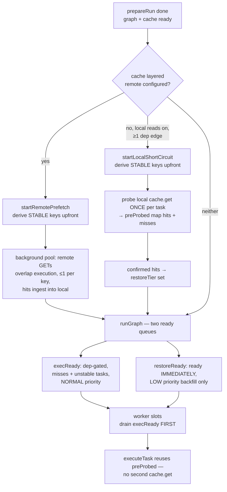
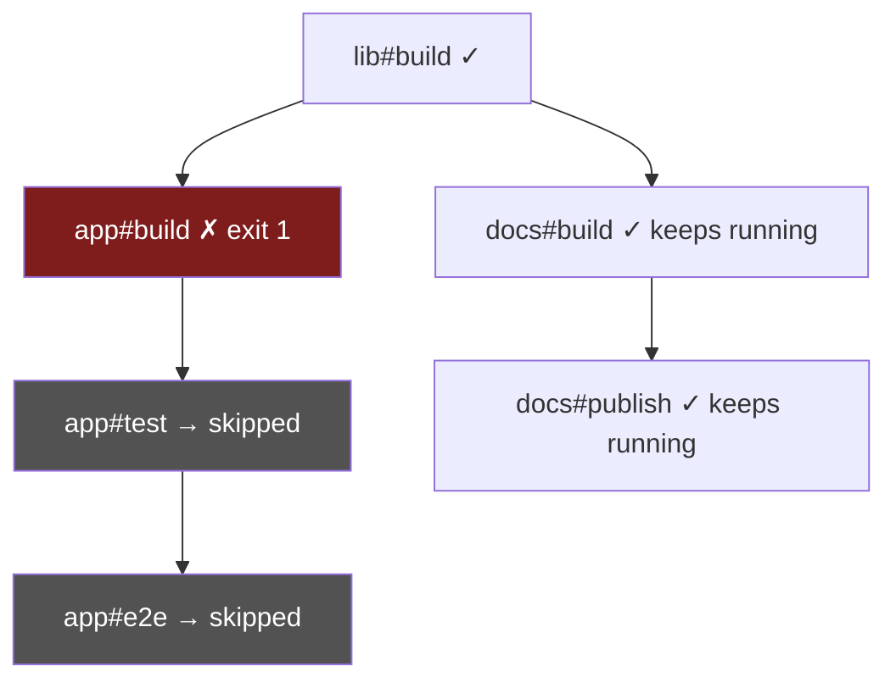
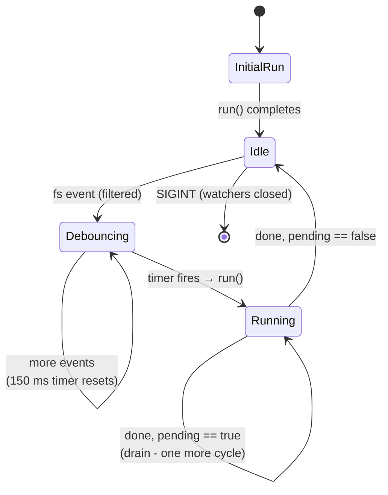
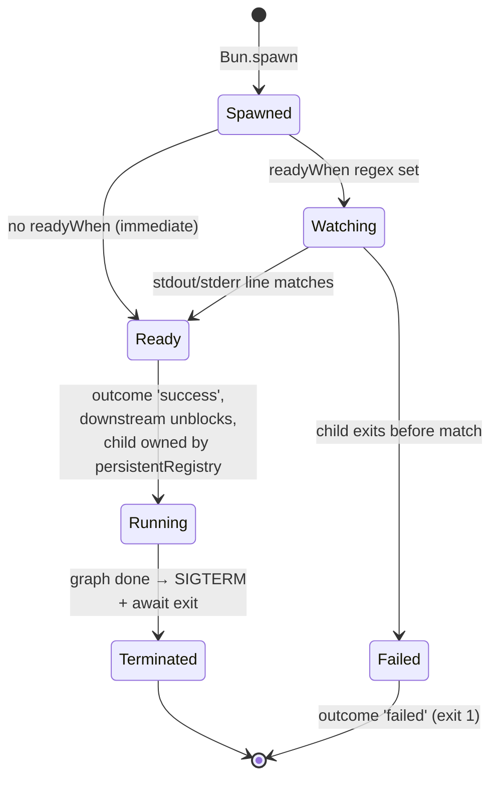
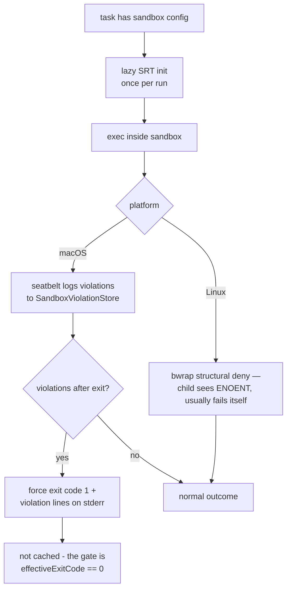
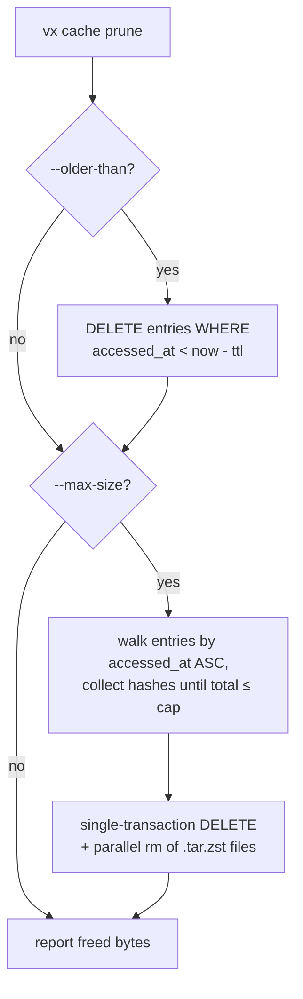
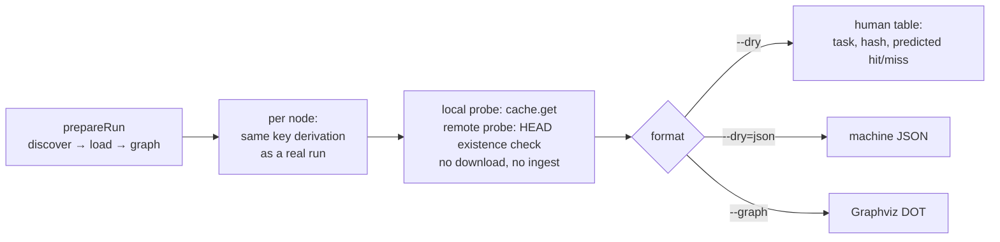

# Execution flows, scenario by scenario

Companion to [`execution.md`](./execution.md) (prose lifecycle) and
[`caching.md`](./caching.md) (key derivation). Each section is one
end-to-end scenario as a diagram, with the source files that own each
step. Diagrams are Mermaid — GitHub renders them inline.

## 1. Cold run — cache miss → exec → save

The path a task takes the first time it runs (or after any input
changed). Owners: `orchestrator/execute-task.ts` (sequence),
`cache/inputs.ts` (enumeration), `cache/cache.ts` (key + save),
`exec/runner.ts` (spawn).

```mermaid
sequenceDiagram
    participant S as scheduler
    participant X as execute-task
    participant I as cache/inputs
    participant C as CacheLayer
    participant R as exec/runner

    S->>X: execute(node, upstream)
    X->>I: resolveFiles(inputs.files)
    Note over I: git ls-files (workspace-root snapshot,<br/>partitioned per project) + Bun.Glob match,<br/>nested projects + declared outputs excluded
    X->>X: hashTaskConfig + hashProjectPackageJson<br/>+ filterUpstreamHashes + env values
    X->>C: key(...) → 16-hex xxh3
    X->>C: get(hash)
    C-->>X: null (miss)
    X->>I: cleanOutputs(outputs.files)
    Note over I: declared outputs wiped so the tree ends<br/>bit-identical to what gets cached
    X->>R: runCommand(command, env, projectDir)
    R-->>X: exitCode, cpuMs, peakRss (streams live via logger)
    alt exitCode == 0 and writes enabled
        X->>X: re-fold key with captureInto<br/>(per-component input fingerprint, miss-only)
        X->>C: save({hash, outputs, stdout, inputComponents})
        Note over C: pack tar.zst (stdout + outputs/*) →<br/>tmp file → atomic rename → one SQLite txn<br/>(entries + output_files + entry_inputs)<br/>(+ background remote PUT when layered)
        X->>I: markOutputsChanged(written rel paths)
        Note over I: the project's git snapshot notes the changed<br/>paths — a downstream task re-spawns git only<br/>when its input globs can actually match them
    else exitCode != 0
        Note over X: nothing cached; failure streams live,<br/>dependents get skipped by the scheduler
    end
    X-->>S: TaskOutcome
```

## 2. Warm run — local cache hit

Owners: `cache/cache.ts:get` + `isOutputsCurrent`, `cache/tar.ts:extractOutputs`.

```mermaid
sequenceDiagram
    participant X as execute-task
    participant C as Cache (local)
    participant T as cache/tar

    X->>C: get(hash)
    C->>C: SELECT entries row (bumps accessed_at)
    C-->>X: CacheEntry {outputFiles, source: 'local'}
    X->>X: cleanOutputs? No — restore path decides
    X->>C: restoreOutputs(projectDir, entry)
    C->>C: isOutputsCurrent? stat each output_files row<br/>(size + mode + floor-to-second mtime)
    alt every output already current
        Note over C: skip extraction entirely —<br/>the warm-warm path costs N stats, zero writes
    else any output stale/missing
        C->>C: wipe declared outputs (cleanOutputs)
        C->>T: extractOutputs(tar bytes → outputs/*)
        Note over T: path-traversal + symlink-clobber guards;<br/>utimes restores header mtimes so the next<br/>run's stat-check passes
    end
    X->>X: replay cached stdout through logger
    X-->>X: status 'cache-hit', exit 0
```

## 3. Remote hit — download → ingest → restore

Owners: `cache/layered-cache.ts`, `cache/remote-cache.ts`. Requires
`VX_REMOTE_CACHE_URL` + `VX_REMOTE_CACHE_TOKEN`
(`orchestrator/remote-cache-setup.ts`).

```mermaid
sequenceDiagram
    participant X as execute-task
    participant L as LayeredCache
    participant LC as Cache (local)
    participant RC as RemoteCache (Turbo wire)

    X->>L: get(hash, {taskId, command})
    L->>LC: get(hash)
    LC-->>L: null (local miss)
    L->>RC: GET /v8/artifacts/:hash
    RC-->>L: 200 + tar.zst bytes + x-artifact-duration
    L->>LC: ingest(hash, bytes, {taskId, command, durationMs})
    Note over LC: same writeArtifactAndIndex path save() uses —<br/>bytes validated, then atomic rename + SQLite row.<br/>The local and remote layers carry identical bytes.
    L-->>X: CacheEntry {source: 'remote'}
    X->>X: restore as in flow 2; status 'cache-hit-remote'
```

On any remote error (timeout, non-404 failure, corrupt body) the
layered cache reports through `onRemoteError` and the task degrades
to a miss — remote problems never fail a run.

The write side is the mirror image: `LayeredCache.save` writes the
local artifact synchronously, then uploads the same bytes verbatim
(`PUT /v8/artifacts/:hash`) as a **fire-and-forget background task**
— the task's outcome never waits on upload latency; `run()` drains
all in-flight uploads before closing the cache. Errors route to
`onRemoteError`.

In practice most remote hits never reach the lazy path above: the
**prefetch** pass (flow 3b) has already ingested them by the time
`execute-task` probes.

## 3b. Run pipeline — classify, prefetch, two-tier schedule

Owners: `orchestrator/run.ts` (wiring),
`orchestrator/stable-keys.ts` (the shared stability gate),
`orchestrator/remote-prefetch.ts`,
`orchestrator/local-shortcircuit.ts`, `graph/scheduler.ts`.



The stability gate is shared: a task whose input globs could match a
same-project upstream's declared outputs (or whose workspace-file
inputs overlap an upstream's workspace outputs) has a preliminary key
and is never probed early — it stays dep-gated with the always-correct
lazy read-through. Restore-tier tasks also bypass the failed-dep→skip
check (their key is dep-success-independent). Any error in
classification degrades to the plain schedule.

## 4. Failure propagation through the graph

Owner: `graph/scheduler.ts`. The scheduler distinguishes _transitive
dependents_ (skipped) from _independent siblings_ (keep running) —
Turbo's middle `--continue` setting.



Skipped outcomes carry exit code 1 and `durationMs: 0`; nothing is
spawned for them. The run's `ok` is false; the summary lists the
failed task IDs (not the skipped ones — the root cause is what you
fix).

## 5. `vx watch` — debounce + reentrancy

Owner: `cli/watch.ts`. One recursive `fs.watch` per project dir plus a
non-recursive watch of the workspace root (lockfile edits). Path
filter drops `node_modules`, `.git`, `.vx`, `*.tsbuildinfo`, editor
swap files.



The `pending` flag is the reentrancy guard: events landing mid-cycle
collapse into exactly one follow-up run, never a queue.

## 6. Persistent task lifecycle

Owner: `exec/runner.ts:runPersistent` + the orchestrator's
`persistentRegistry`. Persistent tasks (`exec.persistent`) gate
downstream work on readiness, then live until the rest of the graph
finishes. `cache + persistent` is rejected at load time.



## 7. Sandboxed task — violation → failure

Owner: `exec/sandbox-runtime.ts` (SRT wrapper). Activation is
per-task (`sandbox: {...}`), no workspace inheritance. Baseline
policy: read = resolved `cache.inputs.files`, write = static prefixes
of `cache.outputs.files`, deny-read = workspace root; user config
adds explicit allow/deny lists.



## 8. `vx cache prune` — TTL + LRU

Owner: `cli/cache.ts` + `cache/cache.ts:prune`. Both bounds can
combine; eviction is one SQL transaction (CASCADE clears
`output_files`) plus parallel artifact unlinks.



`accessed_at` is bumped on every `get`, so LRU reflects real use —
including hits from `--dry` plans.

## 9. `--dry` / `--graph` — the plan path

Owner: `orchestrator/plan.ts` + `plan-format.ts`. Shares
`prepareRun` with the real path, probes the cache for predicted
hits, executes nothing, and writes nothing except the `accessed_at`
bump inherent to probing.



Because the plan path and `execute-task` share the same key
derivation helpers, a predicted hit is exactly what the real run
would see (same process, same env, same tree). Against a remote
layer, planning uses a lightweight existence probe — a predicted
`hit-remote` moves no artifact bytes.
