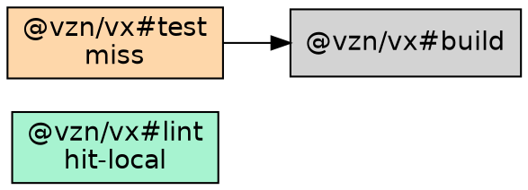

# `src/orchestrator/plan-format.ts` — plan → text / JSON / DOT

## Purpose

Format a `RunPlan` (from [`plan.md`](./plan.md)) into one of three
output formats: human-readable text, structured JSON, or Graphviz
DOT. Pure functions; no I/O.

## Public surface

```ts
export function formatPlanText(plan: RunPlan): string
export function formatPlanJson(plan: RunPlan): string
export function formatGraphDot(plan: RunPlan): string
```

All three return a complete string with a trailing newline; the
caller writes it to stdout or a file (`Bun.write(path, out)`).

## `formatPlanText`

Compact list of tasks with status symbols, one per line:

```
would run:
  ◉  @vzn/vx#format-check  cache hit (local)         02bfe8a9
  ↓  @vzn/vx#lint          cache hit (remote)        d66cfed2
  ▶  @vzn/vx#test          cache miss — would exec   68595e49
  ·  @vzn/vx#dev           no-cache — opts out
  ○  @vzn/vx#ci            group (5 deps)

3 task(s) planned, 2 cache hits (1 local, 1 remote), 1 would run.
```

Status symbols:

| Symbol | Status       |
| ------ | ------------ |
| `◉`    | `hit-local`  |
| `↓`    | `hit-remote` |
| `▶`    | `miss`       |
| `·`    | `no-cache`   |
| `○`    | `group`      |

`description` (when set on the task config) renders on a second
indented line under the cache-status row.

## `formatPlanJson`

JSON-friendly object:

```json
{
  "tasks": [
    {
      "id": "@vzn/vx#lint",
      "project": "@vzn/vx",
      "task": "lint",
      "description": "oxlint with tsgolint-backed type-aware checks",
      "hash": "d66cfed2...",
      "cacheStatus": "hit-local",
      "deps": []
    }
  ]
}
```

For tooling — `vx run <task> --dry=json | jq …`.

## `formatGraphDot`

Graphviz DOT with status-colored nodes:



Fill colors by predicted status: green (local hit), sky blue (remote
hit), orange (miss), gray (no-cache), fuchsia (group). Edges
unstyled.

```sh
vx run ci --graph | dot -Tsvg > graph.svg
vx run ci --graph=graph.dot
```

## Tests

`tests/plan-format.test.ts`:

- Each formatter produces stable strings for a fixture plan.
- Status symbol mapping is exhaustive.
- Group rendering is special-cased in text but appears in JSON+DOT.
- Description renders correctly.
- Empty plan yields valid-but-minimal output for each format.
