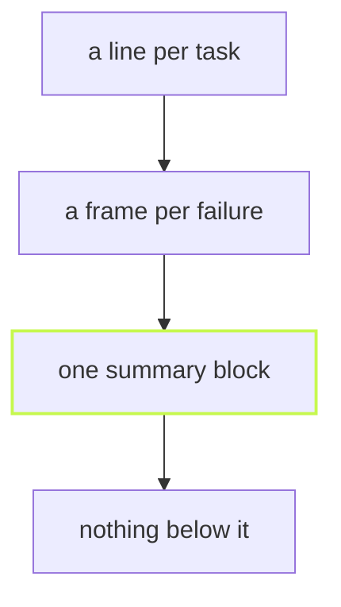

Eight tasks in four projects, run in parallel, used to mean eight logs
cut into each other. vx prints a run in three parts, and each part has
one job.

## A line per task

While the run works, each task gets one line: its glyph, its time, its
outcome and whether the cache had it.

```sh frame="terminal"
$ vx run test --all
 ⏺︎   310ms success miss     @demo/ui#build
 ◼︎     3ms failed  miss     @demo/ui#test
 ⏺︎   308ms success miss     @demo/docs#build
 ⏺︎   310ms success miss     @demo/web#build
 ⏺︎   207ms success miss     @demo/docs#test
 ⏺︎   207ms success miss     @demo/web#test
```

## A frame for what failed

A failed task's log comes back whole, in its own frame, with the command
that ran. No other task's output is woven into it.

```sh frame="terminal"
┌─ @demo/ui#test > failed (exit 1)

$ echo "expected 2, got 3" && exit 1

├─ OUTPUT ──────────────────────────────────────────────────

expected 2, got 3

└─ @demo/ui#test ── (3ms) failed (exit 1)
```

Ask for every log with `--output-logs full`: each task still gets its
own frame, in the order tasks finish.

## One summary, last

```sh frame="terminal"
─ vx 0.0.0 ───────────────────────────────────────────────────
  projects  ▰▰▰▰▰▰▰▰▰▰▰▰▰▰▰▰▰▰▰▰▰▰▰▰▰▰▰▰▰▰▰▰▰▰▰▰▰▰▰▰▰▰▰▰▰▰▰▰▰▰
            4 in run · 4 total
  tasks     ▰▰▰▰▰▰▰▰▰▰▰▰▰▰▰▰▰▰▰▰▰▰▰▰▰▰▰▰▰▰▰▰▰▰▰▰▰▰▰▰▰▰▰▰▰▰▰▰▰▰
            8 success · 8 total
  cache     ▰▰▰▰▰▰▰▰▰▰▰▰▰▰▰▰▰▰▰▰▰▰▰▰▰▰▰▰▰▰▰▰▰▰▰▰▰▰▰▰▰▰▰▰▰▰▰▰▰▰
            8 up-to-date

  info      4 workers · local cache
  time      23ms
  result    8 tasks · all cached · 2.12s saved · 23ms
```

That is the same eight tasks a second time, all cached: 23 ms, and the
summary says how much work the cache saved.



The summary is the last thing on screen, so the answer to "did it pass?"
is always where your eyes land. On CI the frames fold into log groups,
and `vx last` replays the summary later.

Learn more: [Framed output](https://vznjs.github.io/vx/features/framed-output/)
and [Run summary](https://vznjs.github.io/vx/features/run-summary/).
