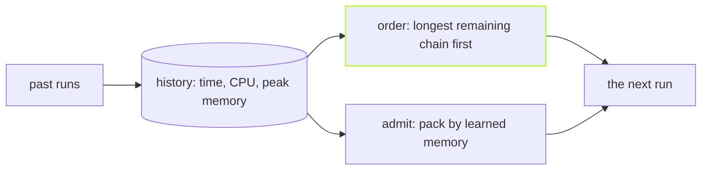

The core scheduler orders tasks by the shape of the graph: a task that
many others wait on goes first. That is a good guess with no data. After
a few runs there is data, and `@vzn/vx-schedule-history` uses it.



## Turn it on

```ts
// vx.workspace.ts
import { defineWorkspace } from '@vzn/vx/config'
import { scheduleHistoryPlugin } from '@vzn/vx-schedule-history'

export default defineWorkspace({ plugins: [scheduleHistoryPlugin()] })
```

It reads the last 20 runs from the cache's own database, once per run.
A broken read warns and falls back to the core order, so the plugin can
never fail a build.

## The longest chain first

Each ready task is weighted by its own median time plus the longest chain
of tasks still waiting behind it. A slow docs build that sits at the end
of the graph starts early, instead of last on an otherwise idle machine.
A fresh CI runner has no history yet, so `assume` names durations for the
tasks you know are slow:

```ts
scheduleHistoryPlugin({ assume: { '@demo/docs#build': 30_000 } })
```

A recorded median always wins over an assumption.

## Packed by real memory

Every execution records its CPU time and peak memory. The plugin
reserves each task's largest peak in the window plus 25% headroom, and
starts a task only while everything running beside it fits in the
machine's memory, capped by the container's limit. Two memory-hungry test
suites stop starting at the same moment and crashing a small runner.

A cache hit carries the usage of the run that produced it. So a runner
that restored a task from a remote cache knows its reservation without
ever executing it.

## See what it learned

```sh frame="terminal"
$ vx history
history: last 20 runs · budgets 4 cores (the default worker count; --concurrency changes it per run) · 13680 MB (what this process may use)
  task              runs      p50  peak rss    cpu  reserves
  @demo/api#build     13    314ms         —   0.0×  —
  @demo/api#test       5    203ms         —   0.0×  —
  @demo/docs#build    10    308ms         —   0.0×  —
  @demo/docs#test      3    204ms         —   0.0×  —
  @demo/ui#build      15    310ms         —   0.0×  —
  @demo/ui#test        3    205ms         —   0.0×  —
  @demo/web#build     14    308ms         —   0.0×  —
  @demo/web#test       5    203ms    587 MB   0.4×  768 MB
```

`web#test` allocates 600 MB, so it reserves 768 MB. The light tasks
reserve nothing and run freely. `--format json` gives the same table for
scripts, and `reservations` declares a size by hand for what history
cannot know yet.

It orders and admits. It never changes what runs or how a task is keyed.
Every option is in the
[vx-schedule-history README](https://github.com/vznjs/vx/tree/main/packages/vx-schedule-history#readme).
