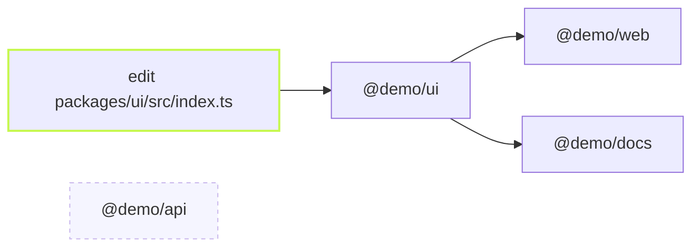

A pull request that touches one library should not test forty apps.
`--affected` runs a task only in the projects a change reaches: the ones
whose files changed, and every project that depends on them.

```sh frame="terminal"
vx run test --affected
```

## What it picks

Four packages. The branch edits `ui`. `web` and `docs` depend on `ui`;
`api` depends on nothing.



Ask for the plan first. `--dry` prints it and runs nothing:

```sh frame="terminal"
$ vx run test --affected=master --dry
would run:
  ▶  @demo/docs#test   cache miss — would exec   067839a7  ~216ms
  ▶  @demo/docs#build  cache miss — would exec   b5134b6e  ~313ms
  ▶  @demo/ui#build    cache miss — would exec   6a36fb4c  ~320ms
  ▶  @demo/ui#test     cache miss — would exec   d5097182  ~209ms
  ▶  @demo/web#test    cache miss — would exec   a5787dc7  ~216ms
  ▶  @demo/web#build   cache miss — would exec   731116aa  ~311ms

6 task(s) planned, 6 would run.
```

`api` is not in it. The run shows the same set, three of four projects:

```sh frame="terminal"
$ vx run test --affected=master
 ⏺︎   313ms success miss     @demo/ui#build
 ⏺︎   205ms success miss     @demo/ui#test
 ⏺︎   309ms success miss     @demo/web#build
 ⏺︎   311ms success miss     @demo/docs#build
 ⏺︎   204ms success miss     @demo/web#test
 ⏺︎   205ms success miss     @demo/docs#test

─ vx 0.0.0 ───────────────────────────────────────────
  projects  3 in run · 4 total
  tasks     6 success · 6 total
```

## Which base

`--affected` compares against a git base. Name one (`--affected=main`),
or let vx pick: the workspace's `affectedBase`, else `origin/HEAD`, else
`main` or `master`, else `HEAD~1`. On a pull request, set
`affectedBase` once in `vx.workspace.ts` and every run agrees.

It is sugar for a filter, `--filter "...[<base>]"`: the projects changed
since the base, and their dependents. So it combines with any other
filter, and `vx show --affected` lists the projects without running.

## Why the cache still matters

`--affected` decides which projects are in the run. The cache key still
decides which tasks execute. A file outside every task's inputs, a
README say, puts its project in the set, and every task there is a hit.

## The edges are task edges

vx follows the task graph, not only `package.json`. A task that reads
another project's output through `dependsOn` is downstream of it, even
without a package dependency. So the set is what your tasks really
depend on.

Learn more: [the CLI reference](../../cli/#--affectedbase) and
[Filters](https://vznjs.github.io/vx/features/affected/).
