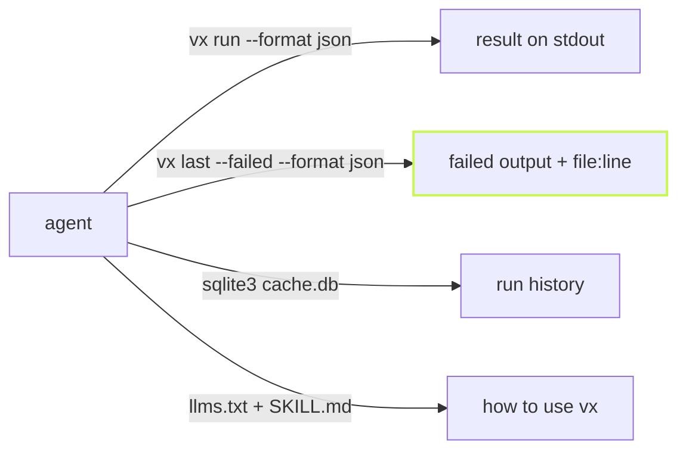

A coding agent cannot read a progress bar. It reads stdout, parses it and
decides what to do next. If the answer is buried in a frame meant for
human eyes, the agent guesses. vx is built so it never has to.



## The result on stdout, the logs on stderr

`vx run --format json` prints one JSON document when the run ends. The
frame and the tasks' output go to stderr, so a pipe sees only the
result.

```sh frame="terminal"
$ vx run build --all --format json 2>/dev/null
{
  "runId": "01a11f0d-014c-700d-a4ad-59e93a00a129",
  "ok": true,
  "exitCode": 0,
  "totalMs": 223.951554,
  "savedMs": 1270,
  "tasks": [
    {
      "id": "@demo/api#build",
      "status": "cache-hit",
      "exitCode": 0,
      "durationMs": 3,
      "hash": "32b3a0bfa973a7a8",
      "storedDurationMs": 326,
      ...
```

`savedMs` is the time the cache saved this run. `vx show`, `vx info`,
`vx why`, `vx last` and `vx cache prune` take the same `--format json`.

## Every shape has a schema

Each JSON document has a checked-in JSON Schema, shipped in the package
at `node_modules/@vzn/vx/schemas/`: `summary.json`, `plan.json`,
`show.json`, `info.json`, `why.json`, `last.json` and `cache.json`.
Every object closes its key set, so a new field is a schema change, never
a surprise. A test holds each verb's output to its schema, so stdout
always parses.

## A failure keeps its log and its files

When a task fails, an agent wants two things: what it printed and which
files it blames. vx saves both, so the agent does not have to scroll a
terminal it never saw.

```sh frame="terminal"
$ vx last --failed --format json | jq '.tasks[] | select(.output != "") | {status, exitCode, output, locations}'
{
  "status": "failed",
  "exitCode": 1,
  "output": "src/index.ts:3:7 - error TS2322: Type string is not assignable to type number\n",
  "locations": [
    {
      "file": "/work/demo/packages/ui/src/index.ts",
      "line": 3,
      "col": 7
    }
  ]
}
```

`locations` lists only files that exist, with absolute paths. Secrets are
masked in the saved output. vx keeps the newest 50 failed runs.

## The history is a SQLite file

Every task of every run goes into `cache.db`: time, CPU, peak memory,
status and cache result. No export step, no API. The file is the API.

```sh frame="terminal"
$ sqlite3 .vx/cache/cache.db "
  SELECT project, task, status, duration_ms FROM runs
  WHERE run_id = (SELECT run_id FROM runs ORDER BY id DESC LIMIT 1)
  ORDER BY duration_ms DESC;"
@demo/ui|test|failed|207
@demo/ui|build|cache-hit|1
```

## Docs and a skill, as markdown

[llms.txt](https://vznjs.github.io/vx/llms.txt) indexes every docs page
as markdown, and
[llms-full.txt](https://vznjs.github.io/vx/llms-full.txt) is the whole
site in one file. `@vzn/vx` also ships an agent skill, one `SKILL.md`
that teaches an agent to run, debug and query vx:

```sh frame="terminal"
$ mkdir -p .claude/skills/vx
$ cp node_modules/@vzn/vx/skills/vx/SKILL.md .claude/skills/vx/
```

For live questions over the Model Context Protocol, see
[Give your coding agent the build's memory](../agents-and-mcp/). The
[agents guide](../../guides/agents/) and
[machine-readable output](../../cli/#machine-readable-output) have the
details.
