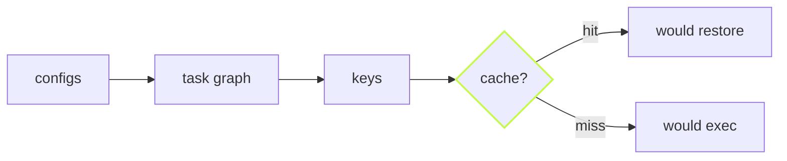

Before a long run, you want to know what it will do. `--dry` answers
without running anything: every task in the graph, whether the cache
would answer it, its key, and how long it took last time.

```sh frame="terminal"
$ vx run test --all --dry
would run:
  ▶  @demo/api#test    cache miss — would exec   62269624  ~213ms
  ▶  @demo/api#build   cache miss — would exec   10361de3  ~326ms
  ◉  @demo/docs#test   cache hit (local)         067839a7
  ◉  @demo/docs#build  cache hit (local)         b5134b6e
  ◉  @demo/ui#build    cache hit (local)         6a36fb4c
  ◉  @demo/ui#test     cache hit (local)         d5097182
  ◉  @demo/web#test    cache hit (local)         a5787dc7
  ◉  @demo/web#build   cache hit (local)         731116aa

8 task(s) planned, 6 cache hits (6 local), 2 would run.
predicted: ~539ms wall · ~539ms total execution
```

One edit to `api`: two tasks would run, six come from the cache.

## Real keys, real predictions

A dry run derives the same keys a real run would and asks the same
cache. A "hit" in the plan is a hit in the run. The time next to each
task is what it took the last time it ran. The wall prediction lays
those times on the graph: `api#test` waits for `api#build`, so the two
run one after the other, ~539 ms.



## For scripts and agents

`--dry=json` prints the same plan as JSON: tasks, keys, hit or miss,
predicted times. An agent can decide whether a run is worth starting,
or show a reviewer what a change will rebuild.

```sh frame="terminal"
vx run build --affected --dry=json
```

## The graph itself

`--graph` writes the task graph as Graphviz DOT, to stdout or a file:

```sh frame="terminal"
vx run build --all --graph=graph.dot
dot -Tsvg graph.dot > graph.svg
```

Learn more: [Plan before you run](https://vznjs.github.io/vx/features/dry-run/) and
[the CLI reference](../../cli/).
