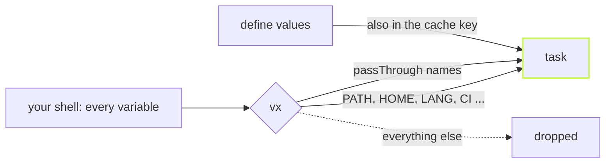

Run `env` in your terminal and count. Tokens, cloud keys, a `PS1`, a
proxy, something an installer left behind years ago. If a build could
read all of that, two machines would build different bytes and never say
why, and every token would be one `echo` away from a CI log.

So a vx task starts almost empty.



## Three layers

A short fixed list always gets through: `PATH`, `HOME`, `SHELL`, `USER`,
`TMPDIR`, locale, terminal and color variables, `CI`, `NODE_OPTIONS` and
a few more. Everything else is something you name:

```ts
// packages/api/vx.config.ts
import { defineProject } from '@vzn/vx/config'

export default defineProject({
  tasks: {
    env: {
      exec: {
        command:
          'echo "FOO=$FOO" && echo "NODE_ENV=$NODE_ENV" && echo "DEPLOY_TOKEN=$DEPLOY_TOKEN" && echo "GH_PAT=$GH_PAT"',
        env: {
          passThrough: ['DEPLOY_TOKEN', 'GH_PAT'],
          define: { NODE_ENV: 'production' },
          secret: ['GH_PAT'],
        },
      },
    },
  },
})
```

- `passThrough` takes a value from your environment. It does not enter
  the cache key, so a laptop and a CI runner can still share a hit.
- `define` sets a literal value. It lives in the config, so it is part of
  the key.
- `secret` marks a name to mask, for names vx would not guess.

Now run it with four variables set:

```sh frame="terminal"
$ FOO=leaked DEPLOY_TOKEN=s3cr3t-value-123 GH_PAT=ghp_abcdef123456 vx run @demo/api#env
┌─ @demo/api#env > $ echo "FOO=$FOO" && echo "NODE_ENV=$NODE_ENV" && echo "DEPLOY_TOKEN=$DEPLOY_TOKEN" && echo "GH_PAT=$GH_PAT"
FOO=
NODE_ENV=production
DEPLOY_TOKEN=***
GH_PAT=***
└─ @demo/api#env ── (3ms) success
```

`FOO` never reached the task. `NODE_ENV` came from the config. Both
tokens arrived, and both printed as `***`.

## Masked everywhere vx prints

A value whose name holds `TOKEN`, `SECRET`, `KEY`, `PASSWORD`, `PASSWD`
or `CREDENTIAL` is masked without being asked. `GH_PAT` holds none of
those words, so it is listed in `secret`. Masking covers more than the
live log: the output the cache keeps and a hit replays, the command a
remote cache receives, `vx show`, `vx why`, `vx last`, telemetry, and the
errors `vx mcp` gives an agent. A multi-line key is masked line by line,
and a value split across two chunks of output is still caught.

## When a variable changes the output

Some variables do change what a build produces, like `NODE_OPTIONS`
loading a loader. vx does not guess which. Say so, and the value joins
the key:

```ts
cache: { inputs: { files: ['src/**'], env: ['NODE_OPTIONS'] }, outputs: { files: ['dist/**'] } }
```

What the task gets and what the key sees are separate on purpose. The
whole set of rules is in the [schema](../../schema/).
