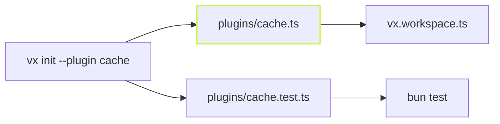

vx is a [pipeline with seams](../pipeline-with-seams/). This post is the
practical side: how to write a plugin today, and how to call vx from
code.



## Start from a working plugin

```sh frame="terminal"
$ vx init --plugin cache --dry
would write plugins/cache.ts and plugins/cache.test.ts
Declare it in vx.workspace.ts: import { dirCache } from './plugins/cache.ts', then plugins: [dirCache(…)]
Test it: bun test plugins/cache.test.ts (needs @vzn/vx installed)
```

Drop `--dry` and the files are written. Every seam has a template:
`executor`, `cache`, `telemetry`, `schedule`, `admit`, `commands`,
`project`, `graph` and `key`. Each one runs, and its test drives it
through a real `run()`. The templates are the same files vx's own gate
runs, so they cannot rot.

## Bring your own remote cache

A remote is a `RemoteCacheLayer`: `has`, `get` and `put`, plus an
optional batched `hasMany`. Here is the whole template, which uses a
directory as the store:

```ts
// plugins/cache.ts
import { mkdir, rename } from 'node:fs/promises'
import path from 'node:path'
import { definePlugin, LayeredCache, type RemoteCacheLayer, type VxPlugin } from '@vzn/vx'

class DirRemote implements RemoteCacheLayer {
  constructor(readonly endpoint: string) {}
  async has(hash: string): Promise<boolean> {
    return Bun.file(path.join(this.endpoint, hash)).exists()
  }
  async get(hash: string) {
    const file = Bun.file(path.join(this.endpoint, hash))
    return (await file.exists()) ? { body: file, durationMs: undefined } : null
  }
  async put(hash: string, body: Blob): Promise<void> {
    await mkdir(this.endpoint, { recursive: true })
    const tmp = path.join(this.endpoint, `.${hash}.${process.pid}`)
    await Bun.write(tmp, body)
    await rename(tmp, path.join(this.endpoint, hash))
  }
}

export function dirCache(dir: string): VxPlugin {
  return definePlugin(import.meta, {
    cache(ctx) {
      return new LayeredCache(ctx.localCache, new DirRemote(dir), {
        policy: ctx.policy,
        onRemoteError: (err) => ctx.warn(`dir-cache: ${err.message}`),
      })
    },
  })
}
```

Swap the directory for S3, R2 or your own HTTP server. `LayeredCache`
does the rest: the local cache stays in front, a remote error turns into
a miss and a warning, uploads run in the background, and every artifact
gets the same integrity check as a local one. vx bounds no call, so a
network store gives each request its own deadline. A plugin's name is its
package name, taken from `import.meta`.

## Code around the run

`setup(ctx)` runs before the first task, and `teardown` runs after the
last. Use them to start a service, take a lock, or flush a report. A
`setup` that throws stops the run with a clean error naming the plugin.
A `teardown` cannot hold the exit hostage: it gets 3 seconds, which
`VX_TEARDOWN_TIMEOUT_MS` changes.

## vx from your own scripts

`@vzn/vx` exports the same `run()` and `planRun()` the CLI uses. A plan
predicts every task's cache status without running anything:

```ts
// scripts/plan.ts
import { planRun } from '@vzn/vx'

const plan = await planRun({ cwd: process.cwd(), tasks: ['build'], projects: ['@demo/web'] })
for (const t of plan.tasks) console.log(t.node.id, t.cacheStatus, t.hash.slice(0, 8))
```

```sh frame="terminal"
$ bun scripts/plan.ts
@demo/web#build hit-local b25e5bf4
@demo/ui#build hit-local 46046abb
```

`run()` takes the same options and returns every task's outcome. Every
export is in the [API reference](../../api/), and each seam's contract is
in [Plugins](../../modules/plugins/).
