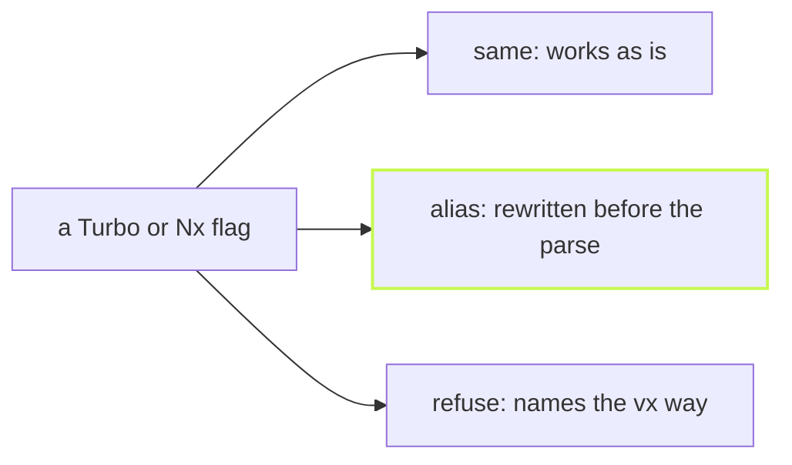

Years of `turbo run` and `nx run-many` live in your fingers. vx does not
ask you to forget them on day one. Every flag either works, is rewritten,
or is answered with the command that does it here.



## Works as is

`-t`, `-p`, `--exclude` and Nx's `--skip-nx-cache` mean what you expect:

```sh frame="terminal"
$ vx run build --all --skip-nx-cache --dry
would run:
  ▶  @demo/api#build   cache miss — would exec   32b3a0bf  ~326ms
  ▶  @demo/docs#build  cache miss — would exec   1f858edb  ~311ms
  ▶  @demo/ui#build    cache miss — would exec   46046abb  ~313ms
  ▶  @demo/web#build   cache miss — would exec   b25e5bf4  ~310ms

4 task(s) planned, 4 would run.
```

## Answered with the vx way

A flag vx has no use for is never ignored. It is refused with the
spelling that does the job:

```sh frame="terminal"
$ vx run build --parallel
vx run: --parallel (turbo): vx always honours `dependsOn`; `--concurrency <n>` sets how many run at once (see `vx run --help`)
```

Nx's verbs and `project:target` get the same treatment:

```sh frame="terminal"
$ vx run web:build
vx run: `web:build` is Nx's project:target: vx run @demo/web#build

$ vx run-many -t build
`nx run-many` is `vx run <task> --all` here; -t, -p, --exclude and --parallel work as they are

$ vx affected -t test
`nx affected` is `vx run <task> --affected` here; -t, --base and --exclude work as they are

$ vx graph
`nx graph` is `vx run <task> --graph[=<file>.dot]` here: the task graph as Graphviz DOT
```

## One table, held by a test

Every row lives in one table, rendered into the CLI reference, and a
test drives each row, so the docs and the binary cannot disagree.

Learn more: [Turbo and Nx flags](../../cli/#turbo-and-nx-flags) and
[Flags you already know](https://vznjs.github.io/vx/features/turbo-nx-flags/).
