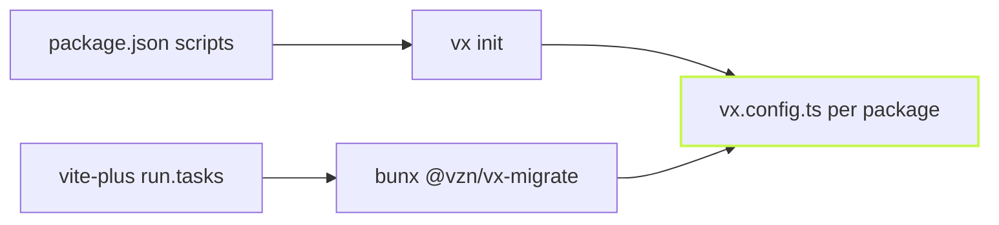

The [Turbo](../from-turborepo/) and [Nx](../from-nx/) paths have their
own posts. Two more starting points convert just as directly: plain
`package.json` scripts and Vite Task.



## npm scripts, hooks included

npm runs `prebuild` before `build` and `postbuild` after it, without
being asked. Copying the scripts one to one would lose that. So
`vx init` folds the hooks into the task's command, in npm's order, and
says so:

```sh frame="terminal"
$ cat packages/app/package.json
{"name":"app","scripts":{"prebuild":"rimraf dist","build":"tsc","postbuild":"node scripts/copy.js"}}

$ vx init --dry
vx init: package.json scripts → vx.config.ts
note: each script became a task with its command verbatim; caching needs declared inputs and outputs, so no task got a cache block

0 tasks migrated clean, 2 TODOs:
  app#build: npm ran `prebuild` and `postbuild` around this script without being asked; folded into the command in that order
  app#build: cache: add `cache: { inputs: { files: ['src/**'] }, outputs: { files: ['dist/**'] } }` with this package's real inputs and outputs …
```

Each part runs in its own subshell, so the chain stops at the first
that fails, and arguments after `--` reach `build` alone, as npm passes
them. Where the package manager runs no such hooks (Yarn 2 and later, or
npm with `ignore-scripts`), each hook stays a task of its own. Lifecycle
hooks like `prepack` never become tasks.

## Vite Task

A repo on vite-plus keeps its tasks in each package's `vite.config.*`
under `run`. The migrator reads them the way `vp run` does:

```sh frame="terminal"
$ bunx @vzn/vx-migrate --from vite-task
```

`command`, `cwd`, `dependsOn` and the cache settings map to their vx
spellings. A command that starts with `vp run x` becomes a `dependsOn`
edge, the way Vite Task inlines it. Anything that does not map cleanly
stays in the command with a TODO, so nothing is dropped without a word.

The full mapping table is in the
[vx-migrate README](https://github.com/vznjs/vx/tree/main/packages/vx-migrate#readme).
