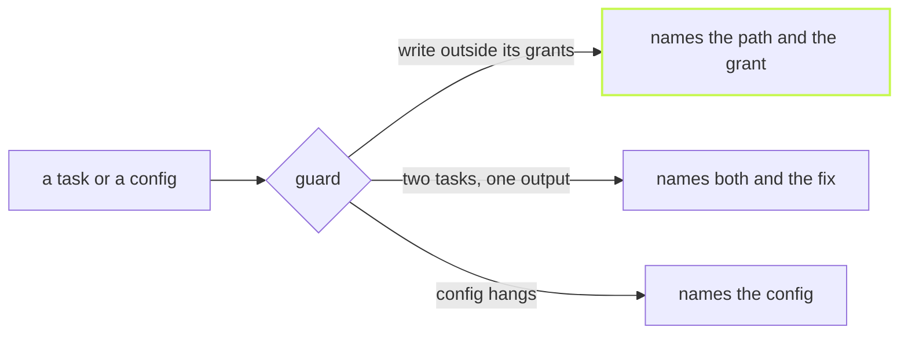

A refusal is only useful if it says what to do next. Each guard in this
post stops something real, and each one ends with the fix.



## The sandbox names what to grant

A sandboxed task that writes outside its grants fails, and vx says
where it tried to write and which grant would allow it:

```sh frame="terminal"
$ vx run @demo/api#gen
┌─ @demo/api#gen > $ mkdir -p dist && echo ok > dist/out.js && echo x > ../shared.txt
/usr/bin/sh: 1: cannot create ../shared.txt: Read-only file system
vx: the sandbox refused writes outside the project, which are not reported as violations: …/demo/packages/shared.txt. If the task needs one, grant its directory, e.g. `allow: { write: ['../'] }`.
└─ @demo/api#gen ── (52ms) failed (exit 2)
```

The tool's own error says "read-only file system". vx says which file,
and the line to add to `exec.sandbox`.

## Two tasks, one output folder

vx cleans a task's outputs before it runs and before a cache restore. Two
tasks that declare the same output would delete each other's work, so the
run is refused before anything starts:

```sh frame="terminal"
$ vx run @demo/api#bundle
vx: @demo/api#bundle and @demo/api#build both declare the output "dist/**" in cache.outputs.files — vx cleans a task's declared outputs before it runs and before a cache-hit restore, so whichever of these runs second DELETES the other's output. Give each task its own output path, or set rules: { exclusiveOutputs: false } in vx.workspace.ts to let a dependant add to its upstream's outputs.
```

This is a workspace rule. Rules are checks that keep vx fast and
correct, on by default. Turning one off allows a shape vx still runs
correctly, only slower, and never changes a cache key:

```ts
// vx.workspace.ts
import { defineWorkspace } from '@vzn/vx/config'

export default defineWorkspace({
  rules: { exclusiveOutputs: false, upfrontKeys: true },
})
```

`upfrontKeys` refuses a task whose inputs match another task's outputs
in the same run, because its key cannot be known before that task
finishes. The message names the glob to exclude.

## A config that hangs

A `vx.config.ts` is code, and code can hang: an `await` on a server that
is down, or a loop. Each config gets 30 seconds, and then the load fails
and names the config. A real evaluation takes about 10 ms.
`VX_CONFIG_WORKER_TIMEOUT_MS` changes the limit.

## A pure config is read once

Most configs only call `defineProject` with plain data. vx proves that
from the imports, then stores the evaluated result. The next run reads it
back as data instead of running the file again. A config that imports
anything else, reads the environment or calls `Math.random` is evaluated
every run, as it should be.

The [schema](../../schema/) lists every rule and sandbox grant.
