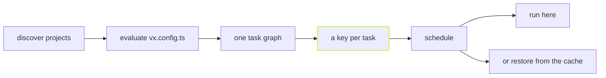

**vx runs and caches a task graph, correctly, and stops there.** It is a
task runner and a content-addressed cache for JavaScript monorepos, built
on Bun, with nothing hidden behind a paid cloud.



## One run, then the same run again

Eight tasks across four packages, run cold, then run again with nothing
changed:

```sh frame="terminal"
$ vx run build test --all --force
  result    8 tasks · 0 cached (0%) · 879ms

$ vx run build test --all
  result    8 tasks · all cached · 2.06s saved · 26ms
```

The second run takes 26ms instead of 879ms, because every key matched and every output
was already on disk. A cold run spends its time in your tools, not in the
runner.

## What is in the box, and what is not

- **In core:** the graph, the keys, the scheduler, the local cache and
  running on this machine. A workspace with no plugins runs and caches.
- **Plugins:** remote caches, remote execution, telemetry, CI summaries,
  lockfile-aware keys, AI agents over MCP. Each one sits on a
  documented seam, and you declare it in `vx.workspace.ts`.
- **Never:** a hosted dashboard, a daemon, or a cloud you have to buy
  into.

## Where to go next

- [Quickstart](../../quickstart/): a workspace running under vx in a few
  minutes, or [add vx to an existing repo](../../quickstart/#an-existing-repo)
  one package at a time.
- [What vx is, and what it refuses to be](../what-vx-is/): the next
  story.
- [Benchmarks](../../benchmarks/): vx, Turborepo, Nx and Vite Task on the
  same graph, each in its own native config.
- [Features](../../features/): every feature, each with a short post.
