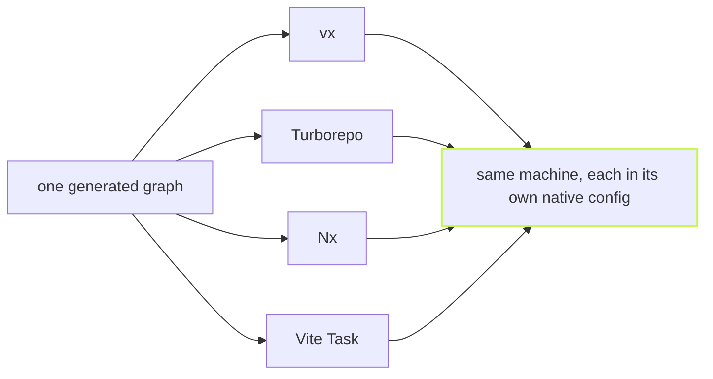

Benchmark numbers are only worth what the method behind them is worth.
Here is the method, then the numbers.

One number first, because it is the one that decides whether a runner
is worth having. Imagine your tasks take three minutes on their own.
What does the tool add on top? On the 3,270-task workspace below the
tasks alone take 3m 38s under an ideal schedule. On a cold build vx adds
**2.33s**. Nx adds **10.98s**, Vite Task **1m 11s** and Turborepo
**1m 21s**.
Every warm number on
this page is a consequence of the same discipline, but this is the one
you feel on every uncached build.

## Synthetic: the same graph, four runners

`bun packages/vx-bench/compare.ts 100 11 1` scaffolds one workspace of
1,090 packages in 100 dependency layers, about 30 dependencies per
package and three tasks each, 3,270 task nodes, and runs vx, Turborepo,
Nx and Vite Task across the same three cache states: cold, warm with outputs
wiped (restore), and warm with nothing touched (no-op). The run below
is Turbo 2.11.7, Nx 23.2.1 and Vite Task (`vp run`, vite-plus 1.0.0)
on Linux x64 with 4 cores, every runner pinned to concurrency 10, every
Nx task an `nx:run-commands` target. Fairness is deliberate: vx runs as
the compiled binary users install, from a `vx lock` snapshot
(`--frozen`) as a CI pipeline runs it, Turbo and Nx run as they would in
CI (`CI=1`: Nx's daemon off, and Turbo uses none for `turbo run`), and
the runners are measured strictly one at a
time, each daemon stopped before the next runner is timed so it cannot
idle-contend for CPU. `build` and `test` are `sleep 1`, so the numbers
isolate the runner's own overhead from compilation.

`build test --all`, the runner's overhead (a cold build's time over the
3m 38s ideal schedule; a fully cached run is all overhead):

| Runner    | Cold build overhead | Fully cached | Cold build CPU |
| --------- | ------------------ | ------------ | -------------- |
| vx        | **2.33s** | **393ms**    | **17.27s**     |
| Turborepo | 1m 21s (vx 35× faster) | 463ms (vx 18% faster) | 21.04s (vx 22% faster) |
| Nx        | 10.98s (vx 4.7× faster) | 6.45s (vx 16× faster) | 52.19s (vx 3× faster) |
| Vite Task | 1m 11s (vx 31× faster) | 2.49s (vx 6.3× faster) | 12.46s (vx 39% slower) |

vx N% faster: that tool takes N% longer than vx; N× faster: N times as long; slower: vx takes that much longer.

Benchmark workload: a synthetic monorepo of 1,090 packages and 3,270 tasks in 100 dependency layers, every build and test taking 1 s; real repos with uneven task times will differ.
Run 2026-10-04 on linux x64, 4 cores: vx from source, Turborepo 2.11.7, Nx 23.2.1, Vite Task (vite-plus) 1.0.0.

The first two columns are wall clock; the third is CPU time (user plus
system, of the invocation and every child it waited for), because on a
synthetic workspace the tasks sleep and that column measures the
runner's own work per task. A daemon that outlives the invocation is
not counted, so Turbo's and Nx's are floors. It is the fairest number for "what does
the tool cost me." The wall-clock rows, the
theoretical baseline and the measured floors (one git walk is 24ms on
that machine) are in [Benchmarks](../../benchmarks/).

## Real repositories: rerun pending

An earlier version of this post measured solidjs/solid with vx on top of
its own `turbo.json` through `turbo()`. That measured a migration
bridge, not vx, so its numbers are gone. Real-repo rows return once each
repo is rerun on the native config `bunx @vzn/vx-migrate` writes.
(Updated 2026-10-02.)

## The method is the point

Every warm-path change in vx's history shipped with a number measured
this way: A/B arms interleaved, min-of-N, the "before" arm checked out
into an immutable git worktree, one workspace copy per arm pre-warmed
by that arm. Where the headroom went, release by release, is a table in
[Benchmarks](../../benchmarks/). The scripts are in the repository:
`packages/vx-bench/compare.ts` for the synthetic workspace. If a number here does not reproduce on your
machine, that is a bug report.
