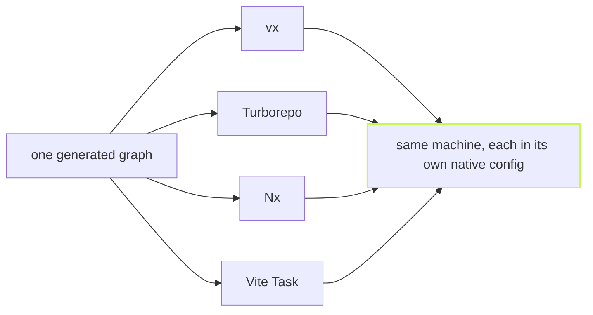

Benchmark numbers are only worth what the method behind them is worth.
Here is the method, then the numbers.

One number first, because it is the one that decides whether a runner
is worth having. Imagine your tasks take six minutes on their own.
What does the tool add on top? On the 9,603-task workspace below the
tasks alone take 6 min 16 s under an ideal schedule. On a cold build vx
adds **8.99 s**, Turborepo **10.06 s** and Nx **1 min 13 s**. Vite Task
adds the least, **4.50 s**. With nothing changed, vx adds **958 ms**,
the least of the four. No tool leads every row, and the table says
where vx does not.

## Synthetic: the same graph, four runners

`bun packages/vx-bench/compare.ts 3` scaffolds one workspace of
1,601 projects in 30 dependency levels, five core libraries that about
a quarter of the projects use, and six kinds of task (`build`, `lint`,
`test`, `typecheck`, `publish`, `installDeps`), 9,603 task nodes. It runs
vx, Turborepo, Nx and Vite Task cold, with nothing changed and with
outputs restored. Edit runs are left out: Nx needs its daemon for them,
and the harness runs every tool as CI does.
The run below is Turborepo 2.11.7, Nx 23.3.0 and Vite Task (`vp run`,
vite-plus 1.1.0) on Linux x64 with 4 cores, every runner pinned to
concurrency 10, every Nx task an `nx:run-commands` target. Fairness is deliberate: vx runs as
the compiled binary users install, from a `vx lock` snapshot
(`--frozen`) as a CI pipeline runs it, Turbo and Nx run as they would in
CI (`CI=1`: Nx's daemon off, and Turbo uses none for `turbo run`), and
the runners are measured strictly one at a
time, each daemon stopped before the next runner is timed so it cannot
idle-contend for CPU. Every task is a `sleep` in fixed ratios (build
1 s, test and typecheck 0.5 s, lint 0.25 s, publish 0.1 s), so the
numbers isolate the runner's own overhead from compilation.

The runner's overhead: the time it adds over the ideal run (a cold
build over its ideal schedule; with nothing changed, over one git walk):

| Runner    | Cold build overhead | Nothing changed | Cold build CPU |
| --------- | ------------------- | --------------- | -------------- |
| vx        | **8.99 s** | **958 ms** | **46.70 s** |
| Turborepo | 10.06 s (vx 12% faster) | 1.05 s (vx 10% faster) | 1 min 11 s (vx 51% faster) |
| Nx        | 1 min 13 s (vx 8.1× faster) | 25.96 s (vx 27× faster) | 6 min 13 s (vx 8× faster) |
| Vite Task | 4.50 s (vx 100% slower) | 12.24 s (vx 13× faster) | 30.60 s (vx 53% slower) |

vx N% or N× faster in overhead: that tool adds N% more or N times as much as vx; slower: vx adds that much more.

Benchmark workload: a synthetic monorepo of 1,601 projects and 9,603 tasks in 30 dependency levels, five core libraries a quarter of the projects use; build 1 s, test and typecheck 0.5 s, lint 0.25 s, publish 0.1 s; real repos with uneven task times will differ.
Run 2026-10-09 on linux x64, 4 cores, concurrency 10: vx from source, Turborepo 2.11.7, Nx 23.3.0, Vite Task (vite-plus) 1.1.0.

The first two columns are wall clock; the third is CPU time (user plus
system, of the invocation and every child it waited for, less what the
task commands burn), because on a synthetic workspace the tasks sleep
and that column measures the runner's own work. A daemon that outlives
the invocation is not counted, so Turborepo's and Nx's are floors. Every
row, the ideal run and the measured floors (one git walk is 59 ms on
that machine) are in [Benchmarks](../../benchmarks/).

## Real repositories: rerun pending

An earlier version of this post measured solidjs/solid with vx on top of
its own `turbo.json` through `turbo()`. That measured a migration
bridge, not vx, so its numbers are gone. Real-repo rows return once each
repo is rerun on the native config `bunx @vzn/vx-migrate` writes.
(Updated 2026-10-02.)

## The method is the point

Every warm-path change in vx's history shipped with a number measured
this way: A/B arms interleaved, min-of-N, the "before" arm checked out
into an immutable git worktree, one workspace copy per arm pre-warmed
by that arm. Where the headroom went, release by release, is a table in
[Benchmarks](../../benchmarks/). The scripts are in the repository:
`packages/vx-bench/compare.ts` for the synthetic workspace. If a number here does not reproduce on your
machine, that is a bug report.
