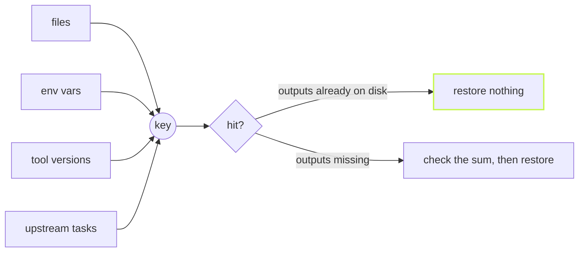

A cache is only as good as two lists: what it hashes, and what it hands
back. vx makes you write both down, then guards each end.



## What goes in

```ts
// packages/api/vx.config.ts
import { defineProject } from '@vzn/vx/config'

export default defineProject({
  tasks: {
    bundle: {
      exec: {
        command: 'vite build',
        env: { passThrough: ['NODE_ENV'] },
      },
      cache: {
        inputs: {
          files: ['src/**'], // required: this project's files
          env: ['NODE_ENV'], // values folded into the key
          runtime: ['bun --version'], // a command's output, folded in
          workspaceFiles: ['tsconfig.base.json'], // root files, by name
        },
        outputs: { files: ['dist/**'] },
      },
    },
  },
})
```

`files` globs stay inside the project: a glob never reaches into a
neighbour's folder, so one project's edit cannot hide in another's key.
A shared root file is named in `workspaceFiles`, on purpose.
`cache.inputs.tasks` narrows which upstream tasks' keys fold in.

An env var in the key is not the same as an env var the task sees. List
it in both places, as above, or the key varies on a value the command
never reads. Change it, and the key changes:

```sh frame="terminal"
$ NODE_ENV=production vx run @demo/api#bundle
bundling for production
└─ @demo/api#bundle ── (5ms) success

$ NODE_ENV=production vx run @demo/api#bundle
bundling for production
└─ @demo/api#bundle ── (4ms) up-to-date

$ NODE_ENV=development vx run @demo/api#bundle
bundling for development
└─ @demo/api#bundle ── (5ms) success
```

## What comes back

A hit replays stdout and stderr in the order the task printed them, so a
warning shows where it did the first time:

```sh frame="terminal"
$ vx run @demo/api#bundle
┌─ @demo/api#bundle > $ echo "bundling for $NODE_ENV"; echo "warn: large chunk" >&2; …
bundling for production
warn: large chunk
└─ @demo/api#bundle ── (4ms) up-to-date
```

When the outputs on disk already match, vx restores nothing. It compares
a few stats, calls the task up to date, and moves on. Delete one
project's `dist` and only that one comes back from the store:

```sh frame="terminal"
$ vx run build --all
  cache     4 up-to-date
  result    4 tasks · all cached · 1.24s saved · 14ms

$ rm -rf packages/web/dist && vx run build --all
  cache     3 up-to-date · 1 local
  result    4 tasks · all cached · 1.24s saved · 21ms
```

Restores run on their own lane, so a warm run is never queued behind
compilers.

## A damaged artifact is a miss

Every artifact ends with a CRC-32 over everything before it, and its own
key. Tar checks only its headers, and a zstd block of incompressible
bytes, like an image or a wasm file, decodes clean even with a byte
flipped. So vx checks the sum before anything lands. A wrong sum, a
wrong key, or an entry outside the declared outputs makes the hit a miss,
and the task runs again. The check costs about 3 ms on a 32 MB restore.

## Uploads never hold the run

With a remote cache, the local save is immediate and the upload happens
in the background. Dependents start at once. Uploads drain before vx
exits, so a short run still ships everything, and a failed upload is a
warning, never a red build.

The full rules are in [Caching](../../caching/) and the
[schema](../../schema/).
