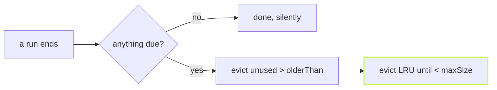

"Which version? How big is the cache? Can this machine sandbox?" Every
bug report starts with those questions, and so does every agent that
lands in a new repository. `vx info` answers them in one screen.

```sh frame="terminal"
$ vx info
vx:               0.0.0
bun:              1.4.2
git:              2.43.0
git status cache: core.fsmonitor, core.untrackedCache off
projects:         4 (8 tasks)
plugins:          none
workers:          4 — the CPU count
memory:           13 GB usable — cgroup limit; the machine has 16 GB
cache store:      ~/.vx/2077a074894d4183/cache
cache versions:   keys vx-cache-v42 · index schema v32
cache entries:    41 (9.8 KB)
task runs (24h):  71 (27 cache hits: 23 up-to-date, 4 restored)
flaky tasks:      none
sandbox:          available (0 tasks declare exec.sandbox)
vx-lock.json:     no
```

It reads what vx already knows: the run history, the cache index, the
host. It notes when a container caps memory below the machine's, and
whether git's fast status cache is on. `--format json` gives agents the
same facts, and `vx mcp` serves them as a tool.

## A cache that keeps itself in bounds

A content-addressed cache only grows. Set a policy once, in
`vx.workspace.ts`:

```ts title="vx.workspace.ts"
import { defineWorkspace } from '@vzn/vx/config'

export default defineWorkspace({
  cacheRetention: { olderThan: '30d', maxSize: '10G' },
})
```

After each run, entries unused for 30 days go first, then the least
recently used until the cache is under 10 GB. It prints nothing, and a
run with nothing due pays one scan of the index.



Or prune by hand, and look first:

```sh frame="terminal"
$ vx cache prune --max-size 4KB --dry-run
Would prune 25 entries (5.9 KB)
```

Learn more: [the CLI reference](../../cli/) and
[the workspace schema](../../schema/).
