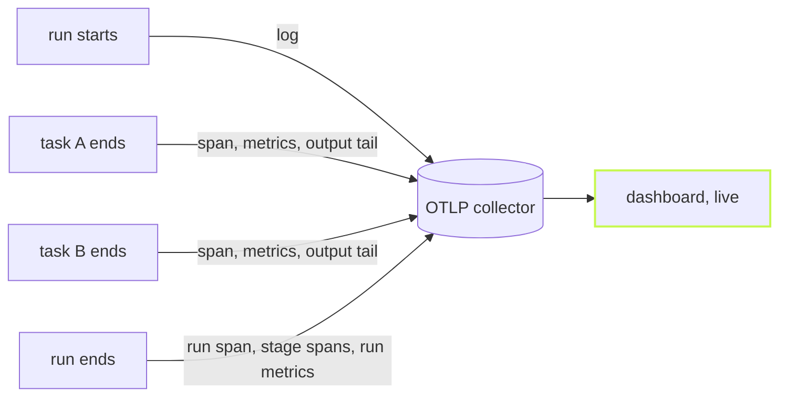

A trace that arrives after the build is a report. A trace that arrives
while the build runs is a window. `@vzn/vx-otel` sends as it goes, so the
slow task shows up in Grafana or Honeycomb while you can still do
something about it.



## Turn it on

Declare the plugin and point the standard OTel variables at a collector.
Live export is the default.

```ts
// vx.workspace.ts
import { defineWorkspace } from '@vzn/vx/config'
import { otel } from '@vzn/vx-otel'

export default defineWorkspace({ plugins: [otel()] })
```

```sh frame="terminal"
$ OTEL_EXPORTER_OTLP_ENDPOINT=http://localhost:4318 vx run build test --all
```

With no endpoint set, the plugin exports nothing, so it is safe to declare
everywhere.

## What arrives, and when

- When the run starts, and when each task starts, a log record
  (`vx.run.start`, `vx.task.start`) linked to the trace.
- When a task ends, its span, its metrics and the tail of its output.
- While a task runs, its process samples as they are taken.
- When the run ends, the `vx.run` span, the stage spans and the run's
  metrics.

Every record names the run, the host, the commit, the repository and, on
CI, the pipeline and the pull request. A chart opens the trace, and a
span opens its output.

## It never holds a task

A task's end only queues its records. Sends are batched: at most one per
second, one in flight at a time, each taking everything that ended
meanwhile. A refused send warns once per signal, and the build goes on.
On 60 tasks against a local collector, live export burned the same CPU as
one send at the end: 815 ms both, median of 10 runs.

To send everything at the end instead, use `otel({ live: false })`. Why
telemetry can never fail a build is its own story:
[Observability that cannot break a run](../telemetry-never-breaks-a-run/).
The full attribute list is in the
[vx-otel README](https://github.com/vznjs/vx/tree/main/packages/vx-otel#live-export).
