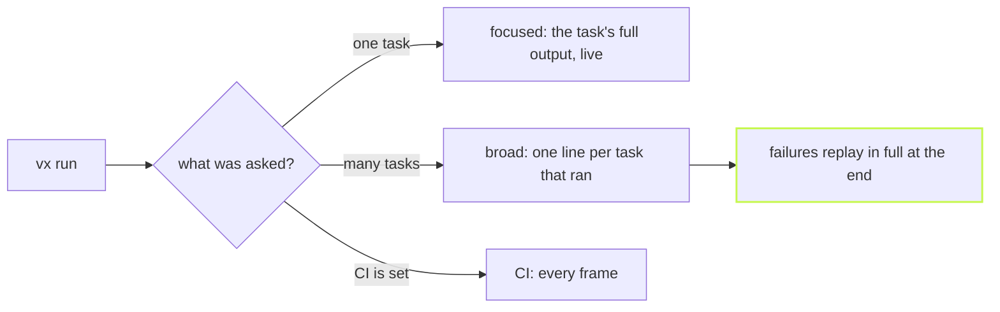

`vx run test` in one package should feel like running the test command
directly. `vx run test --all` across fifty packages should not bury you
in fifty logs. vx picks what to print from what you asked for.



A broad run prints one line for each task that ran and stays silent for
hits. A failure prints its line right away, and its full log replays
just above the summary, so it is the last thing you read. A truthy `CI`
always wins and shows every frame.

## Pick a mode yourself

`--output-logs` overrides the flow: `full`, `errors-only`, `hash-only` or
`none`. `hash-only` is handy when a script wants each task's cache key:

```sh frame="terminal"
$ vx run @demo/web#build --force --output-logs=hash-only
success @demo/ui#build 46046abb75e9c084
success @demo/web#build b25e5bf41cb7a54d
```

Each task line also starts with a glyph that says where its result came
from:

```text
⏺  ran (cache miss)
►  up-to-date, nothing to restore
⇢  restored from the local cache
⇣  restored from the remote cache
◼  failed
⊘  skipped, with the failure that blocked it
▸  persistent, like a dev server
```

## A report for the pull request

`--report-file` appends a markdown report to a file when the run ends:
a pass or fail headline, counts, time saved, and one row per task with
its status, cache result and duration. Point it at
`$GITHUB_STEP_SUMMARY` and the run shows up on the job's summary page:

```sh frame="terminal"
$ vx run build test --all --report-file "$GITHUB_STEP_SUMMARY"
```

`--report` prints the same markdown to stdout instead. The
[@vzn/vx-ci plugin](https://vznjs.github.io/vx/blog/results-on-github/)
goes further, with a check run on the commit.

## The run as a timeline

`--profile` writes the run's wall clock spans as Chrome-trace JSON. Open
it in `chrome://tracing` or [Perfetto](https://ui.perfetto.dev) to see
which task held up the rest.

```sh frame="terminal"
$ vx run build --all --force --profile=prof.json
```

```text
{
  "traceEvents": [
    {
      "name": "@demo/ui#build",
      "cat": "success",
      "ph": "X",
      "ts": 10234,
      "dur": 315466,
      "pid": 1,
      "tid": 1,
      "args": { "exitCode": 0, "hash": "46046abb75e9c084", "cpuMs": 5.72 }
    },
```

Every flag is in the [CLI reference](../../cli/).
