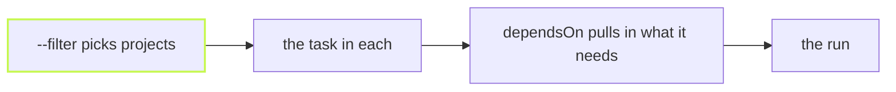

Two questions decide every run: what does each task need first, and
which projects should this run touch? vx answers the first in
`dependsOn` and the second in `--filter`. Both are small languages, and
both fit on one screen.



## What a task needs: dependsOn

```ts
// packages/web/vx.config.ts
import { defineProject } from '@vzn/vx/config'

export default defineProject({
  tasks: {
    build: {
      exec: { command: 'vite build' },
      dependsOn: ['^build'], // build every workspace dependency first
      cache: { inputs: { files: ['src/**'] }, outputs: { files: ['dist/**'] } },
    },
    test: { exec: { command: 'vitest run' }, dependsOn: ['build'] }, // this project's build
    e2e: { exec: { command: 'playwright test' }, dependsOn: ['@demo/api#build'] }, // another project's task
    check: { dependsOn: ['lint.*', 'test'] }, // a group: no command, just edges
  },
})
```

- `name` is a task in the same project.
- `^name` is that task in every workspace dependency.
- `pkg#name` is a task in one named project.
- `name.*` and `^name.*` match every task under a prefix, so `lint.*`
  takes `lint.oxlint` and `lint.oxfmt`.

A task with no `exec` is a group: it runs its dependencies and nothing
else. `dependsOn: []` is a named no-op you can fill in later.

## Which projects: --filter

The demo workspace has four packages, and `web` and `docs` both use `ui`.

```sh frame="terminal"
$ vx run build --filter '...@demo/ui' --dry
would run:
  ◉  @demo/docs#build  cache hit (local)         1f858edb
  ◉  @demo/ui#build    cache hit (local)         46046abb
  ◉  @demo/web#build   cache hit (local)         b25e5bf4

3 task(s) planned, 3 cache hits (3 local).
```

`...ui` takes ui and everything that depends on it. The other spellings
follow pnpm:

```sh frame="terminal"
$ vx run build --filter @demo/web           # one project by name
$ vx run build --filter '@demo/*'           # a glob
$ vx run build --filter 'app...'            # app and its dependencies
$ vx run build --filter '...ui'             # ui and its dependents
$ vx run build --filter ./packages/web      # by folder
$ vx run build --filter tag:frontend        # by the tags a config declares
$ vx run build --all --filter '!@demo/docs' # all but one
$ vx run test --filter '...[main]'          # what changed since main, and its dependents
```

`--exclude-dependencies` runs only what you selected and skips the
`dependsOn` edges, or only the edges you name.

## A typo stops the run

If you ask for several tasks and one name matches nothing, vx refuses
before anything starts, and lists what exists:

```sh frame="terminal"
$ vx run build lnit --all
vx run: no projects declare task(s): lnit. Tasks: build, test.
```

A typo never turns into a quiet green run that skipped your linter. Every
selector is in the [CLI reference](../../cli/), and `dependsOn` is in the
[schema](../../schema/).
