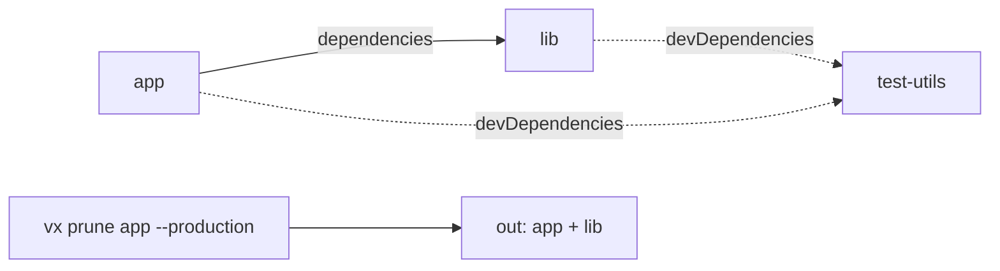

`vx prune` copies one app and the workspace packages it needs, with the
lockfile cut to match. It follows every dependency, dev ones included,
because the build needs them. The image that only runs the built app does
not.



```text
$ vx prune app --docker --production
vx prune: 2 projects → out (json/ + full/) (production), bun.lock pruned
  app (packages/app)
  lib (packages/lib)
```

`test-utils` stays behind. The copied `package.json` files and the lockfile
no longer name it, so the copy installs with a frozen lockfile under bun,
pnpm, npm and Yarn:

```dockerfile
FROM oven/bun AS run
COPY out/json/ .
RUN bun install --frozen-lockfile --production
COPY out/full/ .
CMD ["bun", "packages/app/dist/index.js"]
```

A package that another field also names (`dependencies`, an optional or a
peer dependency) is installed in production and stays. Third-party dev
dependencies stay in the lockfile; the install's own `--production` flag
skips them.
