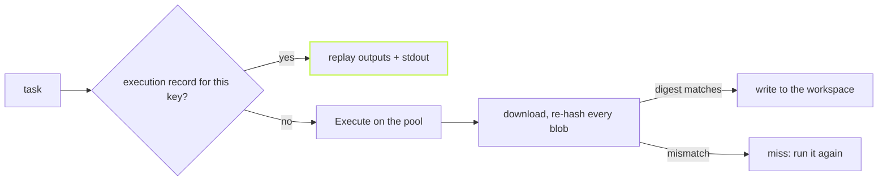

[Remote execution](../remote-execution/) showed that vx can hand a task to
any server that speaks Bazel's Remote Execution API. This post covers what
it takes to run that in production: getting connected, keeping repeat
runs cheap, and making sure a bad server costs you a miss, never a wrong
build.



## Connect the way Bazel does

TLS is on unless you turn it off. A hosted server's API key goes in
`headers`. A private CA and mutual TLS take the same three files as
Bazel's `--tls_certificate`, `--tls_client_certificate` and
`--tls_client_key`.

```ts
// vx.workspace.ts
import { defineWorkspace } from '@vzn/vx/config'
import { reapi } from '@vzn/vx-reapi'

export default defineWorkspace({
  plugins: [
    reapi({
      endpoint: 'remote.buildbuddy.io',
      headers: { 'x-buildbuddy-api-key': process.env.BB_KEY ?? '' },
      execute: true,
    }),
  ],
})
```

A plaintext server needs `grpc://` written out. A certificate file that
cannot be read is refused at startup, with the setting named. With no
endpoint at all, the plugin declines and costs nothing.

## Repeat runs skip the worker

Every successful remote execution writes a record under the task's vx
key: its outputs by digest and its stdout. The next run with that key
skips building the input tree, the upload and `Execute`. The outputs are
already in the server's store, and the stdout replays from the record.
`--force` bypasses it.

A file edited mid-run still runs, but its result is not recorded under a
key that no longer describes it.

## Every byte is checked

Each blob vx downloads is re-hashed and length-checked against the
digest it was asked for. Bytes that do not match are refused before they
touch the local store, so a corrupt or poisoned server degrades to a
miss. Paths are held to the workspace too: an output that climbs out with
`..`, or a link that points outside, is refused before anything is
written.

## A wedged server is a miss, not a hang

A server that is down answers at once. The dangerous one accepts the
connection and never replies. So every call has a deadline, and there are
two: a short one for small control calls, and a longer one for transfers,
which grow with the size of what moves. Raising the transfer deadline for
a big `node_modules` upload does not make every probe wait that long too.

## Leave the bytes on the server

`--download` decides where a remotely executed task's outputs land:

```sh frame="terminal"
$ vx run test --all --download=none       # only the verdict comes home
$ vx run app#build --download=toplevel    # only what you asked for
```

With `none`, outputs stay on the server and come down only when a local
task needs them. Bazel calls this "build without the bytes". It never
changes a cache key, and a task whose outputs another task's inputs could
read stays eager on its own.

The full list of options and guarantees is in the
[vx-reapi README](https://github.com/vznjs/vx/tree/main/packages/vx-reapi#readme).
