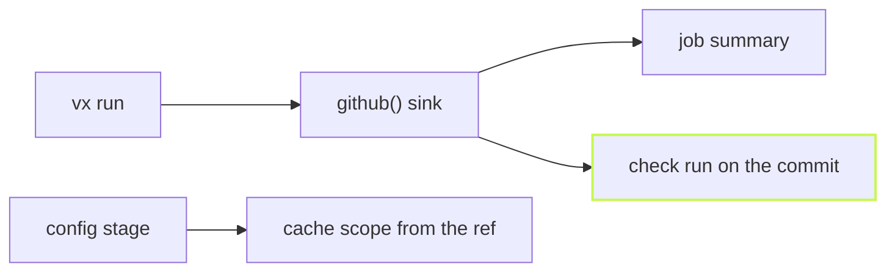

A red CI job should not mean scrolling a log. `@vzn/vx-ci` writes each
`vx run` where you already look on GitHub.

```ts title="vx.workspace.ts"
import { defineWorkspace } from '@vzn/vx/config'
import { github } from '@vzn/vx-ci'

export default defineWorkspace({
  plugins: [github()],
})
```

That is the whole setup. Off GitHub Actions the plugin declines and
costs nothing, so the line stays on for laptops too.

## The job summary

Every run appends a block to the workflow's summary page: the verdict,
the counts, the failures first, then every task. This is the markdown
the plugin wrote for a run where one test failed:

```md frame="code" title="$GITHUB_STEP_SUMMARY"
## ❌ vx run

**8** tasks · **6** executed · **2** cache hits (2 up-to-date, 0 restored) · **1** failed · 901ms

### Failures

- **@demo/ui#test** — exit 1
```

Below that sits a row per task with its status and time, and a footer
naming the vx version and the command.

A task killed by a signal reads `exit 137 (128 + SIGKILL)`, a timeout
reads `timed out, exit 143`, and each failure names the tasks it
blocked.

## A check on the commit

With `GITHUB_TOKEN` in the job, the plugin also posts a check run
(named `vx` unless you pass `checkName`) whose output is that same
summary, so the result sits next to the commit and the pull request.



## A cache a pull request cannot poison

On Actions the plugin sets the cache scope from the ref. A push to the
default branch reads and writes the trusted keys. A pull request becomes
`pr-<n>`: it reads its own keys, then main's, and writes only its own. So
a branch never writes what main reads. Set `cacheScope: false` to opt
out, or set `cacheScope` in `vx.workspace.ts` yourself.

## It never breaks the build

The summary is written by a telemetry sink. vx isolates sinks and bounds
their flush, so a slow or failing GitHub write can never fail or stall
the run.

Learn more: [CI and remote](../../guides/ci/) and
[Results on GitHub](https://vznjs.github.io/vx/features/github-ci/).
