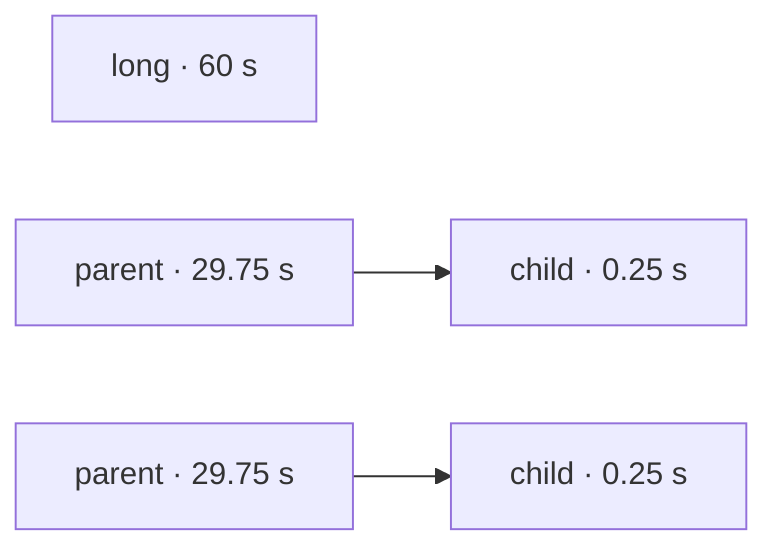
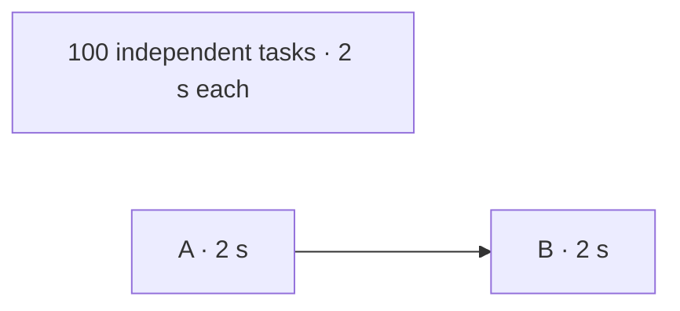

A build has more ready tasks than workers most of the time. Something
has to decide which one starts next. That choice can change the wall
time of a run by a third, with the same tasks, the same machine and the
same worker count.

Without timings, every rule is a guess. This post walks through five
rules, shows a graph where each one wins and a graph where it loses,
and measures them all with vx.

## The five rules

| Rule | Picks first | Needs timings |
| --- | --- | --- |
| Ready order | The task that became ready first | No |
| Most direct dependents | The task the most tasks wait on directly | No |
| Most transitive dependents (vx's default) | The task the most work waits on, at any depth | No |
| Critical path by step count | The task at the head of the longest chain of tasks | No |
| Critical path by recorded time | The task at the head of the longest chain in seconds | Yes |

The last one needs run history. In vx it is the
[`@vzn/vx-schedule-history`](../../plugins/vx-schedule-history/) plugin,
which you add to `vx.workspace.ts`. It is not on by default.

## Why vx guesses "most work waiting"

With no timings, vx assumes the task that blocks the most work matters
most. It counts every task downstream of each ready task and starts the
highest count first.

If every task took the same time, the task with the most work behind it
usually sits at the head of the longest chain too. So with equal tasks
the rule lands close to the textbook rule, longest chain first. Real
tasks are not equal, and that is where any rule without timings can be
wrong.

## Case 1: a slow task with nothing after it

Two workers. One task takes 60 seconds and nothing depends on it. Two
chains each have a 29.75-second parent and a 0.25-second child.



The best order starts the 60-second task at once and runs both chains
on the other worker: 60 seconds in all. Counting dependents puts both
parents ahead of the long task, because each has work behind it and the
long task has none:

```text
best (60 s)       worker 1  long ████████████████████████████████
                  worker 2  parent ███████████████ parent ███████████████ child child
vx default (90 s) worker 1  parent ███████████████ long ████████████████████████████████
                  worker 2  parent ███████████████ child child
```

Measured with vx, two workers:

| Rule | Wall time |
| --- | --- |
| Ready order | 60.2 s |
| Most direct dependents | 60.2 s (a tie, settled by ready order) |
| Most transitive dependents (vx's default) | 90.0 s |
| Critical path by step count | 89.9 s |
| Recorded time, run 1 (no history yet) | 90.0 s |
| Recorded time, runs 2 and 3 | 60.2 s, 60.2 s |

vx's default is 49% slower here. In a real repo this shape is a slow
task that runs straight from source with nothing after it: a typecheck,
a lint, or unit tests on a big package that need no build. It is ready
from the first second, and the default can start it late. App builds
and end-to-end tests do not fit this shape, since they wait on
libraries or a deploy.

Ready order won here because the long task was first in line. It has
no way to know that; it only started the task that was ready first.

## Case 2: the mirror image

Ten workers. 100 independent tasks and one chain of two, A then B.
Every task takes 2 seconds.



Counting dependents starts A first, so B runs beside the last wave of
independent tasks. Ready order can leave A behind the other 100. Then B
starts only after the last wave, and the run gets one task longer.

| Rule | Wall time |
| --- | --- |
| Ready order | 24.3 s |
| Most direct dependents | 24.3 s (a tie, settled by ready order) |
| Most transitive dependents (vx's default) | 22.3 s |
| Critical path by step count | 22.4 s |
| Recorded time, runs 1 to 3 | 22.3 s, 22.2 s, 22.3 s |

Here ready order is 9% slower. Each loss in these two cases costs about
one task's length.

## Case 3: a large graph with equal tasks

The headline benchmark's graph: 1,090 packages and 3,270 tasks in 100
dependency layers, every build and test taking 1 second, on 10 workers.
With every task the same length, the best possible run is 218 seconds:
2,180 seconds of work spread over 10 workers.

| Rule | Wall time |
| --- | --- |
| Ready order | 301.7 s |
| Most direct dependents | 220.5 s |
| Most transitive dependents (vx's default) | 220.4 s |
| Critical path by step count | 220.6 s |
| Recorded time, runs 1 to 3 | 220.6 s, 220.5 s, 220.5 s |

Every rule that looks at the graph lands within 3 seconds of the best
possible run. Ready order takes 37% longer. Each layer's builds wait on
every build in the layer below, and under ready order a layer's last
build finished about 3 seconds after the layer before it; under vx's
default it was 2.2 seconds, the pace the work itself allows (22 seconds
of tasks per layer over 10 workers). Order helps on this graph shape, and with equal tasks the
shape is all there is to know, so history has nothing to add.

## No rule wins every graph without timings

Case 1 and Case 2 are mirror images. Any rule that ranks by graph shape
alone loses one of them, because shape cannot tell a 60-second task
from a 2-second one. The loss is bounded by about the length of the
task that started late, but it is real, and vx's default does lose
Case 1.

What closes the gap is a duration. The history plugin ranks each ready
task by its own recorded time plus the longest recorded chain behind it.
Its first run has no history and keeps vx's default order. From the
second run on, it found the best order in every case above.

That is why vx does not ship more guessing rules. Each one trades one
losing graph for another, and history beats all of them after one run.

## A guess for the first run?

A rule could guess durations before any history exists: by task kind
(`test` slower than `lint`) or by input count. We looked at it and
decided against it. It helps only the very first run on a machine, and
in practice that is mostly a benchmark. If you know a task is slow, the
plugin's `assume` option names its duration for runs with no history:

```ts
scheduleHistoryPlugin({ assume: { 'app#typecheck': 60_000 } })
```

## On CI

A CI runner usually starts empty, so every run there is a first run.
Give the plugin a file and cache it between runs:

```ts
scheduleHistoryPlugin({ file: '.vx-timings.json' })
```

The plugin reads the file before it orders the run and writes each
task's median time back after. The next runner starts with real times
instead of a guess. A time recorded on the machine itself still wins
over the file, and the file wins over `assume`.
[Carry the scheduler's memory between CI runners](../ci-timings-file/)
shows the cache step.

## Turn it on

For the first run, before there is any history, you can also
[pick the rule vx guesses with](../schedule-strategy/) in
`vx.workspace.ts`. The default stays most transitive dependents.

```sh
npm install -D @vzn/vx-schedule-history
```

```ts
// vx.workspace.ts
import { scheduleHistoryPlugin } from '@vzn/vx-schedule-history'

export default { plugins: [scheduleHistoryPlugin()] }
```

It learns from the local run history, the last 20 runs by default.
Ordering is a plugin seam, `schedule`, so history can live elsewhere
too: a plugin can read timings from a store shared by your CI machines
and rank with the same `criticalPathPriorities` function the history
plugin exports.

## How we measured

Synthetic workspaces, not real compilation: every task is a `sleep`.
Run 2026-10-09 on linux x64, 4 cores, Bun 1.4.2, vx from source at
`main` at a85223a, one run per row, cold (`--force`, so every task runs).
Each rule other than vx's default and the history plugin is a small
`schedule` plugin written for this post. Case 1 and Case 2 run through
one group task that depends on every leaf. So in Case 1 the long task
and each parent have one direct dependent, and in Case 2 every
independent task and A have one. That is why "most direct dependents"
ties in both and falls back to ready order.
Each history arm starts from an empty history in its own copy of the
workspace.
