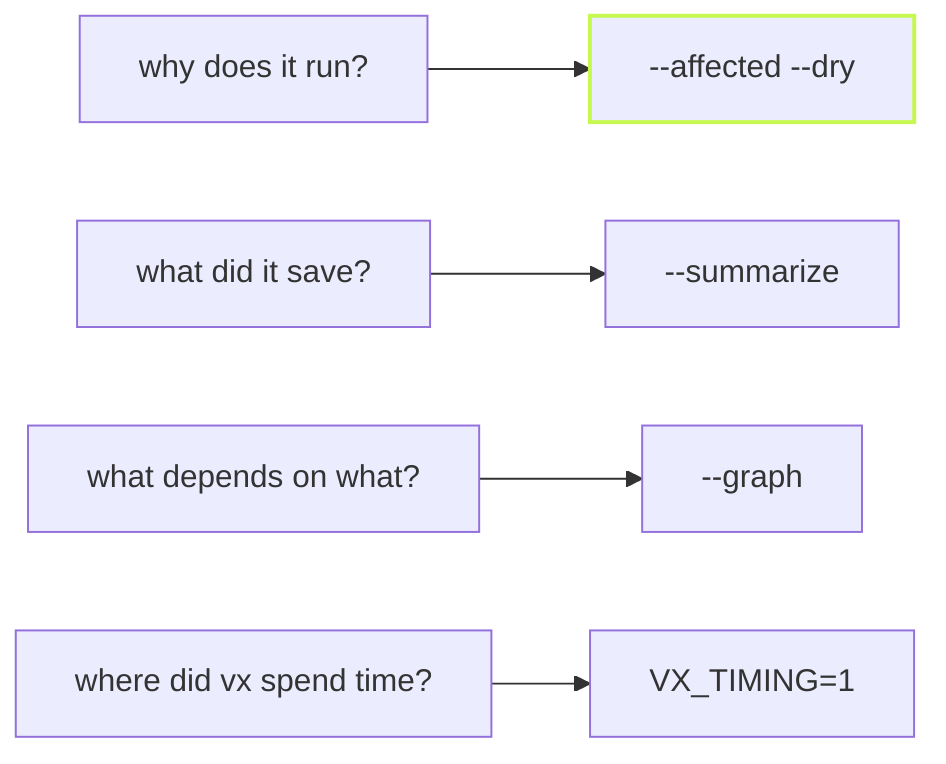

The default run output stays short. When you want the facts behind it,
each one is a flag away, and each prints something a script or an agent
can read.



## Why a task runs

Edit one file in `@demo/ui` and ask what a pull request would run:

```sh frame="terminal"
$ vx run build --all --affected=HEAD --dry
would run:
  ▶  @demo/docs#build  cache miss — would exec   e50d7ee9  ~309ms
                       affected: packages/ui/src/index.ts changed (an input), via @demo/ui#build
  ▶  @demo/ui#build    cache miss — would exec   e212d097  ~312ms
                       affected: packages/ui/src/index.ts changed (an input)
  ▶  @demo/web#build   cache miss — would exec   c6c7de2f  ~308ms
                       affected: packages/ui/src/index.ts changed (an input), via @demo/ui#build

3 task(s) planned, 3 would run.
predicted: ~621ms wall · ~929ms total execution
```

Each kept task names the changed file, or the dependency chain that
reached it. The prediction comes from past runs. `--dry=json` gives the
same as JSON.

## What the run did, as JSON

`--summarize` writes one JSON file per run, under the cache directory or
at the path you give:

```sh frame="terminal"
$ vx run build --all --summarize=run.json --tag env=nightly
$ jq -c 'del(.tasks)' run.json
{"ok":true,"exitCode":0,"totalMs":15.86,"savedMs":1235,"summary":{"successful":4,"failed":0,"skipped":0,"cachedLocal":4,"upToDate":4,"total":4},…}
$ jq -c '.tasks[0]' run.json
{"id":"@demo/api#build","status":"cache-hit","durationMs":2,"hash":"32b3a0bfa973a7a8","storedDurationMs":310,"storedCpuMs":8.075,…}
```

`savedMs` is the time the cache saved: here, a 16 ms run stood in for
1.2 s of work. Every task keeps how long it took when it really ran.
`--tag k=v` labels the run, and the label is kept in run history, so a
nightly run is easy to tell from a pull request.

## The graph, for Graphviz

```sh frame="terminal"
$ vx run build --filter @demo/web --graph
digraph TaskGraph {
  rankdir=LR;
  node [shape=box];
  "@demo/web#build" [label="@demo/web#build\nb25e5bf4", style="filled", fillcolor="#bbf7d0"];
  "@demo/ui#build" [label="@demo/ui#build\n46046abb", style="filled", fillcolor="#bbf7d0"];
  "@demo/ui#build" -> "@demo/web#build";
}
```

Pipe it into `dot -Tsvg`, or write it to a file with
`--graph=tasks.dot`. Green nodes are predicted hits.

## Where vx itself spends time

`VX_TIMING=1` prints vx's own stage table, for performance work on vx:

```sh frame="terminal"
$ VX_TIMING=1 vx run build --all
[vx timing]  stage                    own   cumulative
             startup                 65.7ms      65.7ms
             workspace config        14.6ms      80.3ms
             discover projects        4.2ms      84.5ms
             package graph            0.9ms      85.4ms
             open cache               6.8ms      92.2ms
             load configs             4.9ms      97.1ms
             build graph              3.2ms     100.3ms
             git enumeration          1.1ms     101.4ms
             plugin stages            0.1ms     101.5ms
             classify + probe        12.1ms     113.6ms
             run graph                6.5ms     120.1ms
             record history           2.9ms     123.0ms
             output dir snapshots     0.0ms     123.0ms
             close                    2.8ms     125.8ms
```

A fully cached run of four tasks, start to exit, in 126 ms. Each row is a
stage of the pipeline, so a slow config or a slow probe stands out.

Every flag is in the [CLI reference](../../cli/), and the run JSON's
fields are in [Built for agents](../built-for-agents/).
