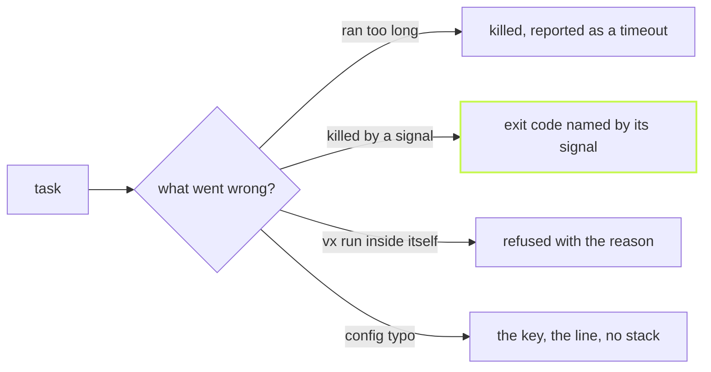

Most tasks run and exit. The rest hang, die, ask a question, or loop
back into vx. These are the cases that cost an afternoon, so vx says
what happened in plain words.



## A hang becomes a timeout

Give a task `exec.timeout` in milliseconds, or set one for the run with
`--timeout`:

```sh frame="terminal"
$ vx run @demo/api#hang
┌─ @demo/api#hang > $ sleep 30
[vx] timed out after 1000ms — killed (SIGTERM)
└─ @demo/api#hang ── (1.01s) failed (timed out, exit 143)
```

## An exit code you can read

Exit 137 means nothing to most people. vx names the signal and the usual
suspects:

```sh frame="terminal"
$ vx run @demo/api#killed
┌─ @demo/api#killed > $ kill -9 $$
[vx] exit 137 is how the shell reports a death by SIGKILL (9): nothing catches it — on Linux the kernel's OOM killer (dmesg, or the memory limit of the container's cgroup) or an explicit kill; vx's own timeout reports itself as a timeout
└─ @demo/api#killed ── (2ms) failed (exit 137, 128 + SIGKILL)
```

## No vx run inside a task

A task that calls `vx run` on its own workspace hides its work from the
graph, the scheduler and the cache key, and a loop back to itself would
fork forever. vx sets `VX_RUN_WORKSPACE` and `VX_RUN_TASK` on every task
and refuses the nested run:

```sh frame="terminal"
$ vx run @demo/api#nested
┌─ @demo/api#nested > $ vx run @demo/api#echo
vx: task @demo/api#nested runs `vx run` inside its own workspace: a nested run is invisible to the outer graph (its tasks escape the schedule, the concurrency budget and the cache key) and a loop back to this task forks without bound. Declare what it needs with dependsOn instead.
└─ @demo/api#nested ── (129ms) failed (exit 1)
```

Driving a different workspace from a task is fine.

## A config typo names the line

```sh frame="terminal"
$ vx run @demo/api#hang
vx: packages/api/vx.config.ts:8:42: tasks.hang.exec.timeout must be a positive integer (milliseconds)
  6 |       cache: { inputs: { files: ['src/**'] }, outputs: { files: ['dist/**'] } },
  7 |     },
> 8 |     hang: { exec: { command: 'sleep 30', timeout: '1s' } },
    |                                          ^
```

The key, the file, the column, and no stack trace.

## Arguments after --

Everything after `--` reaches the task's command and joins its cache
key, so a run with different flags never reuses the wrong result:

```sh frame="terminal"
$ vx run @demo/api#echo -- --watch=false
┌─ @demo/api#echo > $ echo args: --watch=false
args: --watch=false
└─ @demo/api#echo ── (3ms) success
```

## Prompts get the terminal

A task with `exec.interactive: true`, such as a database migration that
asks before it applies, gets vx's own terminal. It runs alone, its output
is passed straight through, and it is never cached. Off a terminal, on CI
or in a pipe, its input is empty, so a prompt reads end of input and
never hangs.

## Two runs take turns

Start a second `vx run` in the same workspace and it waits for the first.
After a second it says who it is waiting for:
`[vx] waiting for another vx run (pid N) on this workspace to finish…`.

Every option is in the [schema](../../schema/) and the
[CLI reference](../../cli/).
