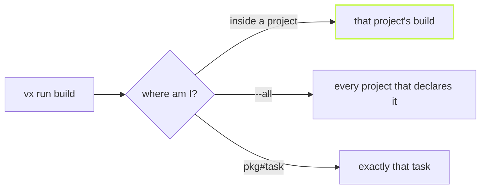

Small things decide whether a tool feels solid: what a bare command
does, what happens in a pipe, and how the CI log reads. Here is how vx
handles each.



## Run what you mean

```sh frame="terminal"
$ cd packages/web && vx run build   # the project you stand in
┌─ @demo/web#build > $ mkdir -p dist && sleep 0.3 && cp src/index.ts dist/index.js
└─ @demo/web#build ── (1ms) up-to-date

$ vx run build --all                # every project that declares build
$ vx run @demo/api#test             # one task, from anywhere
$ vx run build test lint --all      # several at once, one graph
```

## No picker in a pipe

On a terminal, a bare `vx run` opens a picker. In a pipe, a script or an
agent's shell there is nobody to pick, so vx lists the tasks and exits:

```sh frame="terminal"
$ vx run | cat
vx run: missing task name (stdin is not a TTY, so no picker; tasks here: build, test)
```

Off a terminal the live progress region is gone too. The log gets plain
lines that read the same in a file.

## One fold per task on GitHub Actions

On Actions, each task's block is wrapped in a log group with its outcome
and time, so a long run collapses to one line per task:

```sh frame="terminal"
$ vx run test --filter @demo/api
::group::@demo/api#build (success 312ms)
┌─ @demo/api#build > success
$ mkdir -p dist && sleep 0.3 && cp src/index.ts dist/index.js
└─ @demo/api#build ── (312ms) success
::endgroup::
```

A failed task stays open and adds an error annotation instead, such as
`failed (exit 137, 128 + SIGKILL)`. A task's own output is fenced off,
so a line it prints can never be read as a workflow command.

## Colors that listen

Output is truecolor on a terminal and plain elsewhere. `NO_COLOR` turns
it off. `FORCE_COLOR` turns it on, except `FORCE_COLOR=0` and
`FORCE_COLOR=false`, which mean off, the way chalk and Node read them.

## Packages shipped as source

A package with no build step still matters to the packages that use it.
So a project that declares no `build` gets one: a group with
`dependsOn: ['^build']`, keyed on the project's files, that runs nothing.
Edit that package, and its dependents' keys change, so `--affected`
reaches them.

Every flag is in the [CLI reference](../../cli/).
