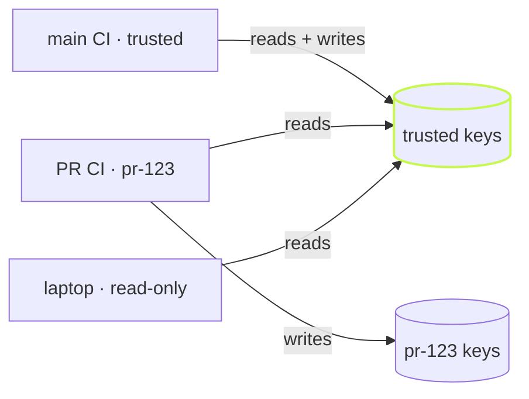

A cache is only useful when you can tell it what to do. vx gives you three
switches for a run, one store for every checkout, and a scope that keeps
untrusted runs from writing what everyone else reads.

## Three switches

```sh frame="terminal"
$ vx run build --all
  result    4 tasks · all cached · 1.27s saved · 18ms

$ vx run build --all --force
  result    4 tasks · 0 cached (0%) · 658ms

$ vx run build --all --no-cache
  result    4 tasks · 4 no-cache · 638ms
```

`--force` runs everything again and refreshes the cache with the result.
`--no-cache` neither reads nor writes. For finer control, `--cache` takes
a read/write spec per layer:

```sh frame="terminal"
$ vx run build --all --cache=local:rw,remote:r   # read the remote, never upload
$ vx run build --all --cache=local:r             # read local, write nothing local
$ vx run build --all --cache=local:,remote:rw    # skip local, still upload
```

An empty spec is refused, never read as "everything on":

```sh frame="terminal"
$ vx run build --all --cache=
vx run: --cache needs a spec like local:r, local:rw, remote:, or local:,remote:rw — pass --no-cache to disable every axis (see `vx run --help`)
```

## One store for every checkout

Artifacts live in `~/.vx/<id>/cache`, where the id comes from the repo's
remote. Each checkout keeps only its own small index. So a second clone
or a fresh `git worktree` hits what the first one built:

```sh frame="terminal"
$ git worktree add ../demo-wt && cd ../demo-wt
$ vx run build --all
  cache     ▰▰▰▰▰▰▰▰▰▰▰▰▰▰▰▰▰▰▰▰▰▰▰▰▰▰▰▰▰▰▰▰▰▰▰▰▰▰▰▰▰▰▰▰▰▰▰▰▰▰
            4 local
  result    4 tasks · all cached · 1.24s saved · 22ms
```

The new worktree had no `dist`. All four builds came back from the shared
store in 22ms. To put the cache somewhere else, use `--cache-dir`,
`VX_CACHE_DIR` or `cacheDir` in `vx.workspace.ts`.

## Who may write the remote cache

A remote cache is shared, so a write is a promise to everyone who reads
it. `cacheScope` decides where a run's writes land:



- `trusted` reads and writes the task keys. This is the default on CI.
- `read-only` reads the task keys and writes nothing. This is the default on a laptop.
- Any other name, like `pr-123`, reads its own keys first, then the
  trusted ones, and writes only its own. A pull request never writes what
  main reads.

```ts
// vx.workspace.ts
import { defineWorkspace } from '@vzn/vx'

export default defineWorkspace({ cacheScope: 'trusted' })
```

`VX_CACHE_SCOPE` beats the config. On GitHub Actions, the
[@vzn/vx-ci plugin](https://vznjs.github.io/vx/blog/results-on-github/)
sets the scope for you: `pr-<n>` on a pull request, trusted on the
default branch. The scope is a client-side rule, so a cache server that
checks tokens is still the real boundary.

Every flag is in the [CLI reference](../../cli/), and `cacheScope` is in
the [schema](../../schema/).
