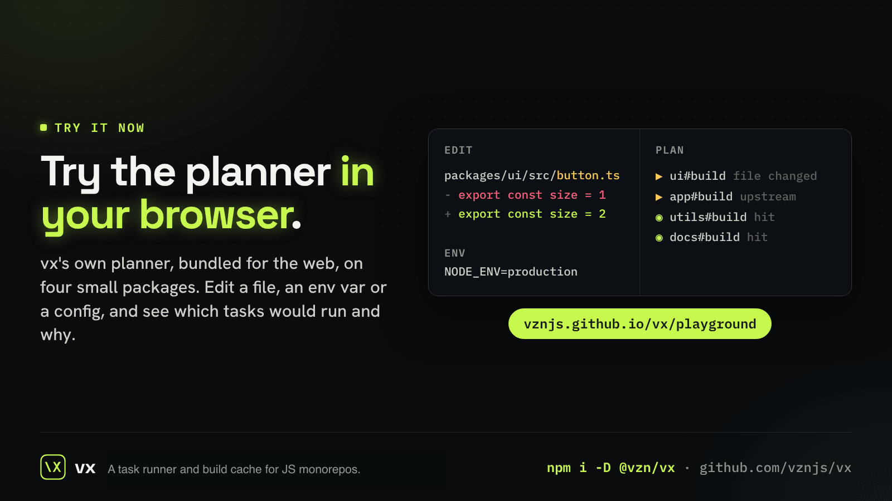
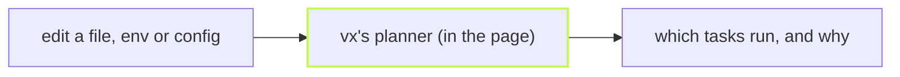

The fastest way to learn how a cache decides is to poke it. The
playground is vx's real planner, the same code the CLI runs, bundled for
the browser. Nothing to install.



## What you can do

- Edit a source file, and see the tasks whose inputs it touches turn into
  misses, plus every task downstream.
- Change an env var a task declares, and see its key move.
- Change a config, and see the resolved task change with it.



The planner plans: it runs no command and writes no file. A test holds
the page's planner to the CLI's, so what you see there is what
`vx` would say.

## The same plan at home

On your own repository the page's answer is one command:

```sh frame="terminal"
vx run build test --all --dry
```

and `--dry=json` gives the plan as data.

[Open the playground →](../../playground/)

Learn more: [The playground](https://vznjs.github.io/vx/features/playground/).
