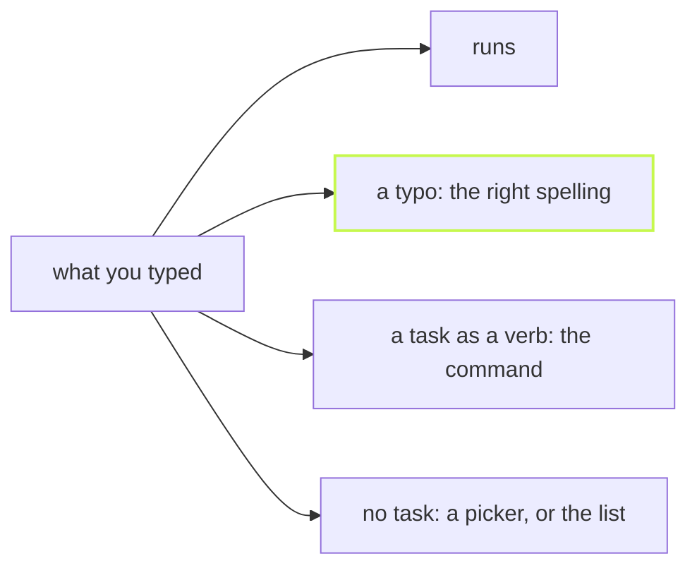

Speed is the headline. The small things are what you meet a hundred
times a day. Every answer below is real vx output from a four-package
workspace.

## A typo gets the right spelling

```sh frame="terminal"
$ vx run build --concurency 4
vx run: unknown flag: --concurency (did you mean --concurrency?) (see `vx run --help`)

$ vx run tset --all
vx run: no projects declare task(s): tset. Did you mean test?
```

## A task typed as a command gets the command

```sh frame="terminal"
$ vx build --all
vx: `build` is a task here, not a command: vx run build --all

$ vx biuld
vx: unknown command: biuld; did you mean the task `build`? vx run build --all
```

## No task, a picker

In a terminal, `vx run` with no task lists the tasks of the project you
are in, to pick one. Off a terminal, for a script or an
agent, it never waits on a prompt. It names the tasks instead:

```sh frame="terminal"
$ vx run < /dev/null
vx run: missing task name (stdin is not a TTY, so no picker; tasks here: build, test) (see `vx run --help`)
```



## Tab completes it all

`vx completions` prints a script for bash, zsh or fish. It completes
every verb, the plugin verbs your workspace adds, and every flag:

```sh frame="terminal"
eval "$(vx completions bash)"                          # this shell
vx completions zsh > ~/.zfunc/_vx                      # zsh, with ~/.zfunc on $fpath
vx completions fish > ~/.config/fish/completions/vx.fish
```

Learn more: [the CLI reference](../../cli/),
[Task picker](https://vznjs.github.io/vx/features/task-picker/) and
[Shell completions](https://vznjs.github.io/vx/features/completions/).
