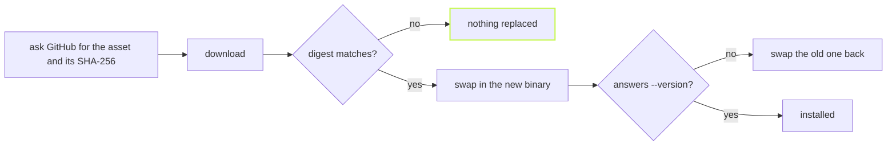

A tool that replaces itself has one job to get right: never leave you
with a broken binary, or a binary someone else built. `vx upgrade` is
careful about both.



## One command

```sh frame="terminal"
$ vx upgrade            # the latest release
$ vx upgrade v0.4.0     # a specific one
```

What it guards against:

- A download that does not match the release's SHA-256 replaces nothing.
  A release with no digest for the asset is refused before the download.
- The new binary must answer `--version` within 10 seconds. One that
  does not start on this machine is swapped back, and the command exits 1.
- A folder you cannot write, such as a root-owned `/usr/local/bin`, is
  refused before anything downloads, with the `sudo` line to run instead.
- No network, a dead proxy, or a captive portal's page is one line that
  says nothing was replaced, never a stack trace.
- On the version it already is, it says `already at <version>` and
  downloads nothing.

An npm install is npm's to update, so there `vx upgrade` tells you to run
`npm install -g @vzn/vx@latest`, rather than leaving a file npm will
quietly put back.

## Who built the bytes

A digest proves the transfer, not the builder. So every release binary
also carries a Sigstore-signed build-provenance attestation:

```sh frame="terminal"
$ gh attestation verify vx-linux-x64 --repo vznjs/vx
```

npm packages are published from CI through trusted publishing, with
provenance attached, and no long-lived token exists to steal.

## A CLI that does not guess

Numbers are strict. `0x10`, `1e3` and `2.7` are refused, never read as
something you did not mean:

```sh frame="terminal"
$ vx run build --concurrency 0x10
vx run: --concurrency must be a positive integer, or a share of the cores such as 50% (got 0x10) (see `vx run --help`)

$ vx run build --timeout 1e3
vx run: --timeout must be a positive integer in ms (got 1e3) (see `vx run --help`)

$ vx run build --retries 2
vx run: unknown flag: --retries (did you mean --retry?) (see `vx run --help`)
```

`vx help` lists every verb, `vx help <verb>` shows one, and `vx version`
prints the version. The full reference is the [CLI page](../../cli/).
