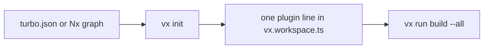

vx 0.0.76 through 0.0.199 shipped on 2026-09-27 and 2026-09-28. The theme
is adoption: a Turbo or Nx user gets a working setup from `vx init`, their
habits get an answer instead of an error, and the root package can hold
tasks. The run footer, `vx last` and secret masking also got better. Two
changes are breaking; they are listed at the end.

**In this release**

- [vx init adopts a Turbo or Nx repo](#vx-init-adopts-a-turbo-or-nx-repo)
- [Turbo and Nx habits get an answer](#turbo-and-nx-habits-get-an-answer)
- [A workspace root can be a project](#a-workspace-root-can-be-a-project)
- [Narrow a filter by a git range](#narrow-a-filter-by-a-git-range)
- [Exclude paths from outputs](#exclude-paths-from-outputs)
- [A one-line result row](#a-one-line-result-row)
- [vx last finds the failure](#vx-last-finds-the-failure)
- [Mask any secret by name](#mask-any-secret-by-name)
- [Scaffold a plugin](#scaffold-a-plugin)
- [JSON Schemas for JSON output](#json-schemas-for-json-output)

## vx init adopts a Turbo or Nx repo

In a repo with `turbo.json` or `nx.json`, `vx init` used to copy scripts
into one config per package and drop every edge the repo declared. It now
writes only `vx.workspace.ts` with `turbo()` or `nx()`, which read the repo
as it is. When it sees a remote cache (`TURBO_TOKEN` in CI, or a
`remoteCache` in turbo.json), it adds `turboCache()` or `nxCache()` too, so
the first vx run on CI hits the cache Turbo already filled. The `next:`
line installs what is missing with your package manager.

```ts
// vx.workspace.ts, as vx init writes it beside turbo.json
import type { WorkspaceConfig } from '@vzn/vx/config'
import { turbo, turboCache } from '@vzn/vx-migrate'

export default { plugins: [turbo(), turboCache()] } satisfies WorkspaceConfig
```



PRs [#1706](https://github.com/vznjs/vx/pull/1706),
[#1801](https://github.com/vznjs/vx/pull/1801). Docs:
[Migrate from Turborepo](../../guides/migrate/#turborepo).

## Turbo and Nx habits get an answer

Hands trained on Turbo or Nx type `turbo build`, `nx run web:build`,
`--dry-run`, `-p` or `--parallel`. vx refused each as unknown. Now every
Turbo and Nx run flag has one outcome: it works as is, it is an alias, or
the error names the vx spelling. A task typed as a verb, and Nx's
`project:target`, name the `vx run` to type instead.

```txt frame="terminal"
$ vx build
vx: `build` is a task here, not a command: vx run build --all
$ vx run app:build
vx run: `app:build` is Nx's project:target: vx run app#build
```

PRs [#1715](https://github.com/vznjs/vx/pull/1715),
[#1720](https://github.com/vznjs/vx/pull/1720),
[#1768](https://github.com/vznjs/vx/pull/1768).

## A workspace root can be a project

A root task, like codegen or a root `tsc -b` every package waits on, had
no home. A `vx.config.ts` at the root is now a project: its globs stop at
every member, and other tasks can depend on it. `--filter //` selects it,
as in Turbo. `turbo()` maps Turbo's `//#task` keys onto it, and
`bunx @vzn/vx-migrate` writes the root config for them. Five of eleven
real Turbo repos had root tasks that were dropped before.

```ts
// vx.config.ts at the workspace root
import { defineProject } from '@vzn/vx/config'

export default defineProject({
  tasks: {
    codegen: { exec: { command: 'bun scripts/codegen.ts' } },
  },
})
```

```sh frame="terminal"
vx run codegen --filter //
```

PRs [#1646](https://github.com/vznjs/vx/pull/1646),
[#1724](https://github.com/vznjs/vx/pull/1724),
[#1685](https://github.com/vznjs/vx/pull/1685),
[#1827](https://github.com/vznjs/vx/pull/1827).

## Narrow a filter by a git range

A selector followed by a git range, like `@scope/*[HEAD]` or
`{./apps/*}[main]`, was read as one name glob and matched nothing. vx now
reads it as Turbo and pnpm do: the selected projects that changed since
that ref.

```sh frame="terminal"
vx run build --filter '{./packages/*}[main]'
```

PR [#1703](https://github.com/vznjs/vx/pull/1703). Docs:
[Run and filter](../../guides/ci/#run-and-filter).

## Exclude paths from outputs

`cache.outputs` now takes `!` entries. A path matched by one is not
cleaned, saved, restored or taken from a remote, and `vx watch` still
sees it. A scratch dir inside `dist` no longer forces a task to run
uncached. Turbo and Nx negated outputs map to it.

```ts
import { defineProject } from '@vzn/vx/config'

export default defineProject({
  tasks: {
    build: {
      exec: { command: 'bun run build' },
      cache: {
        inputs: { files: ['src/**'] },
        outputs: { files: ['dist/**', '!dist/tmp/**'] },
      },
    },
  },
})
```

PRs [#1649](https://github.com/vznjs/vx/pull/1649),
[#1679](https://github.com/vznjs/vx/pull/1679). Docs:
[Caching](../../guides/configure/#caching).

## A one-line result row

The footer spread tasks, cache hits and time over three meters. It now
ends with one `result` line: task count, how many were cached, time saved
and wall time. It says `all cached` when every task hit, and puts
failures first.

```txt frame="terminal"
  info      4 workers · local cache
  time      27ms
  result    2 tasks · all cached · 22ms saved · 27ms
```

PR [#1760](https://github.com/vznjs/vx/pull/1760).

## vx last finds the failure

After a green re-run, finding the failure took `--list` and a copied
UUID. `vx last --failed` replays the latest failed run, and with `--list`
lists only failures. `--list` prints short run ids, and `vx last` and
`vx why` take any unique prefix. A failed replay ends with the command
that re-runs what failed.

```txt frame="terminal"
$ vx last --failed
  $ vx run test --all
  3 tasks · 2 hits (2 up-to-date, 0 restored) · 1 failed

  failed (exit 1)   app#test        5ms  a210b23e08eded55  no-cache  0.3× cpu
  up-to-date        lib#build       0ms  18679153744c589a
  up-to-date        app#build       2ms  15f0218ef9e7a02c

  re-run what failed: vx run app#test
```

PRs [#1499](https://github.com/vznjs/vx/pull/1499),
[#1385](https://github.com/vznjs/vx/pull/1385),
[#1436](https://github.com/vznjs/vx/pull/1436),
[#1493](https://github.com/vznjs/vx/pull/1493). Deep dive:
[Why did this re-run?](../why-did-this-rerun/)

## Mask any secret by name

vx masks values of env vars whose names hold `TOKEN`, `SECRET`, `KEY`,
`PASSWORD`, `PASSWD` or `CREDENTIAL`, wherever it prints, stores or
exports a task's output or command. That missed names like `GH_PAT`: a
task that echoed it stored the token in its cached log. The new
`exec.env.secret` list masks any name you give it.

```ts
import { defineProject } from '@vzn/vx/config'

export default defineProject({
  tasks: {
    publish: {
      exec: {
        command: 'bun scripts/publish.ts',
        env: { passThrough: ['GH_PAT'], secret: ['GH_PAT'] },
      },
    },
  },
})
```

PRs [#1406](https://github.com/vznjs/vx/pull/1406),
[#1532](https://github.com/vznjs/vx/pull/1532). Docs:
[Environment variables](../../guides/configure/#environment-variables).

## Scaffold a plugin

`vx init --plugin <seam>` writes `plugins/<seam>.ts`, a runnable plugin,
and a test that drives it through a real run. It covers all nine seams:
executor, cache, telemetry, schedule, admit, commands, project, graph and
key. The templates are the same examples the repo's gate runs.

```txt frame="terminal"
$ vx init --plugin telemetry
wrote plugins/telemetry.ts and plugins/telemetry.test.ts
Declare it in vx.workspace.ts: import { jsonlTelemetry } from './plugins/telemetry.ts', then plugins: [jsonlTelemetry(…)]
Test it: bun test plugins/telemetry.test.ts (needs @vzn/vx installed)
```

PRs [#1415](https://github.com/vznjs/vx/pull/1415),
[#1347](https://github.com/vznjs/vx/pull/1347). Docs:
[Write one](../../guides/plugins/#write-one).

## JSON Schemas for JSON output

CI scripts and agents parse `vx show`, `vx info`, `vx why`, `vx last`,
`vx cache prune --format json`, `vx run --dry=json` and `--summarize`.
Their shapes are now JSON Schemas shipped in
`node_modules/@vzn/vx/schemas/`, and tests hold each output to its schema.
`vx cache prune` gained `--format json` in the same batch.

```sh frame="terminal"
vx run build --all --dry=json > plan.json   # schemas/plan.json
```

PRs [#1608](https://github.com/vznjs/vx/pull/1608),
[#1675](https://github.com/vznjs/vx/pull/1675),
[#1681](https://github.com/vznjs/vx/pull/1681),
[#1644](https://github.com/vznjs/vx/pull/1644).

## Breaking changes

- `vx stats` is removed; run `vx info`, which prints the same report.
  PR [#1392](https://github.com/vznjs/vx/pull/1392).
- `defineProject` and `defineWorkspace` reject undeclared keys at
  type-check time; vx already refused them at load.
  PRs [#1792](https://github.com/vznjs/vx/pull/1792),
  [#1793](https://github.com/vznjs/vx/pull/1793).

See [Upgrading](../../guides/upgrading/).

## How to update

```sh frame="terminal"
npm install -D @vzn/vx@latest
```

A standalone binary updates itself with `vx upgrade`.

## Learn more

- [Quickstart](../../quickstart/)
- [Benchmarks](../../benchmarks/)
- [Every release on GitHub](https://github.com/vznjs/vx/releases)
