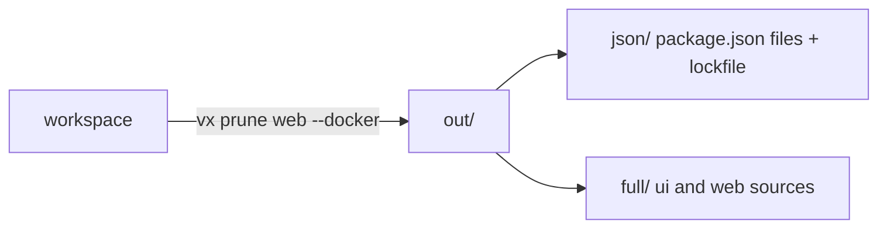

vx 0.0.361 to 0.0.495 all shipped on 2026-10-03. The theme is closing gaps
people hit when they move a Turbo or Nx repo over: a Docker prune, tags,
interactive tasks, Turbo's range spelling, and a remote cache a PR cannot
poison. Dev servers, the sandbox and remote execution also tell you more
when something goes wrong.

**In this release**

- [Prune a workspace for Docker](#prune-a-workspace-for-docker)
- [Project tags](#project-tags)
- [Interactive tasks](#interactive-tasks)
- [Per-PR remote cache scope](#per-pr-remote-cache-scope)
- [Colour in task output and help](#colour-in-task-output-and-help)
- [Dev servers that die or stall](#dev-servers-that-die-or-stall)
- [Turbo-style affected ranges](#turbo-style-affected-ranges)
- [A sandbox that names hidden reads](#a-sandbox-that-names-hidden-reads)
- [Remote execution falls back past a queue bound](#remote-execution-falls-back-past-a-queue-bound)
- [Nx: your own executors as commands](#nx-your-own-executors-as-commands)

## Prune a workspace for Docker

Declaring `pnpm()`, `bun()`, `npm()` or `yarn()` from `@vzn/vx-lockfile`
now adds `vx prune`, vx's answer to `turbo prune`. It copies the named
projects and their workspace dependencies to `out/`, and cuts each lockfile
to what that subset installs, so it still installs frozen. `--docker`
splits the copy into `json/` (manifests and lockfile, the cacheable install
layer) and `full/` (everything).

```txt frame="terminal"
$ vx prune web --docker
vx prune: 2 projects → out (json/ + full/), bun.lock pruned
  ui (packages/ui)
  web (packages/web)
```



PR [#2750](https://github.com/vznjs/vx/pull/2750)

## Project tags

A project config can carry `tags`, and `--filter tag:<pattern>` selects the
projects holding a match, as Nx's `tag:` does. `vx show` and `vx mcp` list
them, and the Nx adoption carries Nx tags over. Tags are in no cache key.

```ts
// packages/web/vx.config.ts
import { defineProject } from '@vzn/vx/config'

export default defineProject({
  tags: ['frontend'],
  tasks: { build: { exec: { command: 'vite build' } } },
})
```

```txt frame="terminal"
$ vx run build --filter tag:frontend
 ⏺︎     7ms success no-cache ui#build
 ⏺︎     8ms success no-cache web#build
```

PR [#2749](https://github.com/vznjs/vx/pull/2749)

## Interactive tasks

`exec.interactive: true` marks a task that reads the terminal: a prompt, a
REPL, a watch mode's keys. On a TTY it gets vx's stdin, stdout and stderr,
and nothing else starts while it runs. It always runs on this machine and
is never cached or sandboxed. Off a TTY, on CI, it runs like any task. The
Turbo adoption maps Turbo's `interactive: true` to it.

```ts
import { defineProject } from '@vzn/vx/config'

export default defineProject({
  tasks: { repl: { exec: { command: 'bun repl', interactive: true } } },
})
```

PR [#2748](https://github.com/vznjs/vx/pull/2748)

## Per-PR remote cache scope

`cacheScope` decides where a run's remote cache writes land. `'trusted'`
reads and writes the shared keys and is the default on CI. `'read-only'`
writes nothing and is the default off CI. Any other name, such as
`'pr-123'`, reads its own keys then the trusted ones, and writes only its
own, so a pull request never writes what the default branch reads. Set it
in `vx.workspace.ts`, with `VX_CACHE_SCOPE`, or let the `github()` plugin
(now `@vzn/vx-ci`) set it on Actions. It is a client-side convention: real
isolation needs a server that scopes writes by token.

```sh frame="terminal"
VX_CACHE_SCOPE=pr-123 vx run build --all
```

PR [#2746](https://github.com/vznjs/vx/pull/2746). See
[Cache poisoning](../../security/#cache-poisoning).

## Colour in task output and help

A task's stdout is a pipe, so tools printed plain under vx. Tasks now get
`FORCE_COLOR=1` unless they already see `FORCE_COLOR` or `NO_COLOR`, as
under Nx and Turbo. When vx's own output is plain, it strips the escapes
from task output, live and replayed. `vx help` on a terminal now has bold
headings and cyan verbs, flags and examples; piped help stays plain.

```sh frame="terminal"
NO_COLOR=1 vx run build --all
```

PRs [#2742](https://github.com/vznjs/vx/pull/2742),
[#2744](https://github.com/vznjs/vx/pull/2744)

## Dev servers that die or stall

A dependency server that crashed mid-run was named only at the end, while
its dependants failed with no word of why. vx now says so when it happens,
and dependants not yet started skip, named for the server. A server whose
`readyWhen` never matches no longer waits in silence: after 10 seconds vx
says what it waits for and whether anything bounds the wait.

```txt frame="terminal"
$ vx run web#e2e
┌─ web#e2e > $ sleep 1; echo e2e done
vx: web#dev exited with code 3 while the run went on
e2e done
└─ web#e2e ── (1.01s) success
```

PRs [#2152](https://github.com/vznjs/vx/pull/2152),
[#2338](https://github.com/vznjs/vx/pull/2338),
[#2463](https://github.com/vznjs/vx/pull/2463). Deep dive:
[Dev servers in the graph](../dev-servers-in-the-graph/).

## Turbo-style affected ranges

Turbo's CI spelling `--filter=[origin/main...HEAD]` was refused as a range.
vx diffs a base against the working tree, so a range that ends at `HEAD`
means the same set plus any uncommitted edit. `<base>...HEAD` and
`<base>..HEAD` now work in `--filter` and `--affected`; a range that ends
anywhere else is still refused.

```sh frame="terminal"
vx run test --affected=origin/main...HEAD
```

PRs [#2149](https://github.com/vznjs/vx/pull/2149),
[#2373](https://github.com/vznjs/vx/pull/2373)

## A sandbox that names hidden reads

A sandboxed task that failed on a read the sandbox hid saw only its tool's
"File not found": `tsc` extending a root `tsconfig.base.json` was the
common case. A failed task now names the hidden paths that exist on the
host and the grant to add. Separately, the host's credential stores
(`~/.ssh`, `~/.aws`, `~/.npmrc` and the like) are now denied to sandboxed
tasks unless `allow.read` names one, so a dependency cannot copy a key into
a cached output.

```txt frame="terminal"
vx: the sandbox hid paths outside the project that exist on this machine,
which are not reported as violations: /repo/tsconfig.base.json. If the
task reads one, grant it, e.g. `allow: { read: ['../../tsconfig.base.json'] }`.
```

PRs [#2387](https://github.com/vznjs/vx/pull/2387),
[#2344](https://github.com/vznjs/vx/pull/2344),
[#2451](https://github.com/vznjs/vx/pull/2451). See the
[sandboxing guide](../../guides/sandboxing/).

## Remote execution falls back past a queue bound

With `@vzn/vx-reapi`, an action no worker picked up waited without bound
unless the task set `exec.timeout`, and then it failed as timed out. The
new `queueTimeoutMs` bounds the wait for a worker. Past it, vx cancels the
remote operation, runs the task on this machine, and says why once. A task
placed `exec.remote: 'only'` fails with that reason instead.

```ts
// vx.workspace.ts
import { defineWorkspace } from '@vzn/vx/config'
import { reapi } from '@vzn/vx-reapi'

export default defineWorkspace({
  plugins: [
    reapi({
      endpoint: 'grpcs://grpc.example.com:443',
      execute: true,
      queueTimeoutMs: 60_000,
    }),
  ],
})
```

PRs [#2716](https://github.com/vznjs/vx/pull/2716),
[#2723](https://github.com/vznjs/vx/pull/2723). Deep dive:
[Remote execution](../remote-execution/).

## Nx: your own executors as commands

`nx()` runs every Nx executor through `nx-exec`, a Node boot per task. A
workspace's own executor that only wraps a shell command can now skip that:
`nx({ executors })` takes a function per executor name that returns
`{ command, timeout?, env? }`, or `undefined` to leave the target to
`nx-exec`. Each function's source text keys the cached mapping, so an edit
re-maps. Also, an Nx output that starts with a wildcard (`**/*.d.ts`) now
stays cached instead of turning the target uncached.

```ts
// vx.workspace.ts
import { defineWorkspace } from '@vzn/vx/config'
import { nx } from '@vzn/vx-migrate'

export default defineWorkspace({
  plugins: [
    nx({
      executors: {
        '@acme/tools:shell': (t) => ({ command: String(t.options.command) }),
      },
    }),
  ],
})
```

PRs [#2733](https://github.com/vznjs/vx/pull/2733),
[#2736](https://github.com/vznjs/vx/pull/2736). Deep dive:
[From Nx](../from-nx/).

## Breaking changes

- Core `SCHEMA_VERSION` v29 to v30: an older cache index is dropped on
  first open ([#2246](https://github.com/vznjs/vx/pull/2246)).
- `nx()` migrations write `nx-exec` lines where they wrote executor
  commands ([#2632](https://github.com/vznjs/vx/pull/2632)).
- `vx init` keeps existing configs and exits 0 instead of refusing with 1
  ([#2546](https://github.com/vznjs/vx/pull/2546)).
- `reapi()` refuses `onWarn`, `tlsCaPem`, `tlsClientCertPem` and
  `tlsClientKeyPem`; use the file options
  ([#2535](https://github.com/vznjs/vx/pull/2535)).
- `@vzn/vx-reapi`'s plugin-api record drops the `WireOnly` type
  ([#2541](https://github.com/vznjs/vx/pull/2541)).
- `refuseUnknownOptions` takes a `PluginOptionKinds` record, and a plugin
  option of the wrong kind is refused
  ([#2475](https://github.com/vznjs/vx/pull/2475)).
- `@vzn/vx-reapi` stops exporting its wire and Merkle internals
  ([#2521](https://github.com/vznjs/vx/pull/2521)).
- `@vzn/vx-migrate` exports only its four plugins
  ([#2520](https://github.com/vznjs/vx/pull/2520)).
- `@vzn/vx-lockfile` stops exporting its parser namespaces
  ([#2512](https://github.com/vznjs/vx/pull/2512)).
- `@vzn/vx-otel` stops exporting its OTLP builders
  ([#2508](https://github.com/vznjs/vx/pull/2508)).
- `@vzn/vx-github` stops exporting its Checks API helpers
  ([#2503](https://github.com/vznjs/vx/pull/2503)).

See [Upgrading](../../guides/upgrading/).

## How to update

```sh frame="terminal"
npm install -D @vzn/vx@latest
```

A standalone binary updates itself with `vx upgrade`.

## Learn more

- [Quickstart](../../quickstart/)
- [Benchmarks](../../benchmarks/)
- [Every release on GitHub](https://github.com/vznjs/vx/releases)
