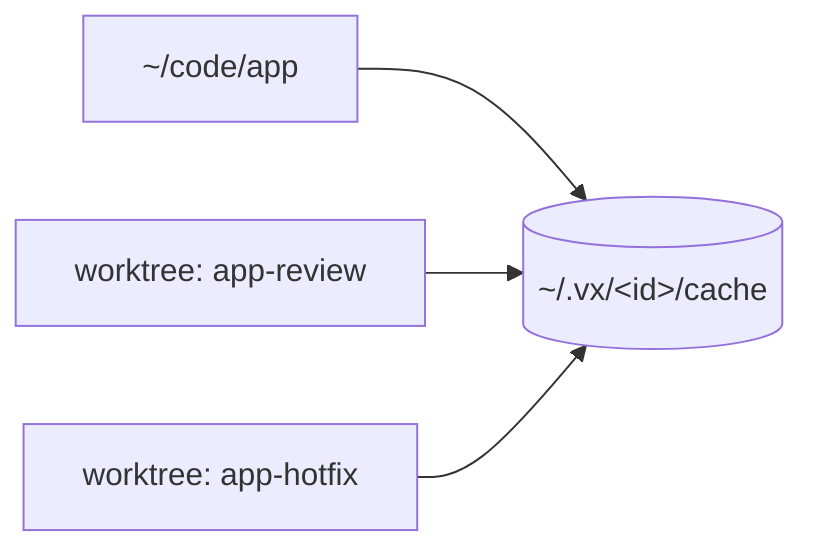

vx 0.0.496 to 0.0.520 shipped from October 4 to October 6, 2026. The theme
is less setup and less noise: every clone and worktree of a repo now shares
one cache, `--affected` picks tasks instead of packages, one command moves
a Turbo or Nx setup to vx, and the run summary is the last thing a run
prints.

**In this release**

- [One cache for every checkout](#one-cache-for-every-checkout)
- [Affected runs follow task edges](#affected-runs-follow-task-edges)
- [vx-migrate does the whole adoption](#vx-migrate-does-the-whole-adoption)
- [The summary is the last line](#the-summary-is-the-last-line)
- [Restored and up-to-date hits everywhere](#restored-and-up-to-date-hits-everywhere)
- [@vzn/vx-github is now @vzn/vx-ci](#vznvx-github-is-now-vznvx-ci)
- [Task metrics and linked spans in OpenTelemetry](#task-metrics-and-linked-spans-in-opentelemetry)
- [Less CPU per cold miss](#less-cpu-per-cold-miss)
- [Fixes](#fixes)

## One cache for every checkout

Cache entries now live in `~/.vx/<id>/cache`, like Nx. The id comes from
the git remote and the workspace's path in the repo (or the first commit
when there is no remote), so clones and worktrees of one repo hit each
other's entries. `cacheDir`, `VX_CACHE_DIR` or `--cache-dir` still keep the
whole cache in one directory of your choosing. A store or index from
another schema version is now reset instead of refusing the run, and its
artifacts are indexed again on their next hit, so a schema change no
longer throws the artifacts away.

```ts
// vx.workspace.ts
import { defineWorkspace } from '@vzn/vx/config'

export default defineWorkspace({
  cacheDir: 'build/.vx', // unset: ~/.vx/<id>/cache, shared by checkouts
})
```



PRs [#2773](https://github.com/vznjs/vx/pull/2773),
[#2775](https://github.com/vznjs/vx/pull/2775). Docs:
[Workspace config](../../guides/configure/#workspace-config).

## Affected runs follow task edges

`--affected` now selects tasks, not packages. A changed file seeds the tasks
whose declared inputs match it, and a requested task runs when its
`dependsOn` closure holds a seeded one. A package with no `build` task gets a
default build group behind `^build`, keyed on every file of the package. So a
package consumed as source still moves its dependants' keys: here `ui` has no
tasks, and an edit to it re-runs `app#test`.

```sh frame="terminal"
echo 'x' >> packages/ui/src/i.ts
vx run test --affected=HEAD
```

```txt frame="terminal"
 ⏺︎     7ms success miss     app#test
```

PR [#2770](https://github.com/vznjs/vx/pull/2770).

## vx-migrate does the whole adoption

`npx @vzn/vx-migrate` now asks whether to migrate natively (a
`vx.config.ts` per package) or keep `turbo.json` / `nx.json` as the source.
`--native` or `--keep` answer it; without a terminal it is native. It
installs vx with the repo's own package manager (`--no-install` skips that)
and leaves your `package.json` scripts alone.

```sh frame="terminal"
npx @vzn/vx-migrate --native
```

PRs [#2771](https://github.com/vznjs/vx/pull/2771),
[#2772](https://github.com/vznjs/vx/pull/2772). Docs:
[One command](../../guides/migrate/#one-command).

## The summary is the last line

Nothing prints below the end-of-run summary anymore. Aborted and unstarted
tasks are rows in the task list with their own status, a skipped task names
its blocker, and a flaky task carries a note on its row. Warnings from
uploads, plugin teardown and history land above the summary. The failure
recap is gone: each failure's output already prints above it.

```txt frame="terminal"
 ◼︎    11ms failed  miss     a#build
 ⊘         skipped          b#build • blocked by a#build

┌─ a#build > failed (exit 1)

$ mkdir -p dist && cp src/i.ts dist/ && exit 1

└─ a#build ── (11ms) failed (exit 1)


─ vx 0.0.0 ───────────────────────────────────────────────────
  projects  ▰▰▰▰▰▰▰▰▰▰▰▰▰▰▰▰▰▰▰▰▰▰▰▰▰▰▰▰▰▰▰▰▰▰▰▰▰▰▰▰▰▰▰▰▰▰▰▰▰▰
            2 in run · 2 total
  tasks     ▰▰▰▰▰▰▰▰▰▰▰▰▰▰▰▰▰▰▰▰▰▰▰▰▰▰▰▰▰▰▰▰▰▰▰▰▰▰▰▰▰▰▰▰▰▰▰▰▰▰
            1 failed · 1 skipped · 2 total
  cache     ▰▰▰▰▰▰▰▰▰▰▰▰▰▰▰▰▰▰▰▰▰▰▰▰▰▰▰▰▰▰▰▰▰▰▰▰▰▰▰▰▰▰▰▰▰▰▰▰▰▰
            1 miss · 1 skipped

  info      4 workers · local cache
  time      56ms · max 11ms · avg 11ms · min 11ms
  result    2 tasks · 1 failed · 0 cached (0%) · 56ms
```

PRs [#2752](https://github.com/vznjs/vx/pull/2752),
[#2757](https://github.com/vznjs/vx/pull/2757),
[#2780](https://github.com/vznjs/vx/pull/2780),
[#2781](https://github.com/vznjs/vx/pull/2781).

## Restored and up-to-date hits everywhere

A hit either found its outputs in place (up-to-date) or restored them from
the cache. Only the live summary told them apart before. The run history
now stores the split, so `vx last`, `vx info`, `vx why`, the markdown
report, `vx mcp` and the plugins all show it.

```txt frame="terminal"
$ vx last
  2 tasks · 2 hits (0 up-to-date, 2 restored: 2 local, 0 remote)

  restored-local    a#build      17ms  73b25577a99ad2f8
  restored-local    b#build      13ms  4935028bcd991dbd
```

Commit
[f336e9f](https://github.com/vznjs/vx/commit/f336e9f3e06bc6f9ca8d4dc615c92aaa0f968585).

## @vzn/vx-github is now @vzn/vx-ci

The GitHub Actions plugin has a new package name. The `github()` export is
unchanged, so only the import moves.

```ts
// vx.workspace.ts
import { defineWorkspace } from '@vzn/vx/config'
import { github } from '@vzn/vx-ci'

export default defineWorkspace({ plugins: [github()] })
```

PR [#2782](https://github.com/vznjs/vx/pull/2782). Docs:
[GitHub Actions](../../guides/ci/#github-actions).

## Task metrics and linked spans in OpenTelemetry

`@vzn/vx-otel` now sends per-task metrics: duration, CPU time and peak
memory at each task's end, and CPU usage and memory each second while it
runs, so a metrics backend can chart them. A task span links to the tasks
it waited on, records each failed attempt as a `vx.task.retry` event, and
each `VX_TIMING` stage is a child span of the run.

```sh frame="terminal"
OTEL_EXPORTER_OTLP_ENDPOINT=http://localhost:4318 vx run build --all
```

PRs [#2783](https://github.com/vznjs/vx/pull/2783),
[#2784](https://github.com/vznjs/vx/pull/2784). Docs:
[OpenTelemetry](../../guides/plugins/#opentelemetry).

## Less CPU per cold miss

A cold run does less work per task: no deferred closure walk when nothing
is deferred, upstream outputs read only for a plugin executor, and small
artifacts packed on the calling thread. On macOS tasks run under `dash`
when it is on `PATH`. vx's own cold CPU on 1,090 packages went from 6.85 s
to 5.7 s.

```sh frame="terminal"
vx run build --all --force
```

<div class="vx-charts"><figure class="vx-bars"><figcaption>vx cold CPU, 1,090 packages</figcaption><div class="vx-bar" style="--w:100%"><span class="vx-bar-name">before</span><span class="vx-bar-value">6.85 s</span><span class="vx-bar-track"><span class="vx-bar-fill"></span></span></div><div class="vx-bar vx-bar-lead" style="--w:83.2%"><span class="vx-bar-name">after</span><span class="vx-bar-value">5.7 s</span><span class="vx-bar-track"><span class="vx-bar-fill"></span></span></div></figure></div>

PR [#2767](https://github.com/vznjs/vx/pull/2767).

## Fixes

- An extglob such as `src/@(x|y).ts` in a task glob matched no file, so an
  edit replayed a stale hit. vx now refuses it at load and suggests the
  brace form ([#2768](https://github.com/vznjs/vx/pull/2768)).
- Tasks get `npm_execpath` for the repo's package manager, so tools like
  `npm-run-all` call back pnpm or bun instead of a global npm
  ([#2774](https://github.com/vznjs/vx/pull/2774)).
- On macOS a wildcard write grant in the sandbox now covers what is inside
  the directories it matches, which pnpm's lock files need
  ([c931a09](https://github.com/vznjs/vx/commit/c931a094303928046d9067d5278eefef8d6e2913)).

```ts
cache: { inputs: { files: ['src/{x,y}.ts'] }, outputs: { files: ['dist/**'] } }
```

## Breaking changes

- `@vzn/vx-github` is now `@vzn/vx-ci`; `github()` is unchanged.
- The cache moves to `~/.vx/<id>/cache`; existing entries miss once.
- The run history gains hit counts; an older index is dropped once.
- `Cache.getMany` and `CacheLayer.getMany` take an optional get context.
- The end-of-run failure recap and `formatFailureRecap` are removed.

See [Upgrading](../../guides/upgrading/).

## How to update

```sh frame="terminal"
npm install -D @vzn/vx@latest
```

A standalone binary updates itself with `vx upgrade`.

## Learn more

- [Quickstart](../../quickstart/)
- [Benchmarks](../../benchmarks/)
- [Every release on GitHub](https://github.com/vznjs/vx/releases)
