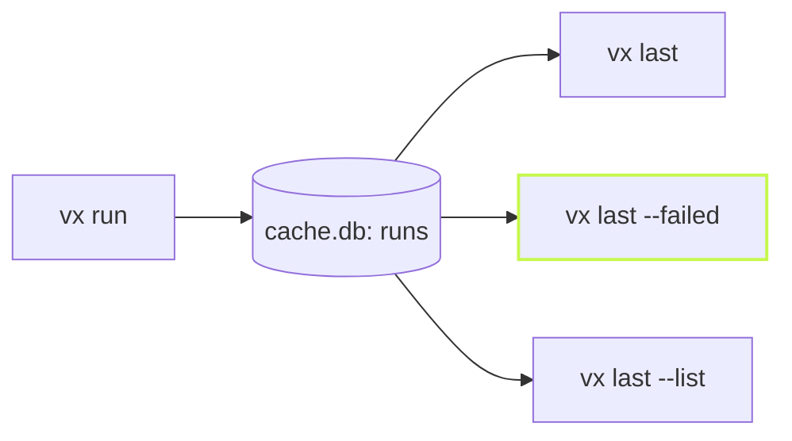

The terminal scrolled away, CI printed ten thousand lines, or an agent
ran the build an hour ago. vx keeps a record of every run, so the
question "what happened?" has an answer after the fact.

```sh frame="terminal"
vx last
```

## The last run

```sh frame="terminal"
$ vx last
run 01a11e14-87de-749d-a6ba-eca7bb441469 — ok
  $ vx run build --all
  2026-10-09T00:33:44.415Z · 62ms · master @ 64a144f9
  4 tasks · 4 hits (1 up-to-date, 3 restored: 3 local, 0 remote)

  restored-local    @demo/ui#build        31ms  46046abb75e9c084
  restored-local    @demo/web#build       31ms  b25e5bf41cb7a54d
  restored-local    @demo/docs#build      31ms  1f858edb724ca91b
  up-to-date        @demo/api#build        9ms  32b3a0bfa973a7a8
```

The command, the branch and commit, the time, and every task with its
outcome and cache key.

## The run that broke

`--failed` skips to the newest run that failed, and ends with the
command that runs only what failed:

```sh frame="terminal"
$ vx last --failed
run 01a11dab-5561-75fe-aa33-fd0fa220ad42 — FAILED
  $ vx run test --all
  2026-10-08T22:38:50.209Z · 606ms · feat @ 5f0b0da6+dirty
  8 tasks · 2 hits (2 up-to-date, 0 restored) · 1 failed

  failed (exit 1)   @demo/ui#test          4ms  fb349347b8a40aeb  0.5× cpu
  success           @demo/web#test       206ms  9b78e7e1a95c53db  0.0× cpu
  success           @demo/docs#test      205ms  36a0120a08d6c9d9  0.0× cpu
  ...

  re-run what failed: vx run @demo/ui#test
```

## Recent runs

```sh frame="terminal"
$ vx last --list
ok     2026-10-09T00:33:44.415Z  01a11e14-87de  4 tasks · 4 hits (1 up-to-date, 3 restored: 3 local, 0 remote)   62ms  $ vx run build --all
FAILED 2026-10-08T22:38:50.209Z  01a11dab-5561  8 tasks · 2 hits (2 up-to-date, 0 restored) · 1 failed          606ms  $ vx run test --all
ok     2026-10-08T22:38:41.669Z  01a11dab-3405  8 tasks · 2 hits (2 up-to-date, 0 restored)                     912ms  $ vx run test --all
```



The record lives in the workspace's cache database, so it costs the run
nothing it was not already writing. `--format json` gives agents the
same answer as data.

Learn more: [the CLI reference](../../cli/) and
[vx last](https://vznjs.github.io/vx/features/vx-last/).
