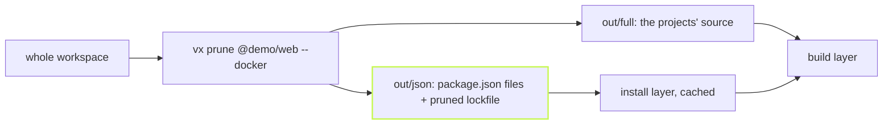

A Docker image for one app should not install the dependencies of forty
others. And when another team bumps a package in their app, your image's
install layer should not rebuild. `vx prune` cuts the workspace down to
what one project needs.



## One command

The demo workspace has four packages. `@demo/web` depends on `@demo/ui`,
and `@demo/docs` pulls in `picocolors` from npm.

```sh frame="terminal"
$ vx prune @demo/web --docker
vx prune: 2 projects → out (json/ + full/), bun.lock pruned
  @demo/ui (packages/ui)
  @demo/web (packages/web)
```

The output has only the two projects web needs. The root
`package.json` lists only their folders, and the lockfile drops every
entry nothing kept reaches:

```sh frame="terminal"
$ grep -c picocolors bun.lock out/json/bun.lock
bun.lock:2
out/json/bun.lock:0

$ cd out/full && bun install --frozen-lockfile
Checked 4 installs across 3 packages (no changes) [2.00ms]
```

The pruned lockfile keeps the package manager's own layout, so a frozen
install accepts it as is.

## The Dockerfile

`--docker` splits the output in two. `json/` holds only what the install
reads, so Docker caches that layer until a dependency of this app
changes. `full/` holds everything else.

```dockerfile
COPY out/json/ .
RUN bun install --frozen-lockfile
COPY out/full/ .
RUN bunx vx run @demo/web#build
```

## Where it comes from

`vx prune` is a verb that `@vzn/vx-lockfile` adds through the plugin
`commands` seam. Declare the plugin for your package manager, and the verb
appears:

```ts
// vx.workspace.ts
import { defineWorkspace } from '@vzn/vx/config'
import { bun } from '@vzn/vx-lockfile'

export default defineWorkspace({ plugins: [bun()] })
```

`pnpm()`, `npm()` and `yarn()` work the same way. The same plugin keys
each task on its own project's dependencies, which
[Lockfile-aware keys](../lockfile-aware-keys/) covers. Every rule and
refusal is in the
[vx-lockfile README](https://github.com/vznjs/vx/tree/main/packages/vx-lockfile#vx-prune).
