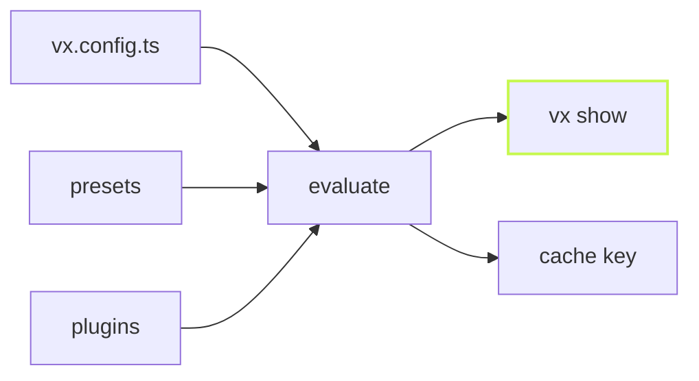

A `vx.config.ts` is TypeScript. Presets compose, plugins add tasks, a
function can compute a command. So the file is not always the answer to
"what will this task do?". `vx show` is.

```sh frame="terminal"
vx show @demo/web#build
```

## Every project, one line each

```sh frame="terminal"
$ vx show
@demo/api   packages/api   2 tasks
@demo/docs  packages/docs  2 tasks
@demo/ui    packages/ui    2 tasks
@demo/web   packages/web   2 tasks
```

## One task, resolved

```sh frame="terminal"
$ vx show @demo/web#build
@demo/web — packages/web

build
  command:       mkdir -p dist && sleep 0.3 && cp src/index.ts dist/index.js
  dependsOn:     ^build
  inputs.files:  src/**
  outputs.files: dist/**
```

This is the config the cache key sees, not the source text. When a
preset sets `outputs` or a plugin rewrites a command, it shows here.



## The same answer, for agents

`--format json` prints the object itself, so a script or an agent reads
the task without parsing text:

```sh frame="terminal"
$ vx show @demo/web#build --format json
{
  "name": "@demo/web",
  "dir": "packages/web",
  "task": "build",
  "config": {
    "exec": { "command": "mkdir -p dist && sleep 0.3 && cp src/index.ts dist/index.js" },
    "dependsOn": ["^build"],
    "cache": {
      "inputs": { "files": ["src/**"] },
      "outputs": { "files": ["dist/**"] }
    }
  }
}
```

`vx show --affected` lists the projects a change reaches, without
running anything.

Learn more: [the CLI reference](../../cli/) and
[vx show](https://vznjs.github.io/vx/features/vx-show/).
