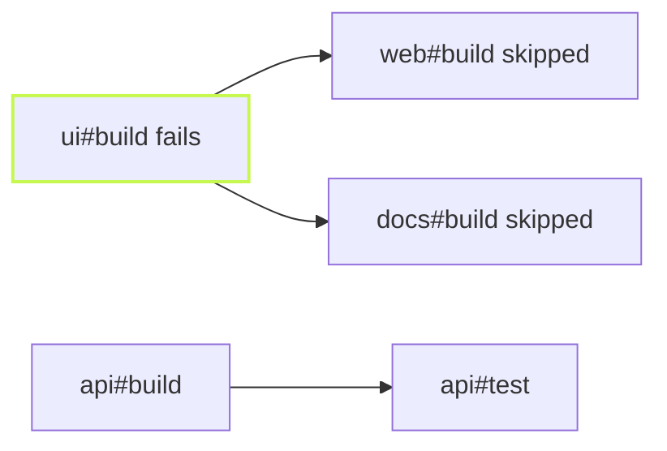

One package fails to build. What should happen to the other forty? vx's
default: skip what needs the broken one, finish everything else, and
tell you which failure each skip is waiting on.



## Every skip names its blocker

`@demo/ui` has a type error. `web` and `docs` depend on it, `api` does
not:

```sh frame="terminal"
$ vx run build test --all
 ◼︎     4ms failed  miss     @demo/ui#build
 ⊘         skipped          @demo/docs#build • blocked by @demo/ui#build
 ⊘         skipped          @demo/web#build • blocked by @demo/ui#build
 ⊘         skipped          @demo/ui#test • blocked by @demo/ui#build
 ⊘         skipped          @demo/docs#test • blocked by @demo/ui#build
 ⊘         skipped          @demo/web#test • blocked by @demo/ui#build
 ⏺︎   309ms success miss     @demo/api#build
 ⏺︎   204ms success miss     @demo/api#test

┌─ @demo/ui#build > failed (exit 1)
src/index.ts:3 type error
└─ @demo/ui#build ── (4ms) failed (exit 1)
```

`api` still built and tested. A skip two levels down, like `web#test`,
names the failure at the root of the chain, not the skip in between. You
fix one thing, not five.

## Pick how far a failure reaches

`--continue` has three settings:

- `deps-ok`, the default: skip the failure's dependents, run the rest.
- `never`: fail fast. The first failure stops dispatch, running tasks
  finish, and nothing new starts.
- `always`, or bare `--continue`: run dependents anyway.

```sh frame="terminal"
$ vx run build test --all --continue=never
 ◼︎     4ms failed  miss     @demo/ui#build
 ⊘         skipped          @demo/web#build • blocked by @demo/ui#build
 ⏺︎   308ms success miss     @demo/api#build
 ⊘         skipped          @demo/api#test
```

`api#build` was already running, so it finished. `api#test` never
started, and its skip has no blocker because nothing upstream failed. The
run simply stopped.

## How many at once

`--concurrency` caps the tasks that execute at the same time. It takes a
count or a share of the CPUs:

```sh frame="terminal"
$ vx run build --all --concurrency 8
$ vx run build --all --concurrency 50%   # half the CPUs, never below 1
$ vx run lint --all --concurrency 200%   # I/O-bound work can go over
```

The default is the core count, capped by the container's CPU quota, so a
CI runner with a two-CPU limit does not start sixteen tasks. Set
`concurrency` in `vx.workspace.ts` to change the default for everyone.

Cache hits do not count against it. Restoring a hit is disk work, so hits
run on their own lane, up to twice the limit, and a warm run is not held
back by a budget meant for compilers.

## A table when you want one

`--verbosity 1` adds one row per task after the run:

```sh frame="terminal"
$ vx run build --all --verbosity 1
@demo/docs#build  skipped (blocked by @demo/ui#build)       0ms
@demo/web#build   skipped (blocked by @demo/ui#build)       0ms
@demo/api#build   success                                 310ms
```

Every flag is in the [CLI reference](../../cli/).
