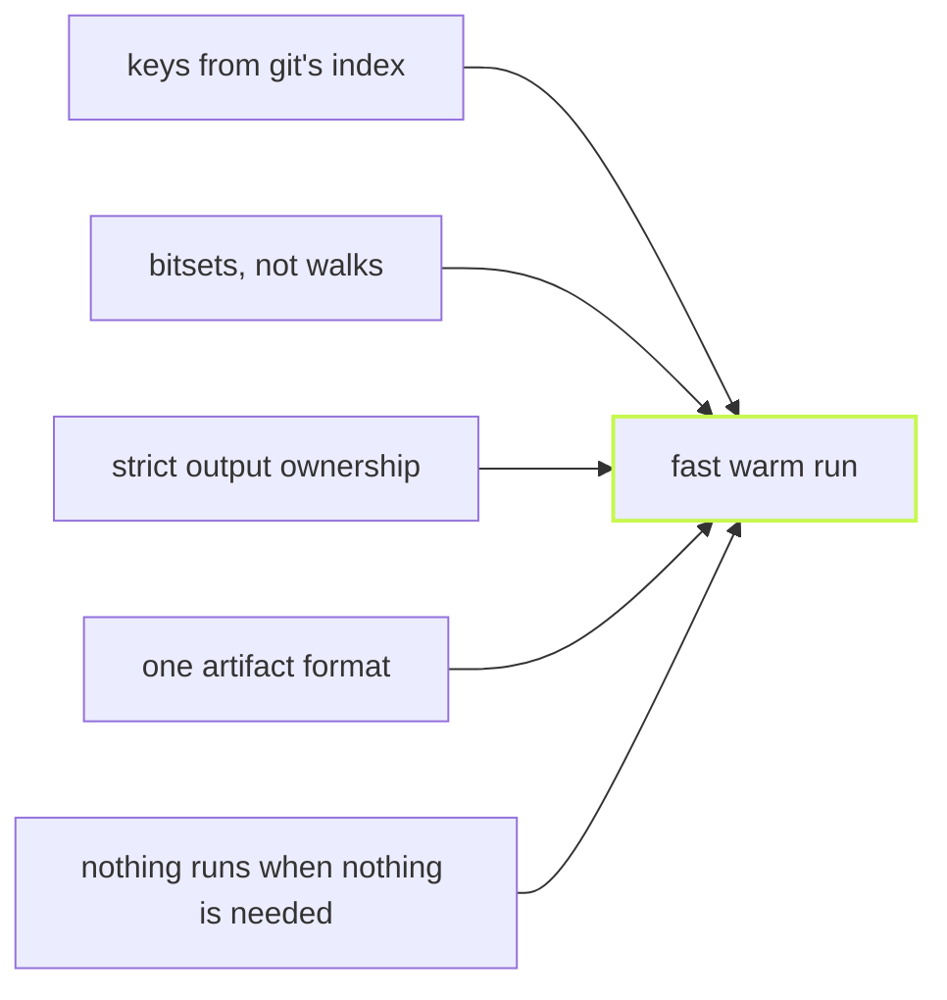

The headline number is the runner's overhead: the time it adds on top
of the tasks themselves. On a synthetic workspace of 1,090 packages and
3,270 tasks of equal duration in deep dependency chains, whose ideal
schedule is 3m 38s, vx adds 2.33s to a cold build, Nx 10.98s (vx 4.7×
faster), Vite Task 1m 11s (vx 31× faster) and Turborepo 1m 21s (vx 35×
faster).
Warm, a fully cached `vx run build test --all` finishes in 393ms,
Turborepo in 463ms (vx 18% faster), Nx in 6.45s (vx 16× faster) and
Vite Task in 2.49s (vx 6.3× faster). The cold build burns 17 s of CPU
in vx, 21 s in Turborepo (vx 22% faster), 52 s in Nx (vx 3× faster)
and 12 s in Vite Task (vx 39% slower), each runner in its own native
config.

Benchmark workload: a synthetic monorepo of 1,090 packages and 3,270 tasks in 100 dependency layers, every build and test taking 1 s; real repos with uneven task times will differ.

None of that comes from a microbenchmark trick. It comes from five
decisions, and every one of them is also a reason to trust the cache
more, not less.

## 1. The cache key is already in git's index

A content-addressed key needs a hash of every input file. Most tools
read each file and hash it, or keep a daemon around so they do not have
to. vx spawns one `git ls-files -s`, which returns the file list *and*
every clean file's blob object id, and one concurrent `git status` to
prune anything that diverges from the index. Clean-tree key derivation
costs zero source-file reads and zero per-file stats.

Dirty files get the identical blob id computed in-process, so a key
never flips when you commit. That class of spurious miss, "I committed
and everything rebuilt", does not exist here.

There is a whole post on this: [Your cache key is already in git's
index](../keys-from-git/).

## 2. Bitsets where others walk

Scheduling priority and the package graph are computed over packed
bitsets with popcount instead of set-union depth-first search. On the
3,270-task graph that turned an 8.5 s priority computation into
single-digit milliseconds. The scheduler tick re-scans nothing: ready
tasks come off an exact most-blocked-first binary heap, a completion
decrements its direct dependents' counters and pushes the ones that
reach zero, and the run costs one pass over the edges plus an
`O(log N)` heap operation per task.

## 3. Strict output ownership makes restore cheap

Declared outputs are wiped before a miss executes and before a hit
restores, so the tree after either is exactly the cached snapshot.
That is a correctness rule first (no stale `dist/old.js` survives), but
it also means vx *knows* what the tree looks like after a hit. On a
warm-on-warm run it verifies the recorded `(size, mode, mtime, inode, ctime)` of each
output with a stat and writes nothing, decompresses nothing. A restore
onto a current tree costs about what an untouched tree costs.

## 4. One artifact format end to end

A cache entry is one `tar.zst` archive plus SQLite rows. Metadata and
the captured stdout live in the index (the stdout in a side table, so
the run's access-time bump never rewrites it), so a hit is a few indexed
`SELECT`s and a replay from them, not a decompression. The same bytes go over
the wire to a remote cache; nothing is repacked at the boundary.
Packing is in-process (vx's own streaming tar), the publish is an atomic
rename, and each save is a single transaction.

## 5. Nothing runs when nothing is needed

vx has no daemon, so there is no process to keep warm and no staleness
window between what the daemon believes and what the disk holds. What
replaces the daemon is a set of zero-cost gates: no telemetry plugin
means no event-bus subscriber, no summary, no git spawn for provenance;
a plugin that declines a task costs nothing; a config that passes the
purity gate is served from an evaluation cache keyed on the git blob
ids of its whole import closure, and a config that reads the
environment or the clock is simply evaluated live.

## The method behind the numbers

Every change to the warm path in this repository ships with a number,
measured the same way: A/B arms interleaved, min-of-N, the "before" arm
checked out into an immutable git worktree, one workspace copy per arm
pre-warmed by that arm. A change without a number is not done. The
history of where the headroom went is in
[Benchmarks](../../benchmarks/), and the full catalogue of decisions,
each with its invariant and its source file, is in
[Optimizations](../../optimizations/).
