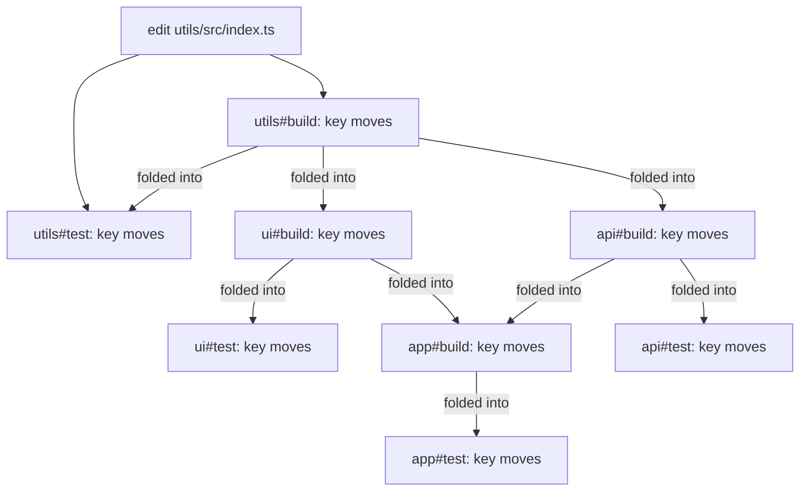

import KeyCalculator from '../../../components/demos/KeyCalculator.astro'
import Checkpoint from '../../../components/demos/Checkpoint.astro'

[The first page](../what-is-task-orchestration/) ended with a promise: a
cache stores each task's result under a key made from its inputs, and gives
it back when the key matches. This page explains how that key is made, why
a hit is safe, and how a hit goes wrong. It uses the same four packages:
`utils`; `ui` and `api`, which use `utils`; and `app`, which uses `ui` and
`api`. It explains the idea first, then shows how vx does it, and how
Turborepo, Nx and Bazel do it.

After reading it you should be able to say why a cache hit is safe or
stale.

## A key is a digest of the inputs

A task's [inputs](../glossary/#inputs) are everything that can change what
it produces: the files it reads, its command, the environment variables it
reads, and the results of the tasks it depends on. Its
[outputs](../glossary/#outputs) are the files it writes and what it prints.

A digest, or hash, turns any amount of data into a short fixed-length
string. The same data always gives the same digest. Different data almost
always gives a different one. Run all of a task's inputs through a hash
function and you get its [cache key](../glossary/#cache-key).

The cache is a table from keys to results. Before a task runs, the runner
computes its key and looks it up:

- **A hit.** The table has the key. The runner restores the stored outputs
  and replays the stored terminal output. The task does not run.
- **A miss.** The table does not have the key. The task runs, and the
  runner stores its outputs under the key.

This is called content addressing: a result's address is computed from the
content that produced it, not from a name or a time. Two things follow
from it. Undo an edit and the key goes back to its old value, so the old
entry hits again. And two machines that hold the same inputs compute the
same key, so they can share results.

A hit is safe for one reason: a task that reads only its inputs, given the
same inputs, produces the same outputs. So a key is exactly as good as its
list of inputs.

## What goes into a key

A useful key holds everything that can change the result, and nothing
else:

- **Which task it is.** `ui#build` must never hit on an entry `api#build`
  stored.
- **The files it reads.** Their content, not their names or dates.
- **Its configuration.** The command and its flags, and the list of inputs
  itself.
- **The environment variables it reads.** A build that bakes `API_URL` into
  its output must miss when `API_URL` changes.
- **The keys of the tasks it depends on.** The next two sections explain
  why keys, and not the outputs.
- **The tools' versions.** The compiler and libraries the task runs,
  usually through the lockfile. And the runner's own key format: a runner
  that changes how it computes keys changes a version string in every key,
  so no key from the old format can match.

What stays out matters as much. A key that holds the time, the machine's
name, or the absolute path of the checkout never matches twice, or never
matches on another machine.

## Upstream inputs, not upstream outputs

`ui#build` reads the files `utils#build` wrote. So when `utils` changes,
`ui#build`'s key must change too. There are two ways to make that happen.

1. **Fold the upstream output.** Hash the files `utils#build` wrote, as
   one more input of `ui#build`.
2. **Fold the upstream key.** Put `utils#build`'s key into `ui#build`'s key.
   That key is a digest of everything `utils#build` read, so it moves
   whenever `utils#build`'s output could.

The first way has two costs.

- **You wait for outputs.** `ui#build`'s key is unknown until
  `utils#build` has run or been restored. The runner cannot ask the cache
  about `ui#build`, or `app#build` above it, until everything below has
  finished. It cannot plan a run up front or fetch results ahead.
- **Outputs must be deterministic.** If `utils#build` writes a timestamp,
  or lists files in a different order each time, its output differs on
  every run. Every key above it then differs on every run, and nothing
  above it ever hits.

The second way has its own cost. An edit that does not change the output,
such as a comment in `utils`, still moves every key above it. The tasks
above rerun, and produce the same bytes they produced before.

## The cascade

Folding upstream keys means a moved key moves every key above it. Edit
`utils/src/index.ts`. `utils#build` and `utils#test` read it, so their keys
move. `ui#build` and `api#build` fold `utils#build`'s key, so theirs move.
And so on, to the top:



Edit `app/src/index.ts` instead and only `app#build` and `app#test` move.
Nothing depends on `app`. Change `API_URL`, which only `api#build` reads,
and four keys move: `api#build`, then `api#test` and `app#build`, which
fold it, then `app#test`.

The calculator below runs these cases. Each control changes one thing, and
then the next run happens.

<KeyCalculator />

The [playground](../playground/) makes the same edits to real files and
runs them through vx's own planner.

## What a stale hit is

A [stale hit](../glossary/#cache-hit-miss-and-stale-hit) is a hit whose
result is wrong. The key matches, the runner restores the stored outputs,
and those outputs were built from something that has since changed. It
happens when the task read something its key never saw, or, far more
rarely, when two different sets of inputs get the same key (the fold, in
[how vx does it](#how-vx-does-it), is one such story).

Try it in the calculator, or read the last table. `utils#build` reads
`utils/tsconfig.json`. Stop declaring it, and run. Every key moves once,
because the list of inputs is part of the config, and the config is in the
key. Now edit `utils/tsconfig.json`. No key moves, because no key sees that
file. All eight tasks hit. All eight hits are stale: `utils#build` restores
an output built with the old `tsconfig.json`, and every task above it
restores an output built on top of that one.

The run is green. Nothing says the output is old. That is why a stale hit
is the worst thing a cache can do: a miss costs time, and a stale hit costs
trust. It also spreads. Edit `ui/src/index.ts` next, and `ui#build` runs,
but it reads the stale output `utils#build` restored, so its output is
wrong even though it ran.

An input the key never sees can be a file outside the declared list, an
environment variable the task reads but does not declare, a tool upgraded
without the lockfile changing, or a file the network returns. Declaring
the input fixes the one you know about. Finding the ones you do not know
about needs the runner to notice a read it was not told about, which is
what a sandbox does. [Correctness](../correctness/) covers it.

## Local and remote caches

A local cache is a directory on your machine. It makes your own second run
fast. A [remote cache](../glossary/#remote-cache) is the same table on a
server that the team and CI share. Because a key is computed from content,
a key your laptop computes matches the one CI computed for the same inputs,
and your laptop downloads CI's result instead of running the task.

Sharing changes three things:

- **A stale entry is shared too.** An entry stored with the wrong output is
  replayed on every machine that computes its key.
- **Keys must be the same on every machine.** An absolute path, a user name
  or a machine-specific variable in a key means no two machines ever share.
- **A hit costs a download.** A runner that knows its keys up front can
  start the downloads early, while other tasks run.

## How vx does it

- **Declared inputs, required.** A task is cached only if it has a `cache`
  block, and `cache.inputs.files` has no default: you list the files the
  task reads, and the key folds those files and nothing else from the
  package ([why caching is opt-in](../../caching/#why-caching-is-opt-in)).
  vx also folds the package's `package.json`, the lockfile, the evaluated
  task config and the keys of every task it depends on
  ([the full list](../../caching/#cache-key-derivation)).
- **Git's blob ids for clean files.** Git already stores a digest of every
  file it tracks. For a tracked file with no local change, vx takes that id
  from git's index and reads nothing. An edited or untracked file is hashed
  the same way git would hash it, so a file's contribution is the same
  whether it is committed or not.
- **Environment variables by name.** Apart from a short base list such as
  `PATH` and `HOME`, a task sees only the variables it is given.
  `cache.inputs.env` puts a variable's value in the key, and
  `exec.env.passThrough` hands it to the command. They are separate lists,
  so a variable in `passThrough` alone is the stale hit above waiting to
  happen ([the two lists](../../guides/environment-variables/#the-two-lists)).
- **Tool versions, if you name them.** The lockfile covers the packages the
  task runs. The Node or Bun version is not in the key unless the task
  names a command that prints it in `cache.inputs.runtime`
  ([what is not in the key](../../caching/#whats-not-in-the-key-and-why)).

For the `api` package, that looks like this:

```ts
import { defineProject } from '@vzn/vx'

export default defineProject({
  tasks: {
    build: {
      dependsOn: ['^build'],
      exec: { command: 'tsc -b', env: { passThrough: ['API_URL'] } },
      cache: {
        inputs: { files: ['src/**', 'tsconfig.json'], env: ['API_URL'] },
        outputs: { files: ['dist/**'] },
      },
    },
  },
})
```

**The fold.** A vx key is a 16-hex-digit xxHash3 digest, built one part at
a time: each part is hashed with the digest so far as the seed. How much
state that chain carries matters. Bun's xxHash3 reads only the low 32 bits
of a seed, so for a while each step carried 32 bits, not 64. Two different
sets of inputs whose running digests shared their low 32 bits merged at the
next step and ended with the same key: a stale hit. With 32 bits of state,
such a pair turns up after about 2^16 keys, some 65,000. A search over
2^17 real keys that differed in one environment variable found one in 0.08
seconds. vx now feeds the seed forward: each step XORs the seed into its
result, so the high 32 bits survive every step. With 64 bits of state, a
pair needs about 2^32 keys. The chain and the collision search are pinned
in `tests/hash-chain.test.ts`.

**The cost.** You type the globs for every task, and a file you leave out
is a stale hit waiting to happen. In return, an edit to a file the task
does not read, such as a README, does not rerun it. The opt-in
[sandbox](../../guides/sandboxing/) closes the gap: a sandboxed task that
reads a file it never declared fails and names the file. When a key does
move and you want to know why, [`vx why`](../../guides/trusting-the-cache/)
names the input that moved it.

Folding upstream keys, vx knows a task's key before anything runs, as long
as the task's inputs do not include files another task writes. On a local
run it uses that to look up every such key at the start and to restore hits
while misses run ([the restore tier](../../caching/#local-restore-tier-two-tier-scheduler)).
Core has only the local cache; a remote cache is a plugin
([remote caching](../../guides/remote-caching/)).

## How the others do it

These were checked against each tool's documentation on 2026-09-24.

- **Turborepo** hashes all source-controlled files in a package by
  default, and `inputs` narrows that
  ([package hash inputs](https://turborepo.com/docs/crafting-your-repository/caching#package-hash-inputs)).
  It adds a variable's value to the hash when the task lists it in `env`,
  and its default Strict Mode hides from a task every variable `turbo.json`
  does not list
  ([strict mode](https://turborepo.com/docs/crafting-your-repository/using-environment-variables#strict-mode)).
  An input with `mode: "dependencyOutputs"` hashes files a dependency
  wrote, and then the key is not known until run time: `--dry=json`
  reports `hash: null`
  ([deferred hashing](https://turborepo.com/docs/reference/configuration#deferred-hashing)).
  Its remote cache is Vercel's or a server you host that speaks its Remote
  Cache API ([remote caching](https://turborepo.com/docs/core-concepts/remote-caching#self-hosting)).
- **Nx** includes all files under a project's root by default
  ([configure inputs](https://nx.dev/docs/concepts/how-caching-works#configure-inputs)).
  An input like `^production` folds the files of the projects a project
  depends on, so Nx reaches upstream through their input files rather than
  their keys
  ([named inputs on dependencies](https://nx.dev/docs/reference/inputs#using-named-inputs-on-project-dependencies)).
  `dependentTasksOutputFiles` hashes files a dependency task produced
  ([outputs of dependent tasks](https://nx.dev/docs/reference/inputs#outputs-of-dependent-tasks)),
  and `{ "env": "API_KEY" }` folds a variable's value
  ([environment variables](https://nx.dev/docs/reference/inputs#environment-variables)).
  Its remote cache is Nx Cloud, or a server you build against its OpenAPI
  specification
  ([self-hosted remote cache](https://nx.dev/docs/kb/self-hosted-caching)).
- **Bazel** caches each action, one compiler call for example. An action
  has inputs, output names, a command line and environment variables, and
  the action cache maps an action's hash to its result
  ([remote caching](https://bazel.build/remote/caching#overview)).
  An action's inputs include files other actions generated
  ([artifact](https://bazel.build/reference/glossary#artifact)), so Bazel
  folds upstream outputs. When a rebuilt output comes out the same as
  before, Bazel does not rerun what depends on it, which it calls change
  pruning ([incrementality](https://bazel.build/reference/skyframe#incrementality)).

Hashing every file in the package, as Turborepo and Nx do by default, is
less to type than vx asks for, and it is the better choice while you adopt
a runner, or for a package whose tasks read most of its files anyway: a
file you forget cannot cause a stale hit. The price is reruns for files
the task never reads. Bazel's choice is the better one when a low package
changes often in ways that do not change its output: a comment in `utils`
reruns every task above it in vx, and none in Bazel. vx pays that to know
its keys before anything runs, and to not need outputs that are the same
byte for byte.

## Checkpoint

<Checkpoint id="caching" />
